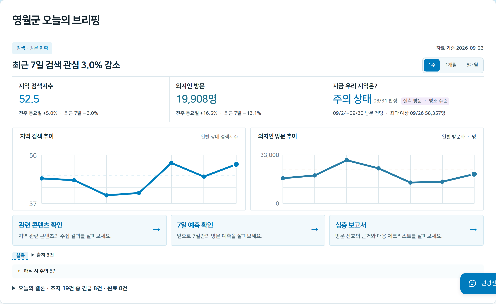
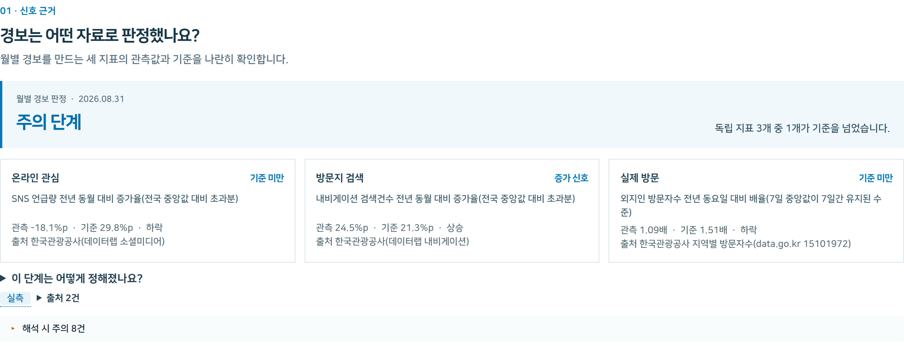
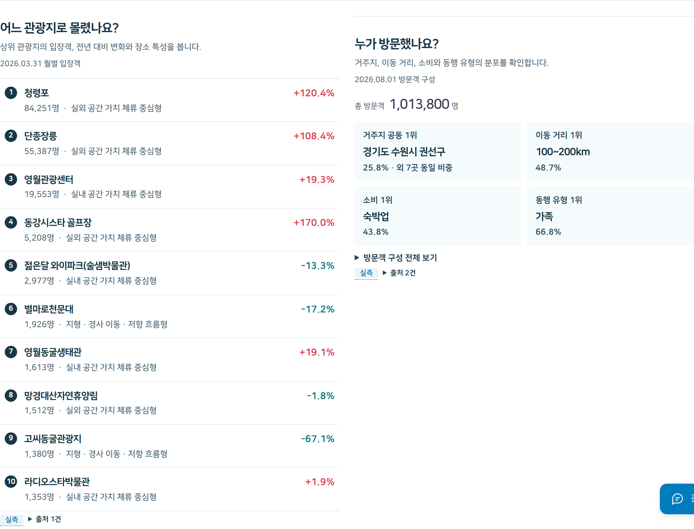
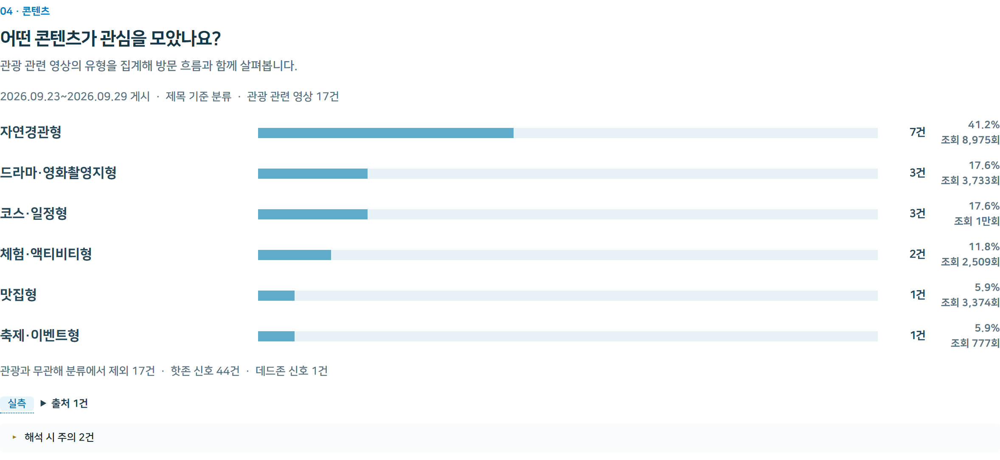
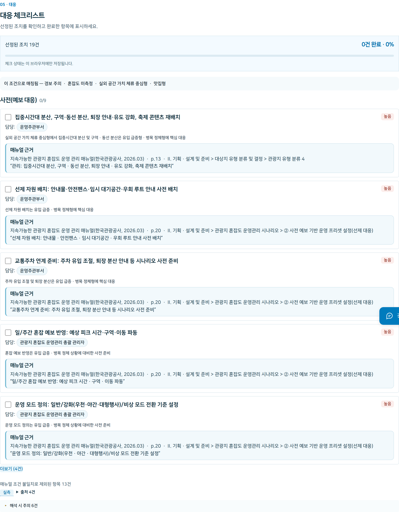
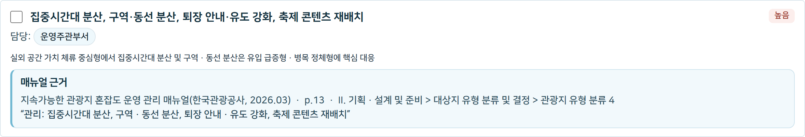
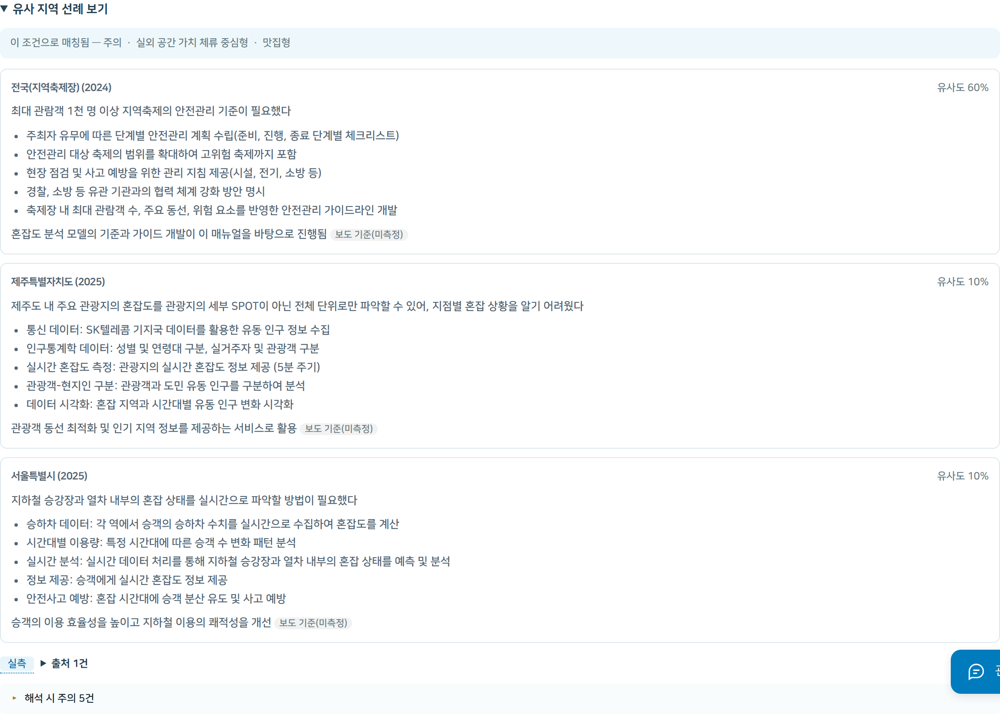
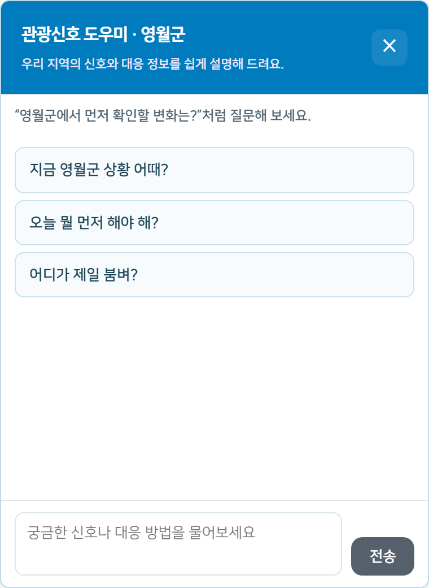

# 미리봄

### 지점 단위 관광 혼잡 조기경보·대응 지원 체계

**2026 한국관광 데이터랩 활용 경진대회** 출품작이다. 검색·방문 데이터의 이상 신호를 조기에 감지하고, 그 원인이 된 콘텐츠와 지점을 특정하며, 지방자치단체 담당자가 즉시 활용할 수 있는 대응 체크리스트와 정책 보고문을 생성하는 관광지 혼잡 조기경보 시스템이다.

**🚀 웹 데모 바로가기: `(배포 후 URL 추가 예정)`**

**UI 데모 캡처는 [UI 데모 핵심 기능](#ui-데모-핵심-기능)에서, 실행 방법은 [로컬에서 UI 실행하기](#로컬에서-ui-실행하기)에서 확인할 수 있다.**

---

## 대회 정보

| 항목 | 내용 |
|---|---|
| 대회명 | 2026 한국관광 데이터랩 활용 경진대회 |
| 주최·주관 | 문화체육관광부 · 한국관광공사 |
| 공모 주제 | 한국관광 데이터랩 데이터를 활용한 성과 창출 사례(관광 외 분야 데이터와의 융복합 사례 포함) |
| 공식 공고 | [한국관광 데이터랩 공고 게시글](https://datalab.visitkorea.or.kr/site/portal/ex/bbs/View.do?cbIdx=1135&bcIdx=311064) |
| 데이터 출처 | [한국관광 데이터랩](https://datalab.visitkorea.or.kr/) |

---

## 프로젝트 소개

### 추진 배경

관광지 혼잡은 대부분 이미 발생한 뒤에야 인지된다. 언론 보도나 민원이 접수되는 시점에는 현장이 이미 포화 상태에 이른 경우가 많다. 원인이 되는 신호(SNS 언급량, 내비게이션 검색 건수, 실제 방문자 수)는 그보다 앞서 움직이지만, 지방자치단체가 이를 매일 확인하고 판단할 인력과 도구를 갖추기는 어렵다.

| 문제 | 설명 |
|---|---|
| 신호는 있으나 판정 기준이 없다 | SNS 언급량이나 검색 건수가 상승해도, 이를 정상적인 변동과 경보 수준으로 구분할 기준이 없으면 담당자의 경험적 판단에 의존하게 된다. |
| 원인을 모르면 대응이 늦어진다 | 방문객 급증의 원인(방송 노출, 유튜브 콘텐츠, 축제 등)을 파악하지 못하면 인력 배치와 조치의 우선순위를 정하기 어렵다. |
| 매뉴얼은 있으나 활용이 더디다 | 관광 혼잡도 운영 매뉴얼에 단계별 조치가 정리되어 있어도, 현재 상황에 맞는 조치를 매번 사람이 찾아야 한다. |

### 프로젝트 목표

담당자가 "지금 어떤 상황이며 무엇을 먼저 해야 하는가"를 하나의 화면에서 확인할 수 있도록 설계했다. 검색·내비게이션·방문자 3개 지표를 전국 중앙값과 교차검증해 경보 단계를 판정하고, 그 원인이 된 콘텐츠를 분류하며, 매뉴얼에서 현재 상황에 맞는 조치만을 선별해 체크리스트와 브리핑 형태로 제공한다.

### 설계 원칙 — LLM 적용 범위의 판단 기준

기능별로 LLM을 적용할지 규칙(코드) 기반으로 처리할지를 다르게 결정했다. 판단 기준은 "이 판정에 LLM의 해석이 필요한가, 규칙만으로 충분한가" 하나였다. 규칙으로 충분한 영역에 LLM을 적용하면 동일 입력에도 결과가 매번 달라져 재현성이 떨어지고, 매뉴얼 원문을 그대로 인용해야 하는 영역(공공누리 4유형 라이선스는 변경금지)에 LLM을 적용하면 원문에 없는 내용을 생성할 위험이 있다.

- **신호 판정(경보 단계)과 핵심 지표 계산**은 전량 규칙 기반이다 — 매뉴얼이 정의한 승격 규칙(3개 지표 중 1개 초과 시 관심→주의, 2개 초과 시 주의→경계, 3개 초과 시 경계→심각)을 코드로 그대로 구현했다.
- **콘텐츠 유형 분류**(유튜브 영상 9종 분류)와 **매뉴얼 조치 매칭**(현재 상황에 맞는 조치 선별)은 LLM(Upstage `solar-pro3`)을 사용한다 — 텍스트의 의미를 판단해야 하는 작업이라 규칙만으로는 처리할 수 없다. 다만 매칭 이후 **화면에 표시되는 조치 문장과 쪽수는 코드가 매뉴얼 원문에서 그대로 발췌한다** — LLM은 선별만 수행하고 문장을 새로 작성하지 않는다.
- **정책 브리핑**은 1·2문단(현재 상황 요약)을 코드가 사실 데이터를 문장 틀에 대입해 생성하고, 3문단(우선순위 판단과 사유)만 LLM이 작성한다 — 매일 동일한 문장 구조를 유지해야 전일 대비 비교가 가능하기 때문이다. LLM이 작성한 문장에 등장하는 수치는 코드가 사실 데이터와 대조 검증하며, 근거 없는 수치가 발견되면 재생성을 요청한다.
- **선례 조사**는 LLM을 사용하지 않는다 — 공개된 사례가 6건에 불과해 선택의 여지가 크지 않고, LLM에 요약을 맡기면 원문에 없는 조치나 성과를 생성할 위험이 커진다. 사례의 선정과 정렬만 규칙으로 처리하고, 본문은 연구보고서 원문을 그대로 인용한다.

---

## 구현 내용

관광 혼잡도 운영 매뉴얼이 정의하는 9개 데이터 계약(및 이를 종합하는 브리핑 1종)을 채우는 파이프라인을 `agents/`에 구현했다. 각 스크립트는 팀 데이터베이스(MySQL) 스냅샷 또는 자체 수집 데이터를 입력받아 스키마(`data/schema/*.schema.json`)를 준수하는 JSON을 `data/prod/`에 생성하며, 프론트엔드는 이 JSON만을 읽는다 — 판정 로직이 변경되어도 화면 코드는 영향을 받지 않는다.

| 데이터 계약 | 생성 스크립트 | LLM 적용 여부 | 커버리지 |
|---|---|---|---|
| `signal_status` (신호 판정) | `agents/judge_signal_status.py` | 아니오 — 3중 교차검증 규칙 | 사례 6곳 + 전국 228개 시군구 |
| `forecast` (7일 방문 예측) | `analysis/src/forecast/export_forecast.py` | 아니오 — 학습된 시계열 모델 | 사례 6곳 + 전국 228개 시군구 |
| `signal_series` / `outlook` (1년 신호 추이 · 6개월 전망) | `analysis/src/forecast/export_signal_series.py`, `monthly_outlook.py` | 아니오 | 사례 6곳 + 전국 228개 시군구 |
| `hotspots` (인기 관광지 랭킹) | `agents/agent_hotspots.py` | 아니오 — 랭킹은 규칙, 공간유형은 매뉴얼 기준의 수작업 분류 | 사례 6곳 |
| `visitor_profile` (방문객 구성) | `agents/agent_visitor_profile.py` | 아니오 — 원자료 재매핑 | 사례 6곳 |
| `content_type` (콘텐츠 유형 분류) | `agents/agent2_apply.py` | **예 — Upstage `solar-pro3`** | 사례 6곳 |
| `checklist` (대응 조치 매칭) | `agents/agent3_match.py` | **예 — Upstage `solar-pro3`**(조치 문장·쪽수는 매뉴얼 원문을 코드가 그대로 삽입) | 거제시·영월군 |
| `precedent` (선례 조사) | `agents/agent4_precedent.py` | 아니오 — 규칙 기반 선정, 연구보고서 원문 인용 | 거제시·영월군 |
| `timeline` (타임라인 추출) | `agents/agent1_timeline.py` | 아니오 — 원문 대조 규칙 | 거제시·영월군 |
| `before_after` (조치 전후 비교) | 미구현(목업) | — | 거제시(목업) |
| `briefing` (정책 브리핑, 9종 종합) | `agents/agent5_briefing.py` | **부분 적용 — 1·2문단 규칙, 3문단만 LLM** | 거제시 |

9개 계약 중 `before_after`를 제외한 나머지는 최소 2개 지역(거제시·영월군) 이상에서 실측 데이터로 검증되었다. `forecast`·`signal_status`·`signal_series`·`outlook` 4종은 데이터랩·이동통신·검색지수만으로 산출하는 공통 모델이라 전국 228개 시군구까지 이미 적용되어 있다. 지역별·기능별 세부 현황은 [`docs/meeting-notes/UI/에이전트_현황_및_프론트_매핑.md`](docs/meeting-notes/UI/에이전트_현황_및_프론트_매핑.md)에 정리되어 있다.

---

## UI 데모 핵심 기능

데모는 지역 하나를 선택하면 오늘의 브리핑 → 방문 흐름·신호 근거 → 콘텐츠 분석 → 정책 대응 → 지난 대응 기록 순으로 이어지는 하나의 보고서 형태로 구성된다. 아래 화면은 영월군(51750) 기준으로 캡처했다.

### 1. 관제 대시보드 — 오늘의 브리핑

접속 시 가장 먼저 표시되는 화면이다. 현재 경보 단계와 최근 검색·방문 신호를 1주/1개월/6개월 단위로 확인할 수 있으며, 하단의 "오늘의 결론"이 처리해야 할 조치 건수를 요약해 제시한다.



### 2. 신호 판정 근거 — 3중 교차검증

SNS 언급량, 내비게이션 검색, 외지인 방문자 3개 지표를 전년 동월(요일) 대비 전국 중앙값과 비교해 경보 단계를 판정한다. 어느 지표가 기준을 초과했는지, 그 판정 근거를 함께 제시한다.



### 3. 방문 흐름과 예측

상위 관광지 랭킹과 방문객 구성(거주지, 동행 유형 등)을 제시하고, 자료 기준일 이후 7일간의 방문 예측을 80% 신뢰구간과 함께 표시한다.




### 4. 콘텐츠 분석 — 방문 증가의 원인 파악

조회수 상위 유튜브 영상을 예능·맛집·포토스팟 등 9종으로 LLM이 분류하고, 분류 근거·감성·핫존/데드존 신호를 함께 제시한다.



### 5. 정책 대응 — 체크리스트, 브리핑, 선례

현재 경보 단계·콘텐츠 유형·방문객 특성에 부합하는 매뉴얼 조치를 LLM이 선별해 우선순위를 부여하고, 조치 문장은 매뉴얼 원문을 그대로 인용한다.

**5-1. 대응 체크리스트**

단계(사전·오전·운영 중·비상·마감)별로 조치를 정리하고, 매칭 조건과 진행률을 함께 표시한다.



**5-2. 매뉴얼 근거 인용**

각 조치 항목에는 매뉴얼의 출처(문서명·쪽수·항목)와 원문 인용이 함께 표시되어, 조치가 임의로 생성된 것이 아님을 확인할 수 있다.



**5-3. 유사 지역 선례**

현재 지역과 공간유형·콘텐츠 유형이 유사한 국내 사례를 유사도와 함께 제시한다. 본문은 한국관광공사 연구보고서 원문을 그대로 인용한다.



**5-4. 정책 브리핑**

현재 상황을 종합해 "현재 상황 · 예상 전개 · 권고 조치" 3단 구조의 정책 보고문을 자동 생성한다.


### 6. 자연어 질의 챗봇

화면 우하단의 챗봇에 자연어로 질의하면 9개 데이터 계약을 도구로 호출해 답변을 생성한다. 답변에는 실측·샘플·준비 전 여부를 표시하는 출처 배지가 함께 제공된다.



---

## 기술 스택

<table>
<thead><tr><th>영역</th><th>내용</th></tr></thead>
<tbody>
<tr><td rowspan="2">데이터 파이프라인<br>· 예측 모델</td><td>


</td></tr>
<tr><td>Python ≥3.10, <code>uv</code>, pandas, scikit-learn, statsmodels, jsonschema, pymysql. 예측 모델은 <code>analysis/src/forecast/</code>의 시계열 베이스라인 및 회귀 모델(복수 방법을 시간 순 검증으로 비교해 채택)이다.</td></tr>

<tr><td rowspan="2">LLM</td><td>

</td></tr>
<tr><td>Upstage <code>solar-pro3</code>(OpenAI 호환 API) — <code>agents/llm_client.py</code>가 anthropic/upstage/로컬 openai 호환/replay 4개 백엔드를 추상화하며, 본 프로젝트는 upstage만 사용한다.</td></tr>

<tr><td rowspan="2">데이터베이스</td><td>

</td></tr>
<tr><td>팀 MySQL(<code>tour_earlywarning</code>, 읽기 전용) — <code>collection/db_export.py</code>로 스냅샷을 생성하며, 웹 애플리케이션은 DB에 직접 접속하지 않고 <code>agents/</code>가 생성한 정적 JSON만 조회한다.</td></tr>

<tr><td rowspan="2">프론트엔드</td><td>


</td></tr>
<tr><td>React 18 + Vite 5, <code>web/src/civic.css</code> · <code>datalab-theme.css</code>(디자인 시스템), <code>react-markdown</code>.</td></tr>

<tr><td rowspan="2">배포<br>· 서버리스</td><td>

</td></tr>
<tr><td>Vercel(정적 호스팅 및 로컬 개발용 질의 API).</td></tr>
</tbody>
</table>

---

## 데이터 흐름과 디렉터리 구조

```
DB(MySQL) → collection/db_export.py → data/raw/
                                          │
                    agents/*.py, analysis/src/forecast/  (판정·분류·매칭·예측)
                                          │
                                    data/prod/*.json  (9개 데이터 계약 + briefing)
                                          │
                                web/src/data/manifest.js  (지역별 real/mock/unsupported 매핑)
                                          │
                                      web/  (프론트엔드는 JSON만 조회)
```

```
tourism-early-warning/
├── agents/              # 5개 에이전트 및 규칙 기반 스크립트, 프롬프트, 실행 로그
│   ├── agent1_timeline.py … agent5_briefing.py
│   ├── agent_hotspots.py, agent_visitor_profile.py, judge_signal_status.py
│   ├── prompts/          # LLM 프롬프트(content_type·checklist·briefing)
│   └── runs/              # 실행 로그(재현·감사용)
│
├── analysis/             # 예측 모델(시계열), 방법 검증
│   └── src/forecast/     # export_forecast.py, export_signal_series.py, monthly_outlook.py
│
├── collection/           # DB 스냅샷, 유튜브·데이터랩 수집
├── manual/                # 매뉴얼 원문 구조화(체크리스트 항목, 선례 사례)
├── data/
│   ├── schema/            # 9개 데이터 계약 JSON Schema
│   ├── prod/               # 실측 산출물(전국 228개 시군구 + 사례 지역)
│   └── mock/                # 실측 이전 계약의 목업
│
├── web/                   # React + Vite 프론트엔드
│   └── src/
│       ├── pages/          # 화면 단위 컴포넌트(Area0Dashboard … Area4Performance, AreaDeepAnalysis 등)
│       ├── components/     # 화면별 하위 컴포넌트
│       └── data/manifest.js  # 지역·계약별 real/mock/unsupported 단일 진실 원천
│
├── scripts/               # 목업 생성, 스키마 검증, 제출 패키징
└── docs/                  # 설계결정, 회의록, 에이전트 현황 문서
```

---

## 로컬에서 UI 실행하기

[Node.js 20.11 이상](https://nodejs.org/)을 설치한 뒤 저장소를 받아 아래 명령을 실행한다. 명령은 저장소의 `web` 폴더에서 실행해야 한다.

```bash
git clone https://github.com/j2nii/tourism-early-warning.git
cd tourism-early-warning
git switch poolhan/ui-improvement
cd web
npm ci
npm run dev:full
```

터미널에 표시되는 주소 또는 [영월군 화면](http://localhost:5173/?region=yeongwol)을 브라우저에서 연다. 종료는 `Ctrl+C`로 한다.

이 명령은 화면과 로컬 질의 API를 함께 실행한다. 화면에서 사용하는 지역별 JSON 자료는 저장소의 `data/prod`와 `data/mock`에서 읽으므로 UI 확인에 별도의 데이터베이스 접속은 필요하지 않다. 챗봇 질의까지 확인하려면 `web/.env.example`을 `web/.env`로 복사하고 `UPSTAGE_API_KEY`를 입력해야 한다. 키가 없어도 나머지 UI는 확인할 수 있다. 비밀 키가 포함된 `.env` 파일은 저장소에 커밋하지 않는다.

화면만 확인할 경우 `web` 폴더에서 `npm run dev`를 실행해도 된다. 이 경우 챗봇 질의 API는 실행되지 않는다.

## 공유 주소

위 명령은 로컬 환경에서 실행하는 방법이다. 설치 없이 브라우저 링크 하나로 접근하려면 별도의 웹 배포가 필요하다. `localhost` 주소는 실행한 컴퓨터에서만 유효하다.

**배포 주소**: `(배포 후 추가 예정)`

## 제출본 자료 기준

이 브랜치는 자동 갱신 없이 고정된 자료를 표시한다. 6개 사례 지역의 검색·방문 신호는 2026-09-23까지, 7일 방문 예측은 2026-09-24~30, 월별 상태 판정은 최신 확정월인 2026-08-31 기준이다. 최근 유튜브 목록과 심층 보고서의 영상 유형 집계는 2026-09-23~29 게시 영상 중 수집 시점 기준 조회수 500회 이상인 표본을 사용했다. 유형은 제목을 검토해 분류한 결과이며, 영상 본문을 시청해 검증한 결과는 아니다.

---

## 관련 문서

- [에이전트 현황 및 프론트 매핑](docs/meeting-notes/UI/에이전트_현황_및_프론트_매핑.md) — 9개 데이터 계약별 LLM 적용 여부와 프론트엔드 반영 상태를 지역별로 정리
- [설계결정.md](docs/설계결정.md) — LLM 사용 범위, 승격 규칙 등 주요 설계 결정 기록
