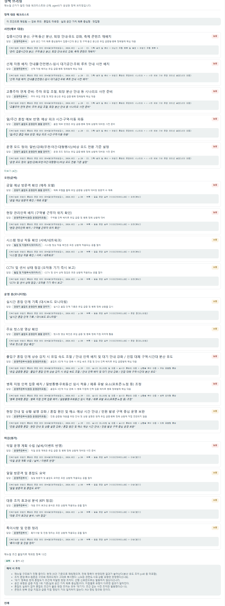
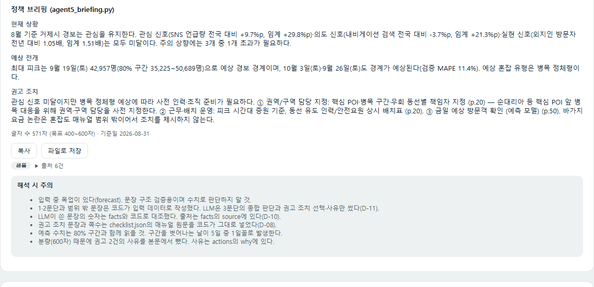
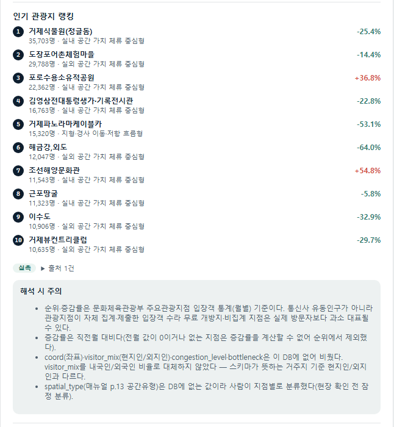
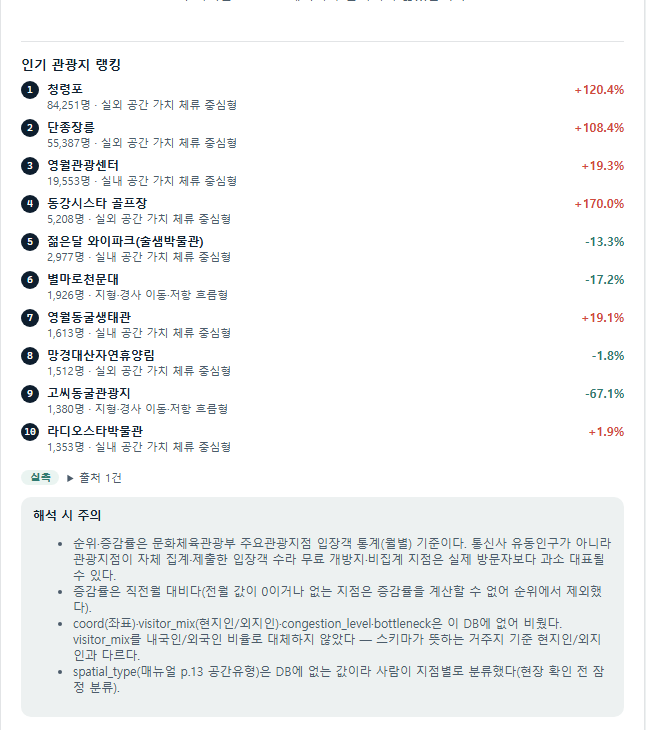
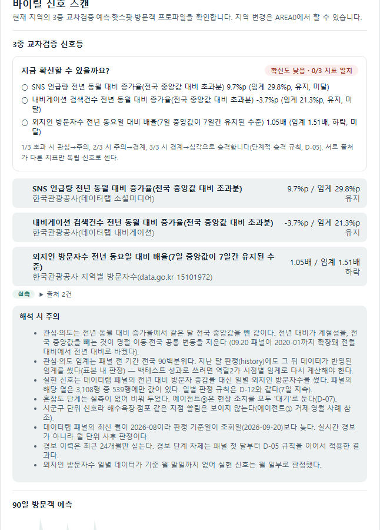
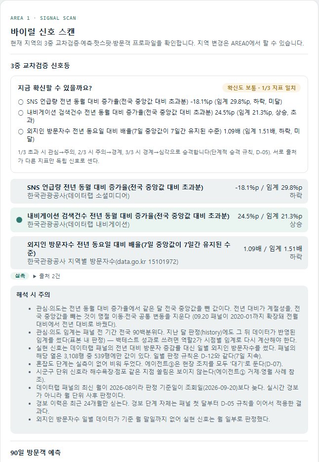

# 에이전트 현황 및 프론트 매핑 (2026-09-24)

9개 데이터 계약(+briefing)마다 "LLM을 쓰는지, 하드코딩이면 왜 그런지"와 "프론트 어디에 어떻게 나타나는지"를 정리한다. 캡처는 로컬에서 거제·영월 두 지역으로 찍었다(`docs/meeting-notes/UI/screenshots/`, 2026-09-25 기준 — 파일 목록은 부록 참고). 각 이미지 아래엔 어느 지역·어느 화면인지 캡션을 달았다. 이 문서는 `프론트구조_기능조사_및_에이전트연동계획.md`(09-17) §3 매트릭스를 최신 상태로 구체화한 것이다.

**구성**: 프로젝트가 원래 번호를 붙여 설계한 5개 에이전트(①타임라인 추출 ②콘텐츠 유형 분류 ③매뉴얼 매칭 ④선례 조사 ⑤브리핑 생성)를 하나씩 설명하고(§2), 이 5개 에이전트 번호에 속하지 않지만 같은 `agents/` 파이프라인이 만드는 규칙 기반 스크립트(signal_status·hotspots·visitor_profile, §3), 아직 스크립트조차 없는 나머지(forecast·before_after, §4) 순서로 정리한다. 각 절 안에서 다시 "무엇을 판정하는가 → LLM 여부·이유 → 프론트 위치·상태 → 캡처"로 본다.

---

## 1. 요약 매트릭스

| 데이터 계약 | 생성 스크립트 | LLM 여부 | 프론트 위치 | 상태 |
|---|---|---|---|---|
| timeline (에이전트①) | `agents/agent1_timeline.py` | 아니오(규칙 — D-12) | AREA4 `LeadTimeTimeline.jsx` | 거제·영월 실측 |
| content_type (에이전트②) | `agents/agent2_apply.py` | **예(Upstage solar-pro3, 5개 지역)** — 거제만 하드코딩 `RESULTS` 동결 | AREA2 `Area2Content.jsx` | 거제·영월 실측(2026-09-24 `VITE_USE_PROD=true`로 기본 전환) |
| checklist (에이전트③) | `agents/agent3_match.py` | **예(Upstage solar-pro3, D-08)** | AREA3 `ChecklistPanel.jsx` | 거제·영월 실측(2026-09-24 `--region` 옵션 추가 후 영월도 실행) |
| precedent (에이전트④) | 미구현(mock만) | 계획상 예(뉴스 웹검색+요약) — 미착수 | AREA3 `PrecedentCards.jsx` | mock (거제), unsupported(영월) |
| briefing (에이전트⑤) | `agents/agent5_briefing.py` | **부분(1·2문단 코드, 3문단 LLM — D-11)** | AREA3 `BriefingGenerator.jsx` | 거제 실측이지만 입력에 mock(forecast) 섞여 `_mock:true`. 영월은 forecast가 mock조차 없어 생성 불가 — 보류(2026-09-24) |
| signal_status | `agents/judge_signal_status.py` | 아니오(규칙 — D-13) | AREA1 상단 경보 단계 | 거제·영월 실측 |
| hotspots | `agents/agent_hotspots.py` | 랭킹=규칙, spatial_type=**하드코딩 유지** | AREA1 `HotspotRanking.jsx` | 거제·영월 실측 |
| visitor_profile | `agents/agent_visitor_profile.py` | 아니오(DB 원자료 재매핑, 규칙) | AREA1 `VisitorProfileCard.jsx` | 거제·영월 실측 |
| forecast | (별도 시계열 브랜치, 미완) | 아니오(데이터랩 제공값) | AREA1 `ForecastChart` | mock (거제), unsupported(영월) |
| before_after | 미구현(mock만) | 아니오(산술 비교) — **비교 기준 사건 자체가 미정** | AREA4 `PerformanceReport.jsx` | mock (거제), unsupported(영월) |

---

## 2. 5개 에이전트

### 에이전트① 타임라인 추출 (`timeline`)

- 스크립트: `agents/agent1_timeline.py`
- LLM 여부: **아니오(규칙 기반, D-12)**
- **왜 규칙으로 하는가**: 근거 문구는 원문 대조로, 신호(전국 분포 임계 초과 여부)는 규칙으로 판정하도록 설계됨(D-12, 09.16 결정) — LLM 요약이 아니라 원문에서 사실을 그대로 뽑아 시계열로 나열한다.
- 화면: AREA4 `LeadTimeTimeline.jsx`. 거제·영월 실측.

### 에이전트② 콘텐츠 유형 분류 (`content_type`)

- 스크립트: `agents/agent2_apply.py`
- 프롬프트: `agents/prompts/agent2_content_type.md`
- 모델/프로바이더: Upstage `solar-pro3`, `reasoning_effort="low"`
- 무엇을 판정하는가: 지역 관련 유튜브 영상(조회수 상위 50건)을 9종 콘텐츠 유형(예능·방송 노출형/맛집형/포토스팟형/체험·액티비티형/축제·이벤트형/자연경관형/드라마·영화촬영지형/코스·일정형/관광무관) 중 하나로 분류하고 신뢰도·근거·POI 언급 여부·감성을 함께 판정한다.
- **LLM 교체 완료(이번 세션)**: 원래 5개 지역 모두 하드코딩된 `RESULTS` dict였다. **적용 범위**: 여수·울릉·속초·영월·인제 5개 지역은 이번에 재수집한 YouTube 데이터(`collection/youtube_collect.py`)로 실제 LLM 호출을 거쳐 생성했다. **거제(48310)만 예외** — 최초 바이럴 사례 분석 당시 사람이 직접 판정한 `RESULTS` dict를 그대로 동결 유지한다(사용자 명시적 결정: "거제는 그대로 동결").
- **비결정성 대응**: solar-pro3가 배치(20건) 중 일부를 임의로 누락시키는 현상이 있어, 누락된 항목만 재요청하는 반복 로직(`classify_batch`, 최대 4회차)을 만들었다.
- **날짜 정합성**: 재수집한 YouTube 데이터는 2026-09월까지 있지만, 다른 실측 계약(signal_status 등)은 데이터랩 공개 시차 때문에 2026-08-31이 기준일이다. `signal_status_{region}.json`의 `as_of` 값보다 늦게 올라온 영상은 분류 대상에서 제외해 계약 간 날짜가 어긋나지 않게 했다.
- **다른 지역 영상 오분류 발견·수정(2026-09-24)**: 영월 재수집 원본(63건) 중 14건이 "영월"을 제목·설명·태그 어디에도 포함하지 않는 순수 강릉 콘텐츠였다(YouTube Data API 검색이 정확한 키워드 매칭이 아니라 의미 기반 유사도 검색이라 생김). 조회수 상위 50건 분류 결과에 포함된 11건 중 프롬프트 수정 전에는 **2건만 관광무관으로 걸러지고 9건이 맛집형 등으로 정상 분류**돼 있었다 — "맛집형 40%(16건)" 같은 집계 수치에 다른 지역 콘텐츠가 섞여 있었던 것.
  - 원인: `agent2_content_type.md`의 "관광무관" 정의(v1.1)가 "지역명만 겹치고 방문 수요와 무관한 콘텐츠"만 다뤄서, "아예 대상 지역이 아닌 콘텐츠"를 명시적으로 걸러내라는 지시가 없었다.
  - 조치: 프롬프트 v1.2 — 판단 규칙 1번으로 "제목·설명·태그 어디에도 대상 지역명이 없으면 관광무관으로 분류"를 추가.
  - 검증(영월 재실행, `--region 51750`): 강릉 영상 11건 중 관광무관으로 걸러진 건수가 2건 → 5건으로 늘었고(R4DRqbyZfH0·AQWN6UTLUBA·-jL3_Ar5b0U 3건 추가 정정), 전체 `unclassified_count`도 5건 → 17건으로 늘었다. 다만 **완전히 해결되지는 않았다** — 나머지 6건(pjRfsSjTmGg·IK1FckxncM0·ObkCuqXVayw·KmLtHYMFMF0·teUlr76YpA4·UpVrj6uSbCY)은 프롬프트에 규칙을 명시했는데도 여전히 맛집형/코스·일정형으로 분류됐다. LLM이 규칙을 항상 따르지는 않는다는 뜻이라, 근본적으로는 `collection/youtube_collect.py` 수집 단계에서 지역명 포함 여부로 사전 필터링하는 것도 함께 검토해야 한다.
  - 거제는 `RESULTS` dict가 하드코딩(동결)이라 프롬프트를 바꿔도 영향이 없다 — 실제로 재실행해도 원본 raw 파일(`거제_20260912_1320.json`)이 로컬에 없어 건너뛰었고, 있었더라도 출력은 바뀌지 않았을 것이다(확인용으로 실행 전 결과와 diff했고 동일함을 확인).
- **DB 스키마 갭**: 팀 DB의 `youtube_video` 테이블에 `description`/`tags` 컬럼이 없어 분류 프롬프트가 필요로 하는 입력을 못 만든다 — 로컬 재수집으로 우회했다(`docs/j2nii_진행상황.md` §23에 데이터팀 공유용으로 기록).
- 실행 로그: `agents/runs/agent2_{지역명}_{시각}_{회차}.json` (2026-09-24 새벽 재실행분)
- 화면: AREA2 `Area2Content.jsx` — 거제·영월 모두 실측(`web/.env`의 `VITE_USE_PROD=true`로 기본 전환, 2026-09-24). 나머지 3개 지역(여수·울릉·속초·인제)은 파일은 있지만 `REGIONS` 선택지에 없어 화면에서 접근 불가(범위 밖 — 시계열 모델이 맞는 지역이 정해지면 추가 예정).

캡처: `geoje_area2.png`, `yeongwol_area2.png`

*거제 AREA2 — 콘텐츠 분석(유튜브 탭), content_type LLM 분류 결과*

*영월 AREA2 — 콘텐츠 분석(유튜브 탭), content_type LLM 분류 결과*

### 에이전트③ 매뉴얼 매칭 (`checklist`)

- 스크립트: `agents/agent3_match.py`
- 프롬프트: `agents/prompts/agent3_manual_match.md`
- 모델/프로바이더: Upstage `solar-pro3` (`llm_client.complete_json`, `provider=upstage`)
- 무엇을 판정하는가: 현재 `alert_level`/`content_type`/`profile_tags`를 보고 매뉴얼 조치 후보 중 지금 상황에 맞는 것만 골라(rank) 낸다.
- **D-08 원칙**: LLM은 "이 조치가 지금 상황에 맞는가"라는 판정만 하고, 실제로 화면에 뜨는 조치 문장·쪽수는 코드가 매뉴얼 원문에서 그대로 복사한다(공공누리 4유형 라이선스가 "변경금지"라 LLM이 문장을 다시 쓰면 안 됨).
- 실행 로그: `agents/runs/agent3_*.json` (거제 `agent3_20260923_2241.json`, 영월 `agent3_20260924_0319.json`)
- 화면: AREA3 `ChecklistPanel.jsx` — 거제·영월 모두 실측(`data/prod/checklist.json`, `checklist_51750.json`, 둘 다 `_mock:false`).
- **2026-09-24 확장**: 원래 `agents/common.py`의 `load_input(name)`이 지역 구분 없이 항상 `{name}.json`(거제 전용)만 읽어서 영월로는 실행 자체가 안 됐다. `load_input(name, region)`으로 바꿔 `region` 인자가 있으면 `{name}_{region}.json`을 찾도록 확장하고(`agent_hotspots.py` 등 다른 지역별 산출물과 같은 파일명 규칙), `agent3_match.py`/`agent5_briefing.py`에 `--region` 옵션을 추가했다. 다른 지역 파일로 대신 채우지 않는다(발명 금지) — 지역별 파일이 없으면 그대로 에러를 낸다.
  - 실행: `python agents/agent3_match.py --region 51750 --provider upstage`
  - 결과: 영월은 "주의" 단계·혼잡도 미측정 상황에서 22건 후보 중 19건 발동으로 매칭됨(거제와 다른 조합 — 상황 유형도 "유입 급증형"·"병목 정체형"으로 다르게 판정됨).

캡처: `yeongwol_area3_checklist.png` (AREA3 전체 중 체크리스트 부분만 잘라냄 — 그 아래 선례·브리핑은 영월에서 아직 unsupported라 빈 화면만 나와 제외)

*영월 AREA3 — 정책 대응 체크리스트, agent3_match.py `--region 51750` 실측 결과*

### 에이전트④ 선례 조사 (`precedent`) — 미착수

- 스크립트: 없음(`agent4_apply.py` 미작성, mock만 존재)
- 계획상 LLM 여부: **예로 설계됨** — 데이터랩 유사지역 목록 + 뉴스/보도자료 검색·요약(LLM)으로 `precedent.schema.json`을 채우는 설계가 `docs/meeting-notes/UI/프론트구조_기능조사_및_에이전트연동계획.md`(§5)에 이미 잡혀 있다.
- 왜 아직 안 됐는가: 손을 안 댄 게 아니라, 담당(에이전트①④는 "이번 주 구현 대상 아님"으로 명시적으로 뒤로 미룬 것)이 아직 시작 전인 상태.
- 화면: AREA3 `PrecedentCards.jsx` — mock(거제), unsupported(영월).

### 에이전트⑤ 브리핑 생성 (`briefing`, 3문단만)

- 스크립트: `agents/agent5_briefing.py`
- 프롬프트: `agents/prompts/agent5_briefing.md`
- 모델/프로바이더: Upstage `solar-pro3`
- 무엇을 판정하는가: signal_status/checklist/forecast 등을 종합한 "그래서 어떻게 해야 하는가" 판단과, 권고 조치 중 우선순위 선택·사유(30~40자)만 LLM이 쓴다.
- **D-11 원칙**: 1·2문단(현재 상황 요약, 수치 나열)은 코드가 facts를 그대로 문장 틀에 꽂아 만든다. LLM이 쓰는 범위를 3문단으로 좁힌 이유는 "매일 같은 문장 틀이어야 어제와 비교된다"는 D-04 설계 근거 때문 — 매번 AI가 통째로 새로 쓰면 브리핑 형식이 날마다 달라져 비교가 안 된다.
- **D-10 원칙**: LLM이 쓴 문장에 등장하는 숫자는 코드가 facts 목록과 대조 검증한다(숫자를 지어내면 검증 실패로 재요청).
- 실행 로그: `agents/runs/agent5_*.json` (가장 최근 `agent5_20260923_2243.json`)
- 화면: AREA3 `BriefingGenerator.jsx` — `data/prod/briefing.json`을 정적으로 읽는다. 라이브 API 호출(`web/api/briefing.js`)은 폐기됨(D-04 근거와 상충).
- **현재 `_mock:true`인 이유**: 입력 중 `forecast`가 아직 mock이라 caveat에 "입력 중 목업이 있다(forecast). 문장 구조 검증용이며 수치로 판단하지 말 것"이 명시돼 있다. forecast가 실측화되면 재실행해서 `_mock:false`로 바뀔 것 — 버그 아니라 정직한 라벨.
- **영월은 아직 생성 불가(2026-09-24 확인, 보류 결정)**: `agent3_match.py`와 같이 `--region` 옵션을 추가했지만, `agent5_briefing.py`는 `forecast`를 필수 입력으로 요구한다. 영월은 forecast 데이터가 **mock조차 없어서**(시계열 브랜치 미완 — `manifest.js`에도 영월 forecast 항목 자체가 없었다) `FileNotFoundError: forecast_51750.json이 data/prod에도 data/mock에도 없다`로 즉시 실패한다. 임시로 지어낸 mock forecast를 만들어 우회할 수도 있었지만, 실제 값이 아닌 것을 화면에 올리는 셈이라(발명 금지 원칙과 상충) 보류했다 — forecast가 실측이든 목업이든 먼저 생기면 그때 실행한다.

캡처: `geoje_area3_briefing.png` (거제만 가능 — 위 에이전트③ 절 스크린샷과 같은 AREA3 화면인데, checklist·선례 밑에 이어지는 브리핑 부분만 잘라냈다)

*거제 AREA3 — 정책 브리핑(agent5_briefing.py), 3문단 중 1·2문단은 코드, 3문단은 LLM*

---

## 3. 5개 에이전트에 속하지 않는 규칙 기반 스크립트

번호가 매겨진 5개 에이전트와 별도로, 같은 `agents/` 파이프라인 안에서 DB 원자료를 규칙으로 가공해 계약을 채우는 스크립트 3개.

### hotspots의 spatial_type — 사람이 채운 룩업 테이블

- 스크립트: `agents/agent_hotspots.py`
- **왜 유지하는가**: 랭킹·증감률은 DB(`major_attraction_visitors_monthly`, 문화체육관광부 주요관광지점 입장객 통계)에서 규칙으로 뽑지만, 매뉴얼 p.13의 "관광지 유형 4분류"(공간유형)는 DB에 없는 값이라 자동 판정이 불가능하다. 지역당 상위 10곳 내외로 규모가 작아 사람이 직접 매뉴얼 기준으로 분류하는 것이 안전하고, **발명 금지 원칙**에 따라 분류표에 없는 POI는 순위에서 제외하지 임의로 추정하지 않는다.
- **하드코딩된 내용** (`POI_SPATIAL_TYPE`, `agents/agent_hotspots.py:39-101`, 6개 지역 78개 POI):

  | 지역 | 관광지 | 공간유형 |
  |---|---|---|
  | 거제(48310) | 거제식물원(정글돔) | 실내 공간 가치 체류 중심형 |
  | 거제 | 도장포어촌체험마을 | 실외 공간 가치 체류 중심형 |
  | 거제 | 포로수용소유적공원 | 실내 공간 가치 체류 중심형 |
  | 거제 | 김영삼전대통령생가·기록전시관 | 실내 공간 가치 체류 중심형 |
  | 거제 | 거제파노라마케이블카 | 지형·경사 이동·저항 흐름형 |
  | 거제 | 해금강,외도 | 실외 공간 가치 체류 중심형 |
  | 거제 | 조선해양문화관 | 실내 공간 가치 체류 중심형 |
  | 거제 | 근포땅굴 | 실내 공간 가치 체류 중심형 |
  | 거제 | 이수도 | 실외 공간 가치 체류 중심형 |
  | 거제 | 거제뷰컨트리클럽 | 실외 공간 가치 체류 중심형 |
  | 여수(12130) | 돌산공원(여수해상케이블카) | 지형·경사 이동·저항 흐름형 |
  | 여수 | (주)여수예술랜드 | 실외 공간 가치 체류 중심형 |
  | 여수 | 전라좌수영거북선 | 실외 공간 가치 체류 중심형 |
  | 여수 | 아쿠아플라넷여수 | 실내 공간 가치 체류 중심형 |
  | 여수 | 유월드 루지테마파크 | 지형·경사 이동·저항 흐름형 |
  | 여수 | 금오도 | 실외 공간 가치 체류 중심형 |
  | 여수 | 유람선(오동도 코스) | 네트워크 보행 흐름형 |
  | 여수 | 디오션리조트 워터파크 | 실외 공간 가치 체류 중심형 |
  | 여수 | 전라남도 해양수산과학관 | 실내 공간 가치 체류 중심형 |
  | 여수 | 거문도 | 실외 공간 가치 체류 중심형 |
  | 울릉(47940) | 독도 | 실외 공간 가치 체류 중심형 |
  | 울릉 | 관음도 | 지형·경사 이동·저항 흐름형 |
  | 울릉 | 봉래폭포 | 지형·경사 이동·저항 흐름형 |
  | 울릉 | 태하향목관광 모노레일 | 지형·경사 이동·저항 흐름형 |
  | 울릉 | 독도박물관 | 실내 공간 가치 체류 중심형 |
  | 울릉 | 독도 및 해돋이관광 케이블카 | 지형·경사 이동·저항 흐름형 |
  | 울릉 | 죽도 | 실외 공간 가치 체류 중심형 |
  | 속초(51210) | 설악산국립공원(설악동) | 지형·경사 이동·저항 흐름형 |
  | 속초 | 아바이마을(갯배) | 네트워크 보행 흐름형 |
  | 속초 | 설악워터피아 | 실내 공간 가치 체류 중심형 |
  | 속초 | 척산온천휴양촌 | 실내 공간 가치 체류 중심형 |
  | 속초 | 국립산악박물관 | 실내 공간 가치 체류 중심형 |
  | 속초 | 뮤지엄엑스 | 실내 공간 가치 체류 중심형 |
  | 속초 | 속초시박물관 | 실내 공간 가치 체류 중심형 |
  | 속초 | 엑스포타워 | 실내 공간 가치 체류 중심형 |
  | 속초 | 척산온천 | 실내 공간 가치 체류 중심형 |
  | 속초 | 얼라이브하트 | 실내 공간 가치 체류 중심형 |
  | 영월(51750) | 청령포 | 실외 공간 가치 체류 중심형 |
  | 영월 | 단종장릉 | 실외 공간 가치 체류 중심형 |
  | 영월 | 영월관광센터 | 실내 공간 가치 체류 중심형 |
  | 영월 | 동강시스타 골프장 | 실외 공간 가치 체류 중심형 |
  | 영월 | 젊은달 와이파크(술샘박물관) | 실내 공간 가치 체류 중심형 |
  | 영월 | 별마로천문대 | 지형·경사 이동·저항 흐름형 |
  | 영월 | 영월동굴생태관 | 실내 공간 가치 체류 중심형 |
  | 영월 | 망경대산자연휴양림 | 실외 공간 가치 체류 중심형 |
  | 영월 | 고씨동굴관광지 | 지형·경사 이동·저항 흐름형 |
  | 영월 | 라디오스타박물관 | 실내 공간 가치 체류 중심형 |
  | 인제(51810) | 농촌체험마을(황태마을) | 실외 공간 가치 체류 중심형 |
  | 인제 | 농촌체험마을(하추리마을) | 실외 공간 가치 체류 중심형 |
  | 인제 | dmz평화생명동산 | 실외 공간 가치 체류 중심형 |
  | 인제 | 합강정공원(번지점프) | 지형·경사 이동·저항 흐름형 |
  | 인제 | 농촌체험마을(냇강마을) | 실외 공간 가치 체류 중심형 |
  | 인제 | 농촌체험마을(신월리마을) | 실외 공간 가치 체류 중심형 |
  | 인제 | 농촌체험마을(산채마을) | 실외 공간 가치 체류 중심형 |
  | 인제 | 농촌체험마을(소치마을) | 실외 공간 가치 체류 중심형 |

- 같은 이유로 `coord`(좌표)·`visitor_mix`(현지인/외지인)·`congestion_level`·`bottleneck`도 이 DB로는 구할 수 없어 스키마상 선택 필드를 비운다. 특히 `visitor_mix`는 DB에 있는 내국인/외국인 비율로 대신 채우면 스키마가 뜻하는 "현지인/외지인"(거주지 기준)과 다른 값이 되므로 일부러 채우지 않았다 — 이 값이 비어 있어서 프론트(`HotspotRanking.jsx`)도 "혼잡도" 문구를 조건부로만 표시하도록 이번에 고쳤다.
- 화면: AREA1 `HotspotRanking.jsx`. 거제·영월 실측.

캡처: `geoje_area1_hotspots.png`, `yeongwol_area1_hotspots.png` (AREA1은 내부 스크롤 패널이라 전체를 한 번에 캡처하면 신호등급 부분만 잡히고 핫스팟 랭킹이 안 잡힌다 — 랭킹 부분만 스크롤해서 따로 잘라냈다)

*거제 AREA1 — 인기 관광지 랭킹(hotspots), spatial_type은 하드코딩 룩업*

*영월 AREA1 — 인기 관광지 랭킹(hotspots), spatial_type은 하드코딩 룩업*

### signal_status — 3중 교차검증 규칙 (D-13)

- 스크립트: `agents/judge_signal_status.py`
- 왜 유지하는가: SNS 언급량/내비게이션 검색건수/외지인 방문자수 세 지표를 "전년 동월(요일) 대비 증가율이 전국 중앙값을 얼마나 초과했는가"로 계산하고, 단계적 승격 규칙(1/3 초과 시 관심→주의, 2/3 시 주의→경계, 3/3 시 경계→심각)으로 경보 단계를 정한다 — 판정 로직 자체가 매뉴얼에 명시된 규칙이라 LLM이 개입할 지점이 없다.
- 화면: AREA1 상단. 거제·영월 모두 실측.

캡처: `geoje_area1_signal.png`, `yeongwol_area1_signal.png` (hotspots와 같은 AREA1 패널인데, 스크롤 맨 위 신호등급 부분만 잘라냈다)

*거제 AREA1 — 3중 교차검증 신호등(signal_status)*

*영월 AREA1 — 3중 교차검증 신호등(signal_status)*

### visitor_profile — DB 원자료 재매핑

- 스크립트: `agents/agent_visitor_profile.py`
- 왜 유지하는가: 거주지·거리대·소비카테고리·동행유형 분포는 DB(데이터랩 방문자 통계)에 이미 있는 값을 스키마 필드로 재매핑만 하면 되는 산술적 작업 — 판단이 필요 없다. `local_external_mix`는 DB 필드가 스키마가 뜻하는 값과 정확히 일치하는지 확인이 안 돼 일부러 생략한다(이번에 이 필드가 없어서 크래시 나던 프론트 버그를 조건부 렌더링으로 고쳤다).
- 화면: AREA1 `VisitorProfileCard.jsx`. 거제·영월 실측.

---

## 4. 스크립트조차 아직 없는 부분

에이전트④(선례 조사, `precedent`)는 설계는 있지만 미착수라 위 §2에서 다뤘다. 아래 둘은 설계 자체가 없거나(별도 브랜치 소관) 진행이 의사결정 단계에서 멈춰 있다.

| 계약 | 상태 | 비고 |
|---|---|---|
| forecast | mock | 별도 시계열 브랜치 진행 중, 완료되면 그 결과로 교체 |
| before_after | mock | LLM 계획 없음(산술 비교), 비교 기준이 될 "전후 사건" 자체가 미정(6.12 캠페인은 09-16에 제외 권고 — 대안 미정, 팀 회의 필요) |

---

## 부록 — 캡처 전체 목록

`docs/meeting-notes/UI/screenshots/`:
- `{geoje,yeongwol}_area0.png`, `{geoje,yeongwol}_area4.png` — AREA0(관제 대시보드)·AREA4(성과 리포트) 전체, 거제·영월 각 1장
- `{geoje,yeongwol}_area2.png` — AREA2 콘텐츠 분석 상단부(유튜브 탭 목록 앞부분)
- `{geoje,yeongwol}_area1_signal.png` / `{geoje,yeongwol}_area1_hotspots.png` — AREA1을 신호등급/핫스팟 랭킹 두 부분으로 잘라낸 것(2026-09-25). AREA1은 `panel-scroll`(고정 높이 82vh + 내부 스크롤)이라 패널 전체를 그대로 캡처하면 스크롤 안 된 상단(신호등급)만 잡히고 핫스팟 랭킹은 아예 안 잡힌다 — 이전 버전(`geoje_area1.png`/`yeongwol_area1.png`)이 이 문제로 핫스팟 내용이 빠져 있던 것을 발견해 스크롤을 해제하고 다시 찍은 뒤 부분별로 잘랐다. 옛 파일은 삭제함.
- `geoje_area3.png` — AREA3(체크리스트+선례+브리핑) 전체, 거제. 본문엔 부분 크롭만 쓰지만 원본은 남겨둠.
- `geoje_area3_briefing.png` — 위 파일 중 브리핑 부분만 크롭.
- `yeongwol_area3_checklist.png` — 영월 AREA3 중 체크리스트 부분만 크롭(선례·브리핑은 아직 unsupported라 빈 화면이라 제외). 옛 `yeongwol_area3.png`(전체, 빈 화면 포함)는 삭제함.

본문에 넣지 않은 AREA0(관제 대시보드, 지역 선택기)·AREA4(성과 리포트, timeline+before_after) 캡처:

*거제 AREA0 — 관제 대시보드, 지역 선택기*

*영월 AREA0 — 관제 대시보드, 지역 선택기*

*거제 AREA4 — 성과 리포트(timeline + before_after, before_after는 mock)*

*영월 AREA4 — 성과 리포트(timeline 실측, before_after는 unsupported)*
