# 에이전트 현황 및 프론트 매핑 (2026-09-30)

9개 데이터 계약(+briefing)마다 "LLM을 쓰는지, 하드코딩이면 왜 그런지"와 "프론트 어디에 어떻게
나타나는지"를 현재 코드 기준으로 정리한다. 이 문서는 2026-09-24/25 작성분을 전면 갱신한 것 —
그 사이 에이전트④(선례 조사)가 구현됐고, forecast·신호 추이·6개월 전망이 목업에서 실측으로
바뀌었고, 프론트 화면 구조 자체도 AREA1~4 단순 4분할에서 "오늘의 브리핑 → 심층 분석 보고서 →
정책 대응 → 성과 리포트"로 넓어졌다. 옛 서술은 유지하지 않고 지금 상태로 다시 썼다.

**구성**: 먼저 5개 데이터 계약(signal_status·forecast·hotspots·visitor_profile·before_after)의
전국·사례 지역 커버리지를 요약하고(§1), 프로젝트가 번호를 붙여 설계한 5개 에이전트(①타임라인 추출
②콘텐츠 유형 분류 ③매뉴얼 매칭 ④선례 조사 ⑤브리핑 생성)를 하나씩 설명한다(§2). 이어서 5개 에이전트
번호에 속하지 않는 규칙 기반 스크립트(§3), 지금 프론트 화면 구조가 실제로 어떻게 바뀌었는지(§4),
아직 목업만 있는 것(§5) 순으로 정리한다.

캡처는 전부 이번 갱신에서 Playwright(헤드리스 크로미움, 뷰포트 1440×1000·2배 해상도)로 새로
찍었다(`docs/meeting-notes/UI/screenshots/`) — 09-24/25에 찍었던 옛 캡처는 지금 코드 기준으로
낡아서 전량 삭제하고 다시 찍었다. `localhost:5173`에서 `npm run dev`로 띄운 뒤 지역별 URL
(`?region=geoje`, `?region=yeongwol`)에 접속해 캡처했고, `SignalTrend` 페이지만 `App.jsx`에
임시 미리보기 라우트(`?trendPreview=1`)를 넣어 찍은 뒤 바로 되돌렸다(커밋된 코드는 변경 없음 —
§4 참고). 각 이미지 아래엔 어느 지역·어느 화면인지 캡션을 달았다.

---

## 1. 요약 매트릭스

| 데이터 계약 | 생성 스크립트 | LLM 여부 | 프론트 위치 | 커버리지 |
|---|---|---|---|---|
| signal_status | `agents/judge_signal_status.py` | 아니오(규칙 — D-13) | `AreaDeepAnalysis`(신호 근거) · `Area0Dashboard` | **사례 6곳 + 전국 228개 시군구** |
| forecast (7일 예측) | `analysis/src/forecast/export_forecast.py` | 아니오(학습된 시계열 모델) | `AreaTrendForecast`(방문 흐름 하단) | **사례 6곳 + 전국 228개 시군구** — 09-26 실측화 |
| signal_series / outlook | `analysis/src/forecast/export_signal_series.py`, `monthly_outlook.py` | 아니오 | `SignalTrend` 페이지 컴포넌트는 완성됐으나 **`App.jsx`에 미배치**(§4) | **사례 6곳 + 전국 228개 시군구**(정식 화면 경로는 없음) |
| hotspots | `agents/agent_hotspots.py` | 랭킹=규칙, spatial_type=사람이 채운 룩업(하드코딩 유지) | `AreaDeepAnalysis`(어느 관광지로 몰렸나요) | 사례 6곳 |
| visitor_profile | `agents/agent_visitor_profile.py` | 아니오(DB 원자료 재매핑) | `AreaDeepAnalysis`(누가 방문했나요) · `Area1SignalScan` 요약 | 사례 6곳 |
| content_type (에이전트②) | `agents/agent2_apply.py` | **예(Upstage solar-pro3)** | `Area2Content` · `AreaDeepAnalysis`(콘텐츠) | 사례 6곳(거제는 09-13 이전 판정 동결, 나머지 5곳은 LLM 재수집) |
| checklist (에이전트③) | `agents/agent3_match.py` | **예(Upstage solar-pro3, D-08)** | `Area3Briefing`(미리보기) · `AreaPolicyReport`(전체) | 거제·영월 |
| precedent (에이전트④) | `agents/agent4_precedent.py` | 아니오(규칙 선정, 원문 인용) | `AreaPolicyReport`(유사 지역 선례, 접이식) | 거제·영월 — **09-26 구현 완료**(이전엔 미착수) |
| timeline (에이전트①) | `agents/agent1_timeline.py` | 아니오(규칙 — D-12) | `Area4Performance`(리드타임) | 거제·영월 |
| before_after | 미구현(목업만) | LLM 계획 없음(산술 비교) | `Area4Performance`(조치 전후 비교) | 거제(목업), 나머지 unsupported |
| briefing (에이전트⑤, 9종 종합) | `agents/agent5_briefing.py` | **부분(1·2문단 코드, 3문단 LLM — D-11)** | `AreaPolicyReport`(작성된 정책 보고문) | 거제만 — forecast가 실측화되며 09-26 재생성돼 `_mock:false`로 바뀜. 영월은 여전히 briefing 없음(§5) |

전국 228개 시군구까지 이미 커버하는 4종(signal_status·forecast·signal_series·outlook)은
데이터랩·이동통신·검색지수만으로 만드는 공통 모델이라 지역별 LLM 처리나 수작업이 필요 없다.
나머지 6종(hotspots·visitor_profile·content_type·checklist·precedent·timeline)은 지역마다
콘텐츠 수집·매뉴얼 매칭처럼 사람 손이 들어가는 단계가 있어 사례 지역(거제·영월 중심)에 머물러
있다.

---

## 2. 5개 에이전트

### 에이전트① 타임라인 추출 (`timeline`)

- 스크립트: `agents/agent1_timeline.py`
- LLM 여부: **아니오(규칙 기반, D-12)**
- **왜 규칙으로 하는가**: 근거 문구는 원문 대조로, 신호(전국 분포 임계 초과 여부)는 규칙으로 판정하도록 설계됨(D-12) — LLM 요약이 아니라 원문에서 사실을 그대로 뽑아 시계열로 나열한다.
- 화면: `Area4Performance`(리드타임 절). 거제·영월 실측, 변동 없음.

캡처: `geoje_area4.png`, `yeongwol_area4.png`

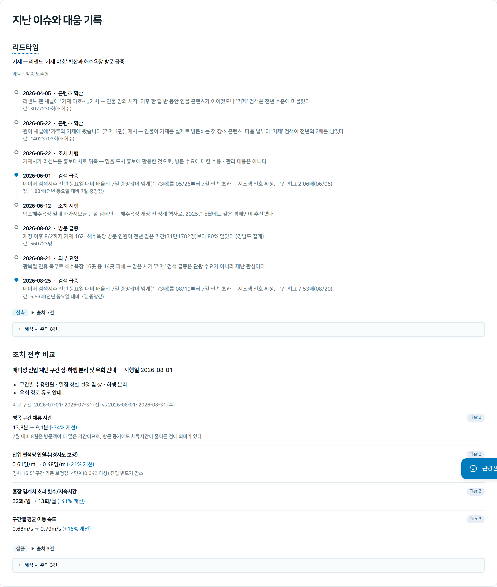
*거제 — 리드타임 + 조치 전후 비교(before_after는 목업)*

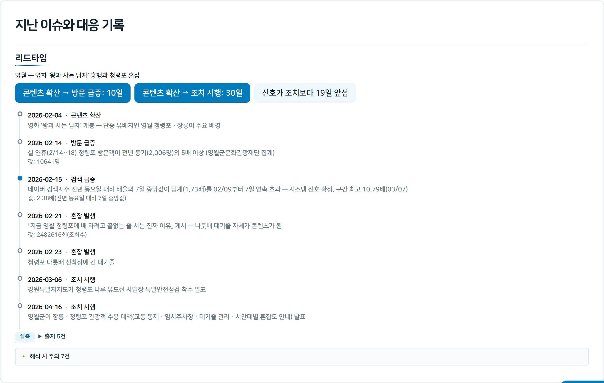
*영월 — 리드타임(before_after는 unsupported)*

### 에이전트② 콘텐츠 유형 분류 (`content_type`)

- 스크립트: `agents/agent2_apply.py`
- 프롬프트: `agents/prompts/agent2_content_type.md`(v1.2 — 09-24, "대상 지역명이 제목·설명·태그
  어디에도 없으면 관광무관으로 분류" 규칙 추가)
- 모델/프로바이더: Upstage `solar-pro3`
- 무엇을 판정하는가: 지역 관련 유튜브 영상(조회수 상위 50건)을 9종 콘텐츠 유형으로 분류하고
  신뢰도·근거·POI 언급 여부·감성을 함께 판정한다.
- 적용 범위: 여수·울릉·속초·영월·인제는 실제 LLM 호출로 생성. **거제만 09-13 이전에 사람이 직접
  판정한 `RESULTS` dict를 그대로 동결 유지**(사용자 명시적 결정).
- 상태 변화 없음 — 09-24 이후 이 계약의 로직·데이터는 추가로 바뀌지 않았다. 화면(`Area2Content`,
  `AreaDeepAnalysis`)의 데이터 소스만 이번에 전국 시군구용(`agentRegion()`) 경로로도 노출되도록
  `manifest.js`가 정리됐다(여수·울릉·속초·인제는 `content_type`이 real이지만 `checklist`/
  `precedent`는 여전히 unsupported).
- 화면: `Area2Content`(유튜브 영상 리스트) + `AreaDeepAnalysis`의 "어떤 콘텐츠가 관심을 모았나요"
  절(유형별 비중·누적 조회수·핫존/데드존 신호). 거제·영월 실측.

캡처: `geoje_area2.png`, `yeongwol_area2.png`("오늘의 지역 보고서" — 유튜브 최근 영상 + 지역
검색 추이)

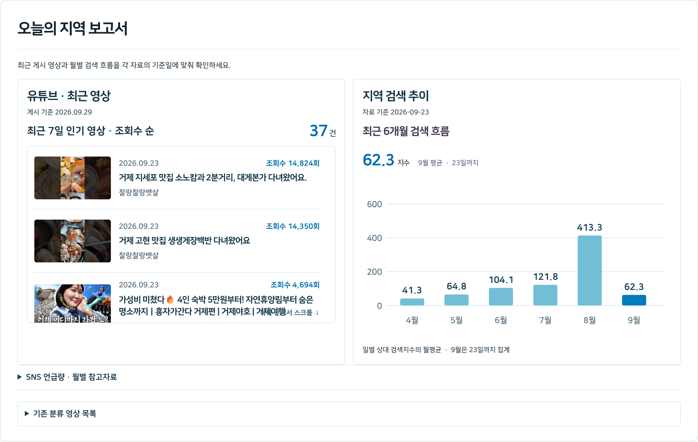
*거제 — 콘텐츠 분석(유튜브 탭), content_type LLM 분류 결과*

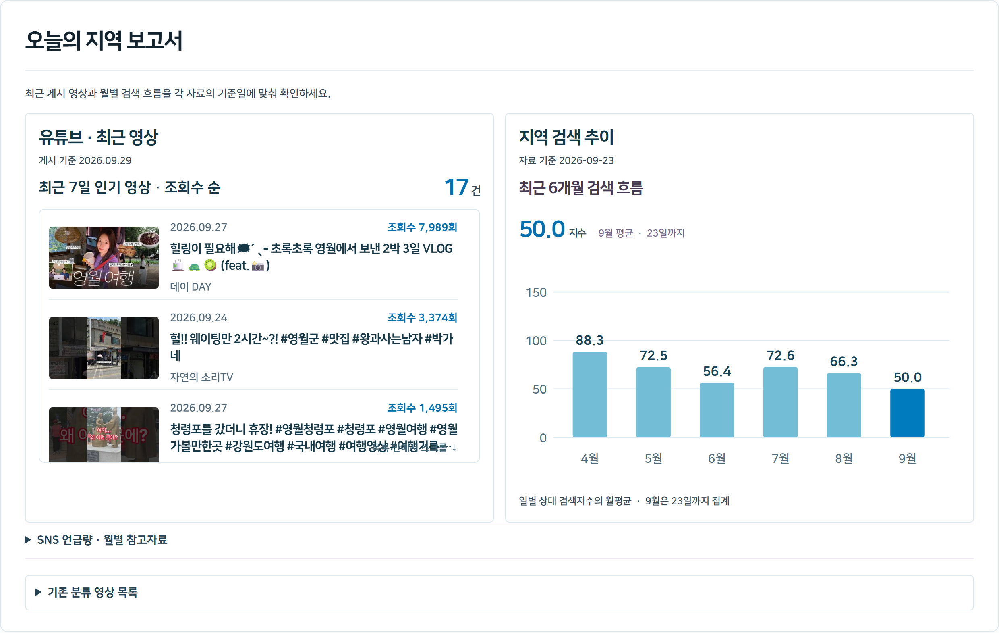
*영월 — 콘텐츠 분석(유튜브 탭), content_type LLM 분류 결과*

### 에이전트③ 매뉴얼 매칭 (`checklist`)

- 스크립트: `agents/agent3_match.py`
- 프롬프트: `agents/prompts/agent3_manual_match.md`
- 모델/프로바이더: Upstage `solar-pro3`
- **D-08 원칙**: LLM은 "이 조치가 지금 상황에 맞는가"라는 판정만 하고, 실제로 화면에 뜨는 조치
  문장·쪽수는 코드가 매뉴얼 원문에서 그대로 복사한다.
- 09-24 이후 로직 변화 없음. 다만 `checklist`가 이제 두 군데서 쓰인다 — `Area3Briefing`이
  압축 미리보기(상위 항목, `showDetails={false}`)를 보여주고, "대응 체크리스트 보기" 링크를 누르면
  `AreaPolicyReport`의 `FullChecklist`(진행률 %, 구간별 완료 수, 완료 체크 저장)로 이어진다.
  체크 상태 저장 키는 `tourism-radar-checklist:<지역>-<기준일>`(로컬스토리지, 날짜가 바뀌면 리셋).
- 화면: `Area3Briefing`(미리보기) → `AreaPolicyReport`(전체, "05 · 대응"). 거제·영월 모두 실측.

캡처: `geoje_checklist.png`, `yeongwol_checklist.png`(체크리스트 첫 구간 "사전(예보 대응)"만 —
구간당 기본 5건까지만 먼저 보여주는 컴포넌트 구조 그대로 크롭)

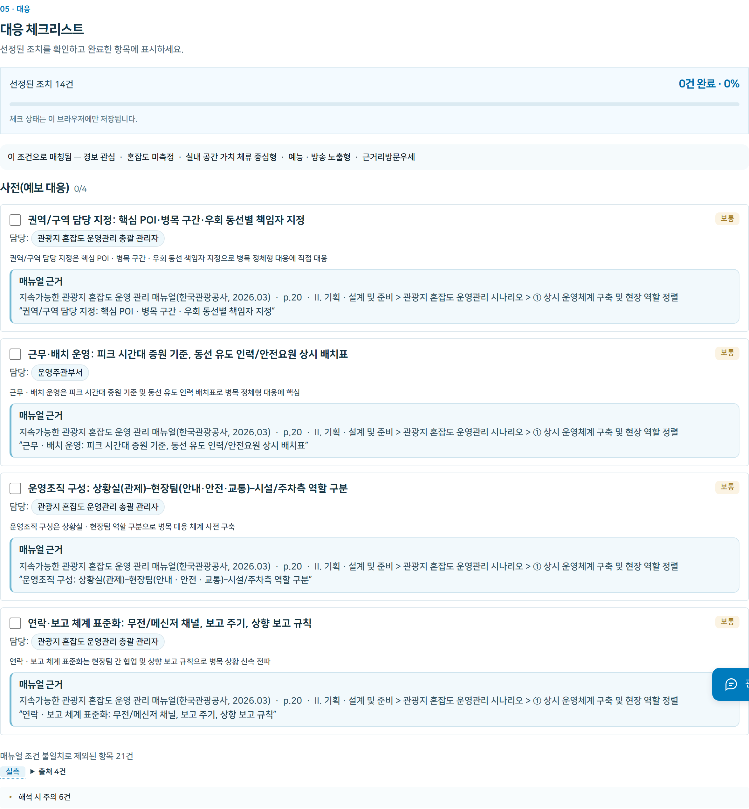
*거제 — 정책 대응 체크리스트, agent3_match.py 실측 결과*

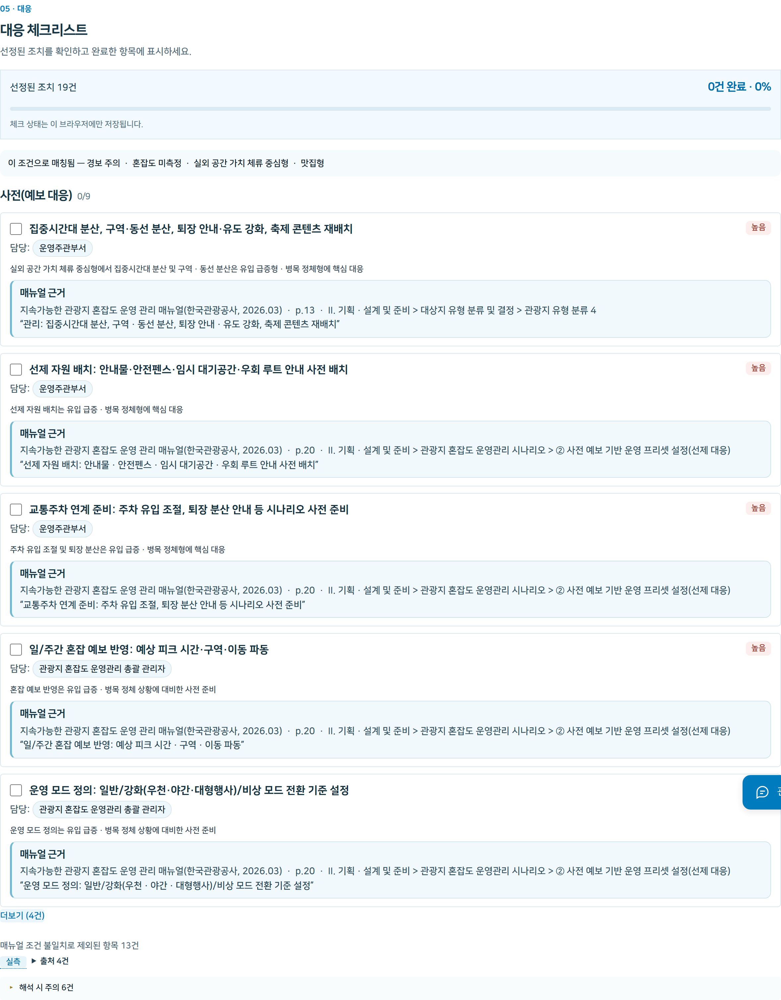
*영월 — 정책 대응 체크리스트, agent3_match.py `--region 51750` 실측 결과*

### 에이전트④ 선례 조사 (`precedent`) — 구현 완료(09-26)

- 스크립트: `agents/agent4_precedent.py` — **09-24 문서 작성 시점엔 미착수였으나 이번에 구현됨.**
- LLM 여부: **아니오** — 애초 설계는 "데이터랩 유사지역 목록 + 뉴스 검색·요약(LLM)"이었지만, 실제
  구현은 `manual/precedent_cases.json`(한국관광공사 "주요 관광지 혼잡도 측정 방안 연구 보고서"
  p.16~19에서 뽑은 사례 6건)에서 **현재 지역과 같은 공간유형인 사례를 규칙으로 골라 정렬**하는
  방식으로 바뀌었다.
- **왜 LLM을 안 쓰기로 했는가**: 사례가 6건뿐이라 "무엇을 고를까"에 판단의 여지가 거의 없다.
  LLM에 요약을 맡기면 원문에 없는 조치·성과를 지어낼 위험만 커진다. 에이전트③과 같은 원칙(D-08의
  연장) — **선택은 규칙, 문장은 원문 그대로.**
- **정직하게 적어 둔 한계**(스크립트 docstring에 그대로 있음): 이 사례들은 "어느 지역이 혼잡에
  대응해 무엇을 했고 결과가 어땠다"가 아니라 "어느 기관이 혼잡도를 이렇게 측정·분석했다"에 가깝다.
  공개된 성과 수치가 없어 전부 `outcome.measured=false`(정성 사례)다. 공간 유형은 원문에 없어
  직접 분류했고 근거를 카드마다 남긴다.
- 유사도 점수: 핫스팟 1위 공간유형 일치(0.6) + 상위 핫스팟 중 일치(0.4) + 콘텐츠 유형 일치(0.3)를
  더한 규칙 값 — 통계적 유사도 아님.
- 실행: `uv run python agents/agent4_precedent.py`(거제) / `--region 51750`(영월)
- 화면: `AreaPolicyReport`의 "유사 지역 선례 보기" 접이식(`PrecedentCards.jsx`). 거제·영월 실측
  (`_mock:false`), 나머지 4개 지역은 아직 미착수 — unsupported.

캡처: `geoje_area3_precedent.png`, `yeongwol_area3_precedent.png`("유사 지역 선례 보기"를 펼친
상태 — 매칭 조건, 사례별 유사도·조치·출처가 보인다)

*거제 — 유사 지역 선례(agent4_precedent.py), 매칭 조건: 실내 공간 가치 체류 중심형 · 예능·방송 노출형*

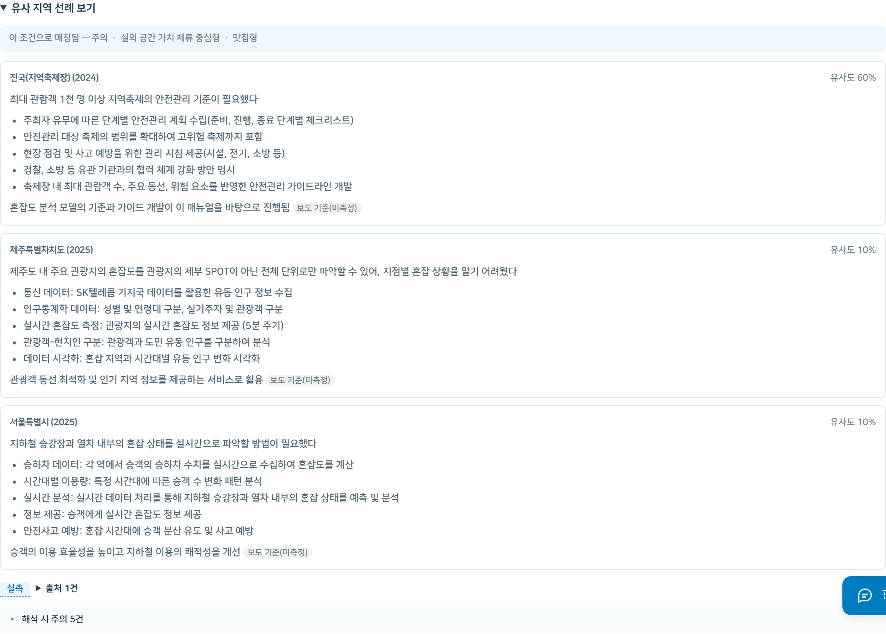
*영월 — 유사 지역 선례(agent4_precedent.py), 매칭 조건: 실외 공간 가치 체류 중심형 · 맛집형*

### 에이전트⑤ 브리핑 생성 (`briefing`, 3문단만)

- 스크립트: `agents/agent5_briefing.py`
- 프롬프트: `agents/prompts/agent5_briefing.md`
- 모델/프로바이더: Upstage `solar-pro3`
- **D-11 원칙**: 1·2문단(현재 상황 요약, 수치 나열)은 코드가 사실을 문장 틀에 꽂아 만든다. 3문단
  (우선순위 판단·사유, 30~40자)만 LLM이 쓴다 — 매일 같은 문장 틀이어야 어제와 비교되기 때문(D-04).
- **D-10 원칙**: LLM이 쓴 문장의 숫자는 코드가 facts 목록과 대조 검증한다(숫자를 지어내면
  재요청).
- **상태 변화**: 09-24 문서는 "입력 중 forecast가 mock이라 `_mock:true`"라고 적었다. **지금은
  다르다** — forecast가 09-26에 실측화되면서 `agents/agent5_briefing.py`를 재실행했고
  (`agents/runs/agent5_20260926_1612.json`), `data/prod/briefing.json`은 이제 **`_mock:false`**다.
  caveat도 forecast 목업 경고가 빠지고, 실제 출처 목록(팀 DB datalab_monthly_panel·fact_signal,
  data.go.kr 15101972, 네이버 데이터랩, YouTube Data API 등)만 남았다.
- **영월은 여전히 브리핑이 없다** — `agent5_briefing.py`가 요구하는 입력(9종 계약) 중 `checklist`·
  `forecast`·`precedent`는 영월에도 이제 다 있지만, 실행 로그가 없는 것으로 보아 아직 실행하지
  않은 상태다. `manifest.js`에도 영월 `briefing` 항목 자체가 없다 — 파일만 만들면 바로 노출된다
  (다음 작업 후보).
- 화면: `AreaPolicyReport`("06 · 보고문", `briefing.status !== "unsupported"`일 때만 렌더).
  `data/prod/briefing.json`을 정적으로 읽는다. 라이브 API 호출(`web/api/briefing.js`)은 D-04와
  상충해 폐기됨 — 실시간성이 필요해지면 이 스크립트 자체를 재실행하는 방식으로 간다.

캡처: `geoje_area3_briefing_real.png`(재캡처 — `_mock:false`로 바뀐 뒤의 화면. 옛
`geoje_area3_briefing.png`은 forecast가 아직 목업이던 시점의 캡처라 "실측" 배지 대신 목업 경고가
떠 있었다. 옛 파일은 남겨 두되 본문에는 새 캡처만 쓴다.)

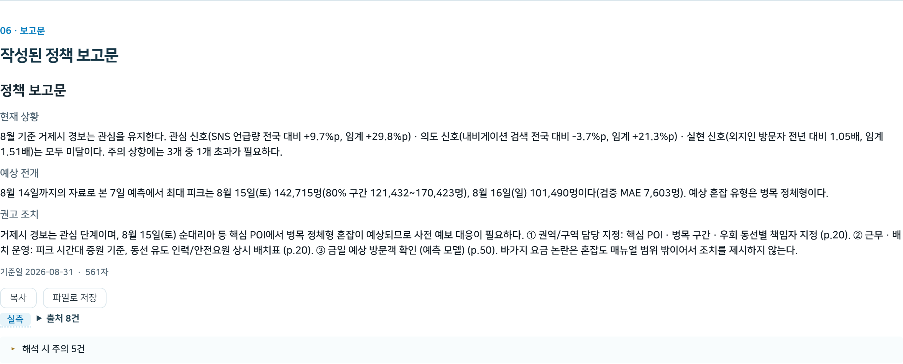
*거제 — 정책 브리핑(agent5_briefing.py), forecast 실측화 이후(09-26) 재생성된 `_mock:false` 상태*

---

## 3. 5개 에이전트에 속하지 않는 규칙 기반 스크립트

### hotspots의 spatial_type — 사람이 채운 룩업 테이블

- 스크립트: `agents/agent_hotspots.py`
- **왜 유지하는가**: 랭킹·증감률은 DB(`major_attraction_visitors_monthly`)에서 규칙으로 뽑지만,
  매뉴얼의 "관광지 유형 4분류"(공간유형)는 DB에 없는 값이라 자동 판정이 불가능하다. 지역당 상위
  10곳 내외로 규모가 작아 사람이 직접 매뉴얼 기준으로 분류하는 것이 안전하고, 발명 금지 원칙에
  따라 분류표에 없는 POI는 순위에서 제외하지 임의로 추정하지 않는다. 이 하드코딩 룩업
  (`POI_SPATIAL_TYPE`, 6개 지역 78개 POI)은 09-24 이후 변화 없음.
- 화면: `AreaDeepAnalysis`의 "어느 관광지로 몰렸나요" 절. 거제·영월 실측.

캡처: `geoje_hotspots.png`, `yeongwol_hotspots.png`(`AreaDeepAnalysis`의 "어느 관광지로 몰렸나요"
절, `HotspotRanking.jsx`)

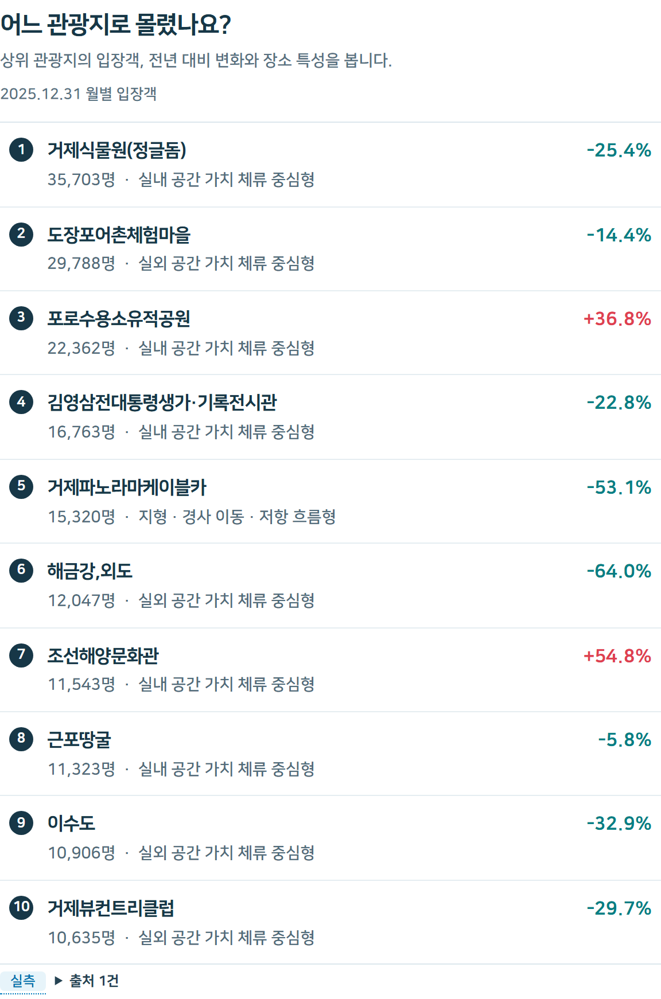
*거제 — 인기 관광지 랭킹(hotspots), spatial_type은 하드코딩 룩업*

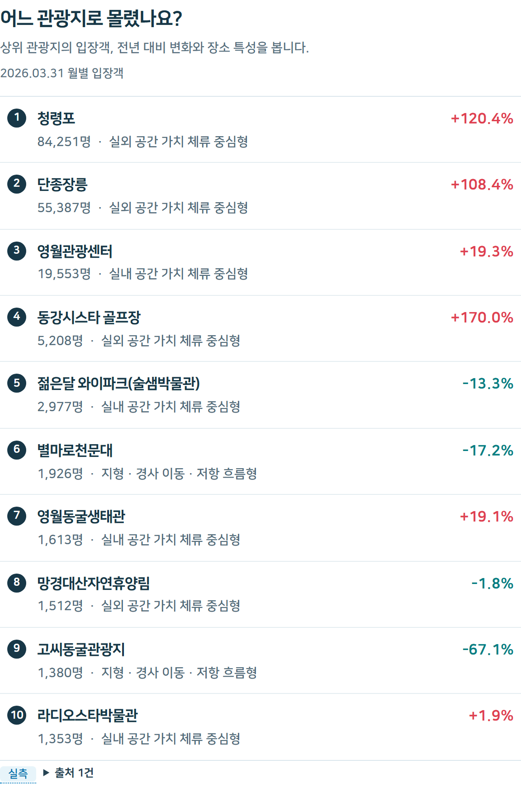
*영월 — 인기 관광지 랭킹(hotspots), spatial_type은 하드코딩 룩업*

### signal_status — 3중 교차검증 규칙 (D-13)

- 스크립트: `agents/judge_signal_status.py`
- 왜 유지하는가: SNS 언급량/내비게이션 검색건수/외지인 방문자수 세 지표를 "전년 동월(요일) 대비
  증가율이 전국 중앙값을 얼마나 초과했는가"로 계산하고, 단계적 승격 규칙(1/3 초과 시 관심→주의,
  2/3 시 주의→경계, 3/3 시 경계→심각)으로 경보 단계를 정한다 — 판정 로직 자체가 매뉴얼에 명시된
  규칙이라 LLM이 개입할 지점이 없다.
- **커버리지 확장**: 09-24 문서 작성 시점엔 사례 6곳뿐이었지만, 지금은 `data/prod/regions/`에
  전국 228개 시군구용 파일이 함께 생성돼 있다(`NATIONAL_TYPES`에 포함, `scripts/build_region_index.py`
  가 목록 관리).
- 화면: `Area0Dashboard`(상단 요약) + `AreaDeepAnalysis`의 "경보는 어떤 자료로 판정했나요" 절.
  거제·영월 모두 실측.

캡처: `geoje_signal_evidence.png`, `yeongwol_signal_evidence.png`

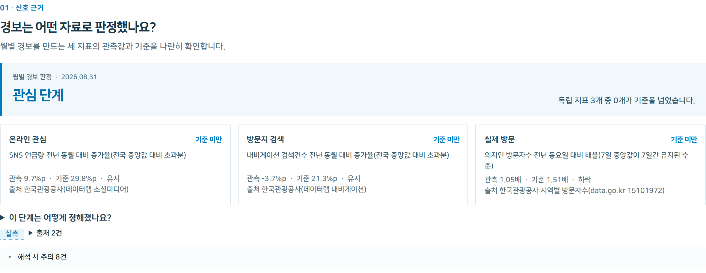
*거제 — 3중 교차검증 신호등(signal_status)*

*영월 — 3중 교차검증 신호등(signal_status)*

### visitor_profile — DB 원자료 재매핑

- 스크립트: `agents/agent_visitor_profile.py`
- 왜 유지하는가: 거주지·거리대·소비카테고리·동행유형 분포는 DB(데이터랩 방문자 통계)에 이미 있는
  값을 스키마 필드로 재매핑만 하면 되는 산술적 작업 — 판단이 필요 없다. 09-24 이후 변화 없음.
- 화면: `AreaDeepAnalysis`의 "누가 방문했나요" 절 + `Area1SignalScan`의 요약 타일. 거제·영월 실측.

### forecast · signal_series · outlook — 시계열 예측 파이프라인(신규, 09-26 실측화)

09-24 문서는 이 셋을 "별도 시계열 브랜치 진행 중, mock"으로 적었다. **지금은 완성됐다.**

- 스크립트: `analysis/src/forecast/export_forecast.py`(7일 일별 예측), `export_signal_series.py`
  (1년 통합 신호 추이 — 검색 배율·외지인 방문자를 같은 시간축에), `monthly_outlook.py`(6개월 월별
  방문객 전망), 그 아래 `build_panel.py`·`baseline.py`·`models.py`·`detect.py` 등 모델 학습 코드.
- LLM 여부: 아니오 — 학습된 시계열 모델(방법 후보를 sMAPE로 검증해 채택, 근거는
  `docs/submission/` 참고).
- 커버리지: 사례 6곳 + **전국 228개 시군구**(`data/prod/regions/`, 881개 파일 — signal_status와
  같은 전국 커버리지).
- 프론트 반영 상태는 균일하지 않다 — 7일 예측(`forecast`)만 `AreaTrendForecast`로 이미 배치돼
  있고, `signal_series`·`outlook`은 화면이 없다. §4에서 자세히.

캡처: `geoje_area1_forecast7d.png`, `yeongwol_area1_forecast7d.png`(`Area1SignalScan` 하단의
"04 · 이후 7일 방문 예측" 절 — 실측 3일 + 예측 7일을 80% 구간과 함께 보여준다)

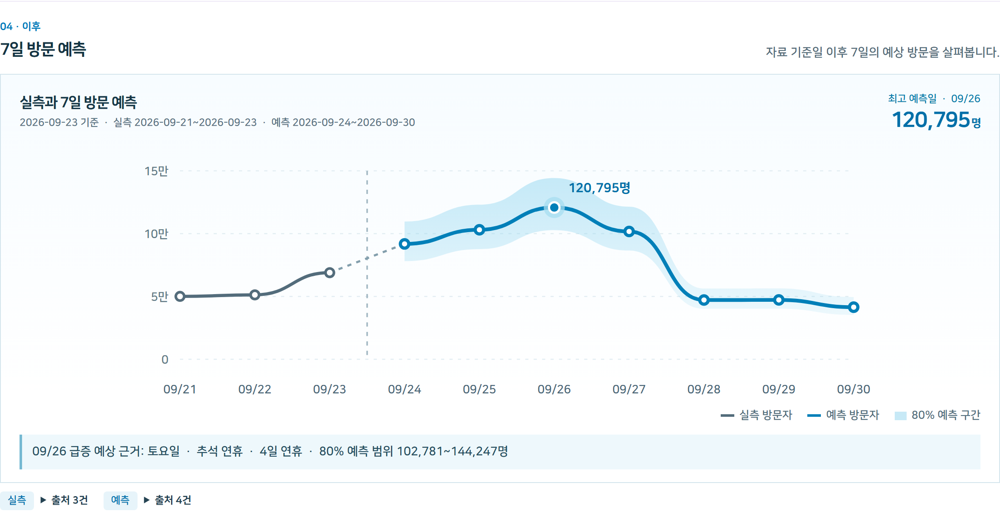
*거제 — 7일 방문 예측, 09/26(토, 추석 연휴) 최고 120,795명 예상*

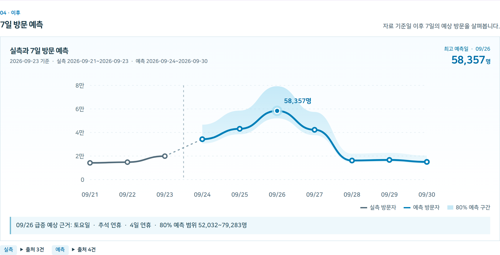
*영월 — 7일 방문 예측, 09/26(토, 추석 연휴) 최고 58,357명 예상*

---

## 4. 프론트 화면 구조 — AREA1~4 단순 모델은 더 이상 정확하지 않다

09-24 문서는 "AREA1 신호 확인 / AREA2 콘텐츠 / AREA3 정책 대응 / AREA4 성과 리포트"로 화면을
나눴다. 지금 `App.jsx`는 그보다 세분화돼 있다 — 컴포넌트 이름이 `Area1SignalScan`처럼 남아 있는
곳도 있지만, 실제 배치는 "오늘의 브리핑 → 심층 분석 보고서(방문 흐름·신호 근거·콘텐츠) → 정책
대응 → 성과 리포트" 순서다.

| 화면(페이지 컴포넌트) | `App.jsx` 섹션 id | 보여주는 것 |
|---|---|---|
| `Area0Dashboard` | `area0` | 오늘의 브리핑 — 신호 추이 차트(1주/1개월/6개월) + 오늘의 결론 |
| `Area2Content` | `area2` | 유튜브 영상 리스트("오늘의 지역 보고서") |
| `Area3Briefing` | `area3` | 대응 체크리스트 압축 미리보기("우선 대응 사항") |
| (인트로만) | `area1` | "심층 분석 보고서" 제목 + 목차 링크만, 실제 콘텐츠는 아래 3개 |
| `Area1SignalScan` | `visit-analysis` | 방문자 증가 신호 + 관광지/방문객 요약 + **`AreaTrendForecast`(7일 예측)** |
| `AreaDeepAnalysis` | (섹션별 id: `signal-evidence`, `place-analysis`, `audience-analysis`, `content-analysis`) | 신호 판정 근거, 관광지 랭킹, 방문객 구성, 콘텐츠 유형 분석 |
| `AreaPolicyReport` | `policy-report` | 체크리스트 전체, 정책 브리핑, 선례(접이식) |
| `Area4Performance` | `area4` | 리드타임 타임라인 + 조치 전후 비교 |

**`SignalTrend` 페이지는 미배치 상태다.** `web/src/pages/SignalTrend.jsx`와 그 전용 차트
컴포넌트(`components/trend/SignalTrendChart.jsx`, `OutlookChart.jsx`, `PointVsTotalChart.jsx`,
`ForecastChart.jsx`)는 1년 통합 신호 추이·관광지점 vs 시군구 총량·6개월 전망을 한 화면에 담도록
이미 완성돼 있고, 코드 안 주석("9/26 회의: 스파이크가 실제로 튀는 걸 잘 보이는 위치에")을 보면
AREA0 바로 아래에 배치할 계획이었던 것으로 보인다. 하지만 **`App.jsx`가 이 페이지를 import하지
않아 현재 어떤 경로로도 도달할 수 없다** — 데이터(`signal_series`·`outlook`)는 전국 228개
시군구까지 다 있는데 화면이 없는 상태. `forecast`(7일 예측) 부분만 별도 경로(`AreaTrendForecast`)로
`Area1SignalScan` 하단에 이미 붙어 있다.

**캡처는 넣지 않는다.** `SignalTrend`는 지금 UI에서 열 수 있는 정식 경로가 없는, 실제로는
존재하지 않는 화면이다. 확인 목적으로 `App.jsx`에 `?trendPreview=1` 임시 분기를 넣어 렌더된
모습을 본 적은 있지만(코드는 확인 직후 원상 복구, `git diff` 무변화 확인 완료), 그 캡처를 이
문서에 신지는 않는다 — "지금 배포된 UI 화면"이 아닌 것을 다른 실측 캡처와 나란히 두면 어느 게
실제로 떠 있는 화면인지 헷갈리기 때문이다. 화면이 생기면 그때 실측 캡처로 채운다.

---

## 5. 아직 목업만 있는 것

| 계약 | 상태 | 비고 |
|---|---|---|
| before_after (조치 전후 비교) | 목업 | `data/mock/before_after.json`만 존재, 거제만 목업으로 노출(`Area4Performance`), 나머지 5개 지역은 unsupported. LLM 계획 없음(산술 비교) — 비교 기준이 될 "전후 사건" 자체가 여전히 미정 |
| briefing (영월) | 없음 | 입력 9종은 이제 다 갖췄지만(checklist·forecast·precedent 포함) 아직 `agent5_briefing.py --region 51750`을 실행한 적이 없다. `manifest.js`에도 항목이 없다 — 실행하고 파일만 드롭하면 바로 노출된다 |
| checklist · precedent · briefing (여수·울릉·속초·인제) | 미착수 | 이 4개 지역은 `signal_status`·`timeline`·`hotspots`·`visitor_profile`·`content_type`·`forecast`·`signal_series`·`outlook` 8종은 실측인데, 매뉴얼 매칭·선례·브리핑 3종은 아직 실행하지 않았다 |

---

## 부록 — 캡처 전체 목록

`docs/meeting-notes/UI/screenshots/`(총 14장, 전부 이번 갱신에서 09-30 Playwright로 새로 찍은
것 — 09-24/25 옛 캡처는 지금 코드와 어긋나 전량 삭제했다. 뷰포트 1440×1000·2배 해상도. 전부
지금 배포된 UI에서 실제로 열리는 화면만 찍었다 — `SignalTrend`처럼 미배치 상태인 화면은 캡처를
남기지 않는다(§4). 별도 `readme/` 하위 폴더는 루트 `README.md`용으로 같은 방식으로 찍은 캡처라
이 문서와는 무관하다):

- `{geoje,yeongwol}_area0.png` — 관제 대시보드(`Area0Dashboard`) 전체
- `{geoje,yeongwol}_area2.png` — 콘텐츠 분석(`Area2Content`, "오늘의 지역 보고서") 전체
- `{geoje,yeongwol}_signal_evidence.png` — 신호 판정 근거(`AreaDeepAnalysis` "경보는 어떤 자료로
  판정했나요")
- `{geoje,yeongwol}_hotspots.png` — 인기 관광지 랭킹(`AreaDeepAnalysis` "어느 관광지로 몰렸나요")
- `{geoje,yeongwol}_checklist.png` — 대응 체크리스트 첫 구간(`AreaPolicyReport`, 사전(예보 대응)만)
- `{geoje,yeongwol}_area4.png` — 성과 리포트(`Area4Performance`, 리드타임 + 조치 전후 비교) 전체
- `{geoje,yeongwol}_area1_forecast7d.png` — 7일 방문 예측 차트(`AreaTrendForecast`)
- `{geoje,yeongwol}_area3_precedent.png` — 유사 지역 선례 카드(펼친 상태)
- `geoje_area3_briefing_real.png` — `_mock:false`로 바뀐 뒤의 정책 브리핑

캡처 시 공통으로 처리한 것: 접속 시 첫 방문 사용법 투어가 뜨지 않도록
`localStorage.guideTourSeen`을 미리 채웠고, 헤더의 접근성 스킵링크(`.skip-link`, 평소
`top:-80px`로 화면 밖에 있다가 포커스를 받으면 `top:10px`로 튀어나오는 요소)가 DOM 조작 이후
간헐적으로 포커스를 받아 캡처에 끼어드는 문제가 있어, 매 캡처 직전 `top:-999px`로 강제 고정해
제거했다.

본문에 넣지 않은 AREA0(관제 대시보드)·AREA4(성과 리포트) 전체 캡처:

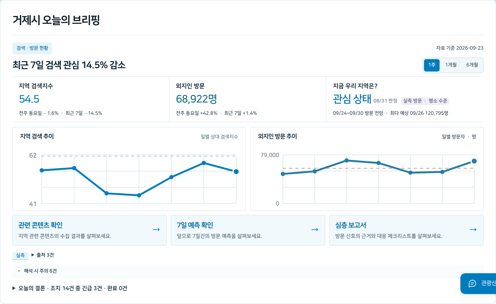
*거제 — 관제 대시보드*

*영월 — 관제 대시보드*
