# [참고자료] 미리봄 결과보고서 — 부록

> 작성 2026-09-30 · 서식4 참고자료(2. 사이트 사용법)의 최신화 + 신규 부록(성과 창출 사례 2건)
> 화면 캡처는 실제 배포 화면(`localhost:5173`, 뷰포트 1280×1000)에서 직접 캡처했다. 이미지 경로는 프로젝트 루트 기준 `docs/appendix-screenshots/{영월군=yeongwol, 거제시=geoje}/파일명`이다.
> 수치·문장은 `docs/확정수치_0924.md`·`docs/사례_영월_거제_0924.md`·`docs/submission/서식4_초안_0924.md`와 대조해 그 문서들이 명시한 "쓸 수 없는 문장"을 피했다. 화면에 그대로 뜨는 수치는 스크린샷을 출처로 삼았다.
> **그림 배치**: 본문(사이트 사용법)은 〈그림 1〉~〈그림 11〉, 부록 A는 〈그림 A-1〉~〈그림 A-6〉, 부록 B는 〈그림 B-1〉~〈그림 B-3〉으로 각각 별도 번호를 매겼다. 같은 화면이 본문과 부록에서 다른 목적으로 다시 쓰이는 경우 캡션에 "(그림 N과 동일 화면)"으로 표시했다 — 한글 파일로 옮길 때 그림 번호만 그대로 유지하면 된다.

---

## 1. 사이트 사용법 — "미리봄" 웹 대시보드

> 아래 본문은 기존 참고자료와 같은 문체로 다시 써서 바로 복사/붙여넣기할 수 있게 한 것이다. **문장·구조는 그대로 두고, 사실이 달라진 부분만 고쳤다**: ① 서비스명(관광레이더→미리봄) ② 챗봇 이름·위치("지역 상황 물어보기"→화면 우측 하단 고정 버튼 "관광신호 도우미") ③ AREA1의 예측 그래프 기간(90일 예측 그래프→실제로는 7일 방문 예측 그래프이며, 90일 그래프는 신호 추이 쪽이다) ④ AREA2의 탭 구조(3개 탭→탭이 아닌 단일 흐름) ⑤ AREA3 체크리스트 시간대(4단계→비상 대응이 추가된 5단계) ⑥ AREA4의 전후비교 서술(영월군은 리드타임만 실측이고, 전후비교 패널 자체가 아직 없다 — 화면 캡처로 직접 확인했다). 그 외 문장은 손대지 않았다.

"미리봄"은 지역을 하나 선택하면 화면 전체가 그 지역 기준으로 바뀌는 단일 대시보드입니다. 상단 지역 검색창으로 지역을 바꾸면 AREA 0~4 다섯 개 화면이 모두 같은 지역 데이터로 갈아타며, '감지 → 원인 분석 → 대응 → 성과'의 흐름을 하나의 화면 안에서 위에서 아래로 따라가도록 구성했습니다. 화면의 모든 수치에는 실측·샘플·목업 배지와 출처가 함께 표시되어, 어떤 수치가 실제 데이터에 기반했고 어떤 수치가 아직 준비 중인지 이용자가 스스로 구분할 수 있습니다.

**AREA0. 이슈 브리핑(오늘의 브리핑)**

지역을 선택하면 가장 먼저 보이는 화면입니다. 지역 검색지수와 외지인 방문자 수를 전주 대비 수치와 함께 보여주고, 그 아래 일별 검색 추이·일별 방문 추이 그래프가 나란히 붙습니다(1주·1개월·6개월 범위를 고를 수 있습니다). "지금 우리 지역은?" 배지는 관심·의도·실현 3중 신호를 종합해 현재 지역이 어느 경보 단계에 있는지를 보여주고, 맨 아래 "오늘의 결론"에는 발동된 조치 건수와 상위 조치가 요약됩니다. 자연어로 질문할 수 있는 챗봇("관광신호 도우미")은 이 화면 안이 아니라 서비스 전체에서 화면 오른쪽 아래에 항상 떠 있는 버튼으로 제공되며, "이번 주말 방문객 얼마나 예상돼?" 같은 자유 질문을 입력하면 다른 화면들의 실측 수치를 근거로 답변합니다.

| 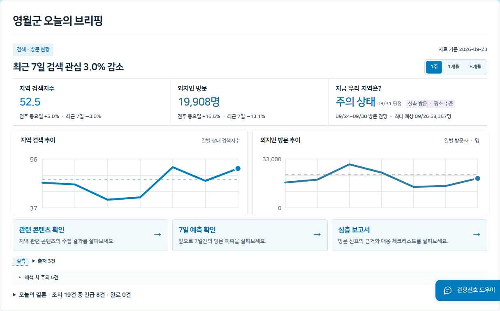 |
| :---: |
| **〈그림 1〉 이슈 브리핑 — 오늘의 브리핑 화면(영월군)** |
| 지역 검색지수·외지인 방문자 수와 "지금 우리 지역은?" 경보 배지, 일별 그래프, "오늘의 결론" 요약을 한 화면에서 확인할 수 있다. |

| 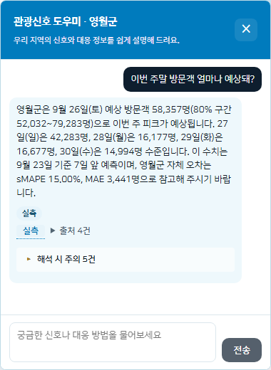 |
| :---: |
| **〈그림 2〉 관광신호 도우미 — 자연어 질의응답 실제 화면(영월군)** |
| 본문에서 예시로 든 질문 "이번 주말 방문객 얼마나 예상돼?"를 실제로 입력한 결과다. 9/23 기준 7일 앞 예측(9/26 토요일 58,357명 · 80% 구간 52,032~79,283명 등 요일별 수치)을 근거로 답하고, 하단에 "실측" 출처 배지와 "해석 시 주의" 항목이 함께 붙는다. |

**AREA1. 심층 분석**

'관심(SNS언급량)·의도(내비게이션 검색)·실현(방문자수)' 3중 교차검증 판정이 이 화면의 중심 요소입니다. 세 신호가 각각 임계치를 넘었는지를 보여주고, 이어서 방문자 증가 신호, 인기 관광지 랭킹, 방문객 프로파일(성/연령·거주지·동반유형 등) 요약, 7일 방문 예측 그래프가 순서대로 배치되어 있습니다. 지역별로 준비된 데이터 범위가 달라, 실측 데이터가 있는 지역은 판정·예측 그래프가 실제 값으로 채워지고, 아직 데이터가 없는 지역은 "forecast 데이터가 준비되지 않았습니다" 같은 안내 문구로 대체됩니다.

| 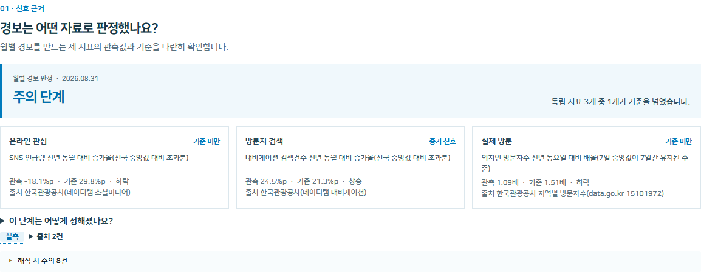 |
| :---: |
| **〈그림 3〉 신호 근거 — 3중 교차검증 판정 화면(영월군)** |
| 온라인 관심·방문지 검색·실제 방문 세 지표의 관측값·기준·초과 여부를 나란히 보여준다. |

| 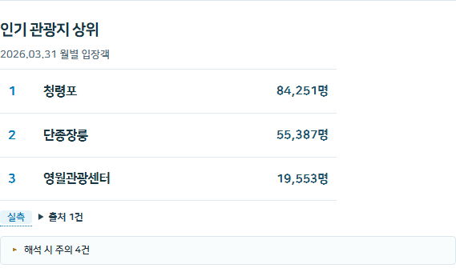 |
| :---: |
| **〈그림 4〉 방문자 증가 신호 화면(영월군)** |
| 전년 같은 요일 대비 방문 배율의 7일 중앙값이 기준을 며칠 연속 넘었는지를 보여준다. |

| 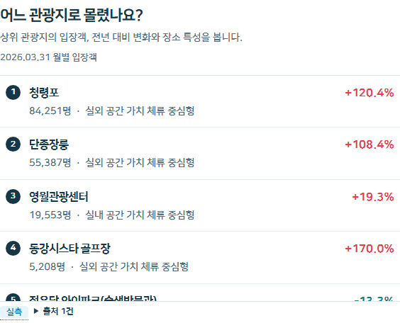 |
| :---: |
| **〈그림 5〉 인기 관광지 상위 랭킹 화면(영월군)** |
| 관광지별 월 입장객과 전월 대비 증감률을 순위별로 보여준다. |

| 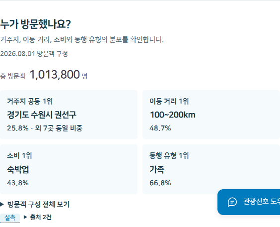 |
| :---: |
| **〈그림 6〉 방문객 구성 화면(영월군)** |
| 성/연령, 거주지, 동반유형 등 방문객 프로파일 상위 항목을 보여준다. |

| 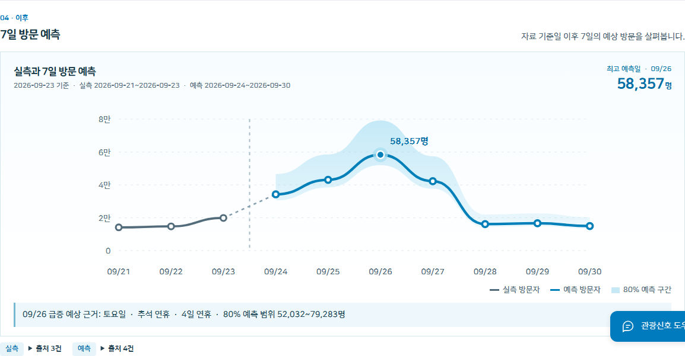 |
| :---: |
| **〈그림 7〉 7일 방문 예측 그래프(영월군)** |
| 실측치에 이어지는 7일 예측치와 80% 예측 구간을 보여주며, 그래프에 마우스를 올리면 날짜별 수치가 표시된다. |

**AREA2. 관련 콘텐츠**

관광객 급증의 콘텐츠적 원인을 보여주는 화면으로, 최근 유튜브 영상 → 일별 검색 요약 → SNS 언급량 월별 참고자료 → 기존 분류 영상 목록이 순서대로 이어지는 하나의 흐름입니다. 콘텐츠 원본 데이터가 충분히 쌓인 지역은 실제 영상 카드가 나열되고, 아직 콘텐츠 수집이 부족한 지역은 대체 안내로 표시됩니다.

| 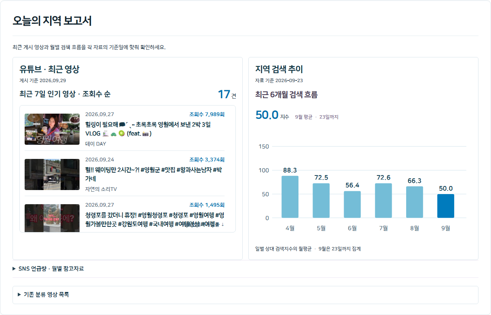 |
| :---: |
| **〈그림 8〉 관련 콘텐츠 — 오늘의 지역 보고서 화면(영월군)** |
| 최근 유튜브 영상, 검색 요약, SNS 언급량 참고자료가 한 흐름으로 이어진다. |

**AREA3. 대응 준비**

관광지 안전사고 예방을 위한 실무 화면입니다. 한국관광공사 공식 매뉴얼에서 그대로 가져온 조치 항목을 사전(예보 대응)·오전(준비)·운영 중(모니터링)·비상 대응·마감(평가) 다섯 개 시간대로 나눠 체크리스트("정책 대응") 형태로 제공하고, 유사 선례와 AI가 작성한 브리핑 초안도 함께 보여줍니다. 조치 문장은 모두 매뉴얼 원문에서 그대로 가져와, AI가 임의로 정책을 만들어내지 않도록 설계했습니다. 혼잡도를 실측할 조건이 없는 현장 조치는 별도 상태로 표시해, 검색 신호 같은 선행 지표만으로 조치가 발동되는 오권고를 막습니다.

| 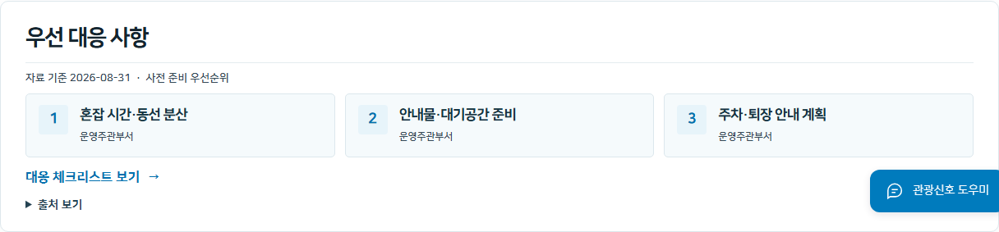 |
| :---: |
| **〈그림 9〉 대응 준비 — 우선 대응 사항 요약 화면(영월군)** |
| 우선순위 상위 3개 조치를 요약 카드로 보여주며, 전체 체크리스트로 이동할 수 있다. |

| 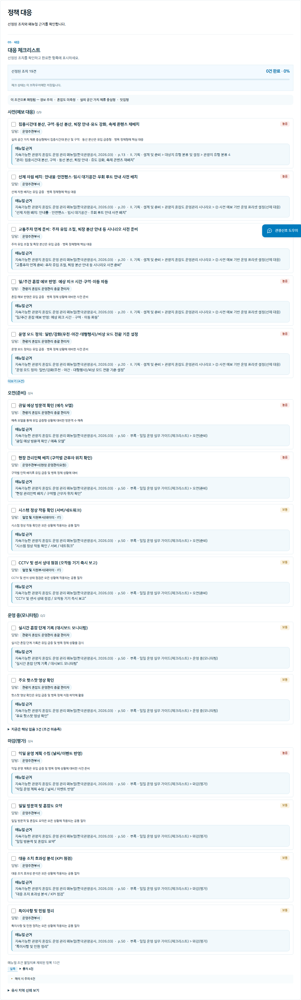 |
| :---: |
| **〈그림 10〉 정책 대응 — 전체 체크리스트 화면(영월군)** |
| 사전·오전·운영 중·마감 단계별 조치와 담당, 매뉴얼 원문 인용을 함께 제시한다. |

**AREA4. 대응 기록**

조치의 효과를 사후에 확인하는 화면입니다. 검색 신호가 뜬 시점부터 실제 행정조치까지 걸린 기간을 리드타임 타임라인으로 보여주고, 조치 전후 방문객·검색량 변화를 비교하는 패널이 있는 지역은 그 아래에 이어집니다. 영월군은 이 중 리드타임 타임라인이 실측 데이터를 기준으로 채워져 있습니다(전후비교 패널은 영월군에 아직 없고, 거제시는 목업 데이터로 표시됩니다).

| 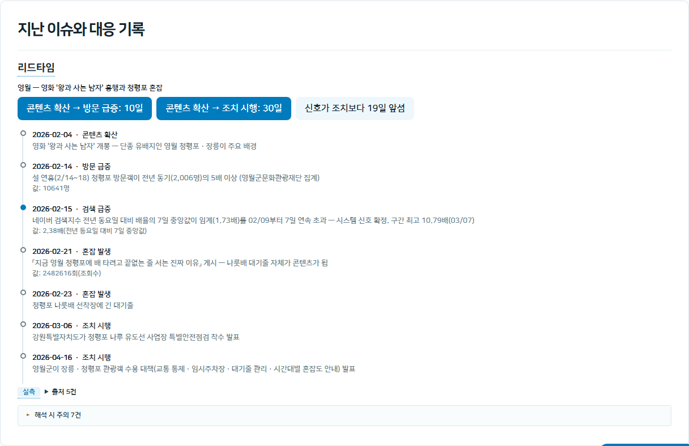 |
| :---: |
| **〈그림 11〉 대응 기록 — 리드타임 타임라인 화면(영월군)** |
| 콘텐츠 확산부터 검색 신호 확정, 첫 행정 조치까지의 과정을 이벤트별로 정리해 보여준다. |

**화면을 관통하는 설계 원칙**

다섯 화면은 개별 기능이 아니라 하나의 조기경보 흐름으로 이어지도록 설계했습니다. AREA0에서 이상 여부를 감지하면, AREA1~2에서 그 원인(어떤 신호가, 어떤 콘텐츠 때문에)을 분석하고, AREA3에서 매뉴얼 근거로 대응하고, AREA4에서 그 대응의 성과를 되짚어보는 순서입니다. 모바일(375px 폭 기준)에서도 카드·그래프·타임라인이 한 컬럼으로 쌓여 데스크톱과 동일한 흐름으로 볼 수 있습니다.

---

## 부록. 미리봄으로 실제 성과를 확인한 사례 2건

> 두 사례 모두 **과거 데이터를 미리봄 화면에 그대로 띄워 재현한 백테스트**이며, 실제 운영 중 조치가 아니다. 이 점은 화면 하단 "실측/목업" 배지와 캡션에도 그대로 노출된다. 인용 규칙은 `docs/사례_영월_거제_0924.md`를 따랐다 — 언론 인용 수치는 반드시 "보도 인용"으로 표기하고, 미리봄 분석 결과와 섞어 쓰지 않는다.

### 부록 A. 영월군 — 검색 신호가 행정 조치보다 19일 앞선 사례

**시나리오** 2026년 2월, 영월군 관광 담당자가 미리봄으로 지역 현황을 확인하는 상황을 가정한다. 사흘 전(2/4) 개봉한 영화 《왕과 사는 남자》가 흥행 중이고, 극 중 단종의 유배지인 청령포·장릉이 배경지로 알려지기 시작한 시점이다. 아래는 담당자가 미리봄 화면을 순서대로 따라가며 이상을 포착하고, 원인을 확인하고, 대응 조치를 준비해 실제 행정 대응보다 앞선 결과를 얻기까지의 과정이다.

**진행 과정**

**① 이슈 브리핑에서 이상 신호를 먼저 포착한다.** 담당자가 오늘의 브리핑을 열면 "지역 검색 추이" 그래프가 평소보다 눈에 띄게 튀어 있다. 네이버 검색지수가 전년 동요일 대비 7일 중앙값 기준 임계(1.73배)를 2월 9일부터 7일 연속 넘어, **2월 15일에 시스템 신호가 확정**된다(구간 최고 10.79배, 3/7). 이 시점 외지인 방문자 총량은 아직 뚜렷하게 움직이지 않은 상태다.

|  |
| :---: |
| **〈그림 A-1〉 검색 급증 신호 확정 기록(2026-02-15)** |
| 리드타임 타임라인의 "검색 급증" 이벤트 — 값 2.38배(전년 동요일 대비 7일 중앙값), 구간 최고 10.79배(3/7). (〈그림 11〉과 동일 화면, 타임라인의 첫 신호 이벤트를 재인용) |

**② 심층 분석 · 신호 근거에서 교차검증한다.** 온라인 관심(SNS 언급량)·방문지 검색(내비게이션)·실제 방문(외지인 방문자 배율) 3개 지표를 나란히 확인하면, 방문자 배율은 급증 임계(1.51배)를 7일 연속이라는 지속 조건만큼 채우지 못해 여전히 "기준 미만"이다. 즉 **총량만 봐서는 아직 이상 신호가 뚜렷하지 않다** — 검색 신호가 먼저 움직였다는 것을 이 화면에서 바로 대조할 수 있다.

|  |
| :---: |
| **〈그림 A-2〉 3중 교차검증 — 시군구 총량 기준 미달 확인** |
| 실제 방문 지표가 "기준 미달"로 표시된다. (〈그림 3〉과 동일 화면, "총량은 아직 안 움직였다"는 2단계 근거로 재인용) |

**③ 관광지 랭킹에서 쏠림이 일어난 지점을 특정한다.** "어느 관광지로 몰렸나요"를 열면 청령포·단종장릉이 나란히 1·2위다(2026년 3월 기준 청령포 84,251명 · 전월 대비 +120.4%, 단종장릉 55,387명 · +108.4%). 시군구 총량은 평온해 보여도, 담당자는 이 화면 하나로 **어디에 인력을 배치해야 하는지**를 바로 알 수 있다.

|  |
| :---: |
| **〈그림 A-3〉 관광지 단위 쏠림 확인 — 청령포·단종장릉 1·2위** |
| 청령포 84,251명(+120.4%), 단종장릉 55,387명(+108.4%). (〈그림 5〉와 동일 화면, 쏠림 지점 특정 근거로 재인용) |

**④ 대응 준비에서 매뉴얼 조치를 그대로 확인한다.** 판정 결과가 매뉴얼 조치와 자동으로 매칭되어 "혼잡 시간·동선 분산", "안내물·대기공간 준비", "주차·퇴장 안내 계획" 등 19건이 우선순위와 함께 뜬다. 각 항목에는 매뉴얼 원문 인용이 붙어, 담당자가 매뉴얼을 처음부터 뒤질 필요 없이 바로 조치에 들어갈 수 있다.

|  |
| :---: |
| **〈그림 A-4〉 매뉴얼 조치 자동 매칭 — 우선 대응 사항** |
| "혼잡 시간·동선 분산" 등 상위 3개 조치 요약. (〈그림 9〉와 동일 화면) |

|  |
| :---: |
| **〈그림 A-5〉 매뉴얼 원문 인용이 붙은 전체 체크리스트(19건)** |
| 담당·매뉴얼 근거 인용이 항목마다 표시된다. (〈그림 10〉과 동일 화면) |

**⑤ 대응 기록에서 실제로 얼마나 앞섰는지 확인한다.** 실제 역사에서 첫 행정 조치(강원특별자치도의 청령포 나루 유도선 안전점검)는 3월 6일에야 나왔다. 미리봄의 신호 확정일(2/15)과 비교하면 **19일의 격차**가 리드타임 타임라인에 그대로 집계된다. 4월 16일에는 영월군이 교통 통제·임시주차장·대기줄 관리를 포함한 종합 수용 대책을 추가로 발표했는데, 미리봄 기준으로는 60일이 더 지난 뒤였다.

|  |
| :---: |
| **〈그림 A-6〉 "신호가 조치보다 19일 앞섬" 최종 집계** |
| 타임라인 상단 배지에 리드타임이 요약 집계된다. (〈그림 11〉·〈그림 A-1〉과 동일 화면, 최종 성과 지표로 재인용) |

**성과** ②단계에서 검색 신호가 확정된 시점부터 실제 첫 행정 조치까지 **19일의 시간차**가 이 진행 과정 전체를 통해 정량적으로 확인된다. 다만 신호 확정일(2/15)은 설 연휴 청령포 혼잡(2/14~18)과 같은 시기이므로, 미리봄이 벌어준 시간은 "혼잡보다 먼저"가 아니라 **"실제 첫 행정 조치보다 먼저"**로만 서술한다. 또한 시군구 총량 기준으로는 이 사례가 "급증"으로 분류되지 않는다는 점(②단계에서 확인) 자체가, 미리봄이 "시군구 총량이 아니라 관광지 단위·다중 신호로 봐야 한다"고 주장하는 근거가 된다.

### 부록 B. 거제시 — 시군구 총량은 평탄한데 검색 신호는 뚜렷했던 사례

**시나리오** 2026년 여름, 거제시 관광 담당자가 미리봄으로 지역 현황을 점검하는 상황을 가정한다. 시군구 단위 통계만 보던 기존 방식으로는 "올해도 예년과 비슷하다"고 넘겼을 시기지만, 미리봄은 같은 화면 안에서 검색과 총량을 나란히 보여줘 다른 판단을 가능하게 한다.

**진행 과정**

**① 이슈 브리핑에서 검색과 방문을 한 화면에 놓고 본다.** 오늘의 브리핑을 6개월 범위로 넓혀 보면, "지역 검색 추이" 그래프는 8월 21일에 전년 동요일 대비 335.0(평소 40 안팎)까지 치솟는 고립된 스파이크를 보여주는 반면, 바로 옆 "외지인 방문 추이" 그래프는 같은 기간 내내 평소와 다를 것 없는 주간 등락을 유지한다. **검색은 튀었는데 총량은 흔들리지 않은 것**이 한 화면에서 바로 대비된다 — 시군구 총량만 봤다면 놓쳤을 신호다.

| 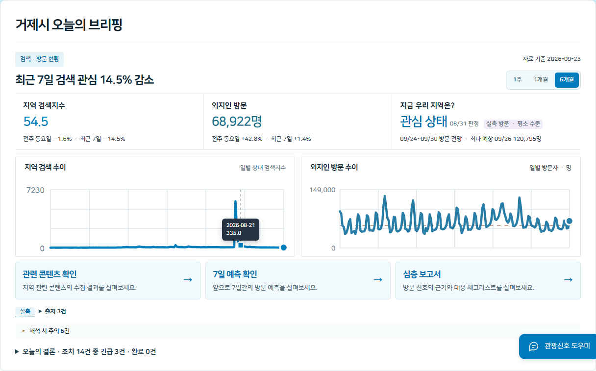 |
| :---: |
| **〈그림 B-1〉 검색 스파이크(335.0, 8/21) vs 방문자 총량 평탄 대비(거제시, 6개월)** |
| 같은 화면 좌우에서 "지역 검색 추이"와 "외지인 방문 추이"를 나란히 대비해 보여준다. |

**② 심층 분석 · 신호 근거에서 총량 판정을 재확인한다.** 2026년 8월 31일 기준 온라인 관심·방문지 검색·실제 방문 3개 지표 모두 "기준 미만"으로 판정돼 있다. 월 단위 경보로는 거제가 계속 "관심" 단계에 머무른다 — ①단계에서 본 검색 스파이크가 이 월별 판정에는 반영되지 않았다는 것을 담당자가 바로 알 수 있다.

| 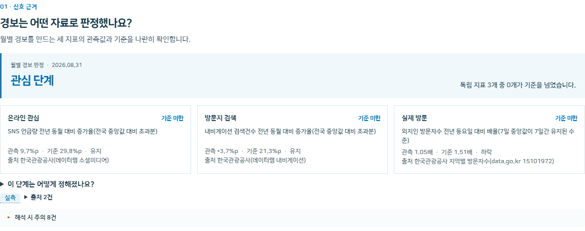 |
| :---: |
| **〈그림 B-2〉 3중 교차검증 — 3개 지표 전부 "기준 미만"(거제시)** |
| 2026-08-31 기준 월별 경보 판정이 "관심" 단계에 머물러 있다. |

**③ 관광지 랭킹에서 데이터 공백을 발견한다.** 검색 스파이크가 실제로 어느 관광지에 몰렸는지 확인하려고 "어느 관광지로 몰렸나요"를 열면, 2025년 12월 31일 기준 겨울철 데이터(거제식물원·도장포어촌체험마을 등)만 떠 있다. 2026년 여름 관광지별 입장객 통계가 아직 팀 DB에 없어서다 — 미리봄 화면만으로는 여기서 막힌다.

| 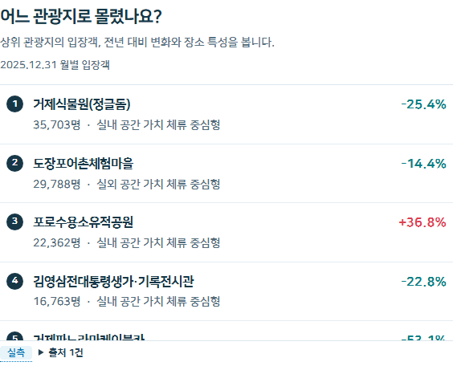 |
| :---: |
| **〈그림 B-3〉 관광지 단위 데이터 공백 — 2025년 12월 데이터만 표시(거제시)** |
| 2026년 여름 관광지별 입장객 통계가 없어, 검색 스파이크가 어디로 쏠렸는지는 이 화면만으로 확인할 수 없다. |

**④ 언론 보도로 교차검증해 공백을 메운다.** 실제로는 2026년 8월 2일까지 거제 해수욕장 16곳 이용객이 56만 723명으로 전년 동기(31만 1,782명) 대비 **+80%** 늘어 이미 작년 한 해 전체 실적(55만 884명)을 넘어섰다(경상남도 집계, 서울경제 2026.8.8 보도 인용). 덕포해수욕장은 유튜브 콘텐츠(아이돌 그룹 멤버의 방문 영상) 배경으로 알려지며 명소가 됐고, 여차·함목해수욕장은 SNS로 스노클링 명소로 퍼져 예년 대비 최대 3배로 붐볐다. 같은 보도는 6/30~7/25 거제 강수량이 평년의 17.6%에 그친 마른장마도 핵심 동력으로 함께 지목했다 — 그래서 이 사례는 콘텐츠 효과 단독이 아니라 **광역 기상 요인 위에 콘텐츠 효과가 얹힌 사례**로 서술한다. (이 단계는 미리봄 화면이 아닌 언론 보도 인용이므로 별도 그림 번호를 붙이지 않는다.)

**성과** ①단계의 검색 스파이크와 ④단계의 언론 보도(+80%)를 이어보면, 미리봄이 시군구 총량 판정만으로는 놓쳤을 이상을 **일별 검색 신호로 먼저 짚어냈다는 것**이 이 사례의 성과다. 동시에 ③단계에서 드러난 공백 — 관광지 단위 2026년 데이터가 없어 미리봄 화면만으로는 어디로 쏠렸는지 확인할 수 없었다는 것 — 은 한계가 아니라 다음 제언의 근거가 된다. 거제시는 이미 주요 관광지 46곳·해수욕장 16곳의 입장객을 자체 집계하고 있다(거제신문 2019.10.7 보도) — 새 데이터를 만들 필요 없이, 이미 있는 이 집계를 미리봄의 감시 지표로 연결하기만 하면 이번에 확인된 공백이 메워진다.

### 두 사례가 함께 보여주는 것

| | 영월군 | 거제시 |
| --- | --- | --- |
| 미리봄이 잡아낸 것 | 검색 신호(일별) + 관광지 단위 입장객 급증 | 검색 신호(일별) — 관광지 단위는 2026년 데이터 없음 |
| 시군구 총량 판정 | 급증 임계 미달("기준 미만") | 3개 지표 전부 "기준 미만" |
| 실제로 확인된 성과 | 신호 확정이 첫 행정 조치보다 **19일** 앞섬 | 검색 스파이크(335.0)와 총량 평탄이 **같은 화면에서 대비** 확인됨 |
| 근거 성격 | 미리봄 분석 결과(팀 DB 실측) | 미리봄 화면(검색·총량) + 언론 보도 인용(해수욕장 이용객) 교차검증 |

두 사례 모두 "시군구 총량만 보는 감시로는 이 변화를 놓치거나 늦게 알아챈다"는 같은 결론으로 수렴한다. 다만 이는 두 파일럿 지역의 결과이며, 전체 지역에 적용했을 때의 평균적인 성능으로 일반화하지 않는다.

---

## 그림 목록 (한글 문서 삽입 시 대조용)

| 그림 번호 | 파일 | 지역 |
| --- | --- | --- |
| 그림 1 | `yeongwol/02-area0-이슈브리핑.png` | 영월군 |
| 그림 2 | `yeongwol/01b-chatbot-질의응답.png` | 영월군 |
| 그림 3 | `yeongwol/08-신호근거-3중교차검증.png` | 영월군 |
| 그림 4 | `yeongwol/06-방문자증가신호.png` | 영월군 |
| 그림 5 | `yeongwol/09-관광지랭킹-청령포단종장릉.png` | 영월군 |
| 그림 6 | `yeongwol/10-방문객구성.png` | 영월군 |
| 그림 7 | `yeongwol/07-7일방문예측.png` | 영월군 |
| 그림 8 | `yeongwol/03-area2-관련콘텐츠.png` | 영월군 |
| 그림 9 | `yeongwol/04-area3-대응준비-요약.png` | 영월군 |
| 그림 10 | `yeongwol/12-정책보고서-체크리스트.png` | 영월군 |
| 그림 11 | `yeongwol/13-대응기록-리드타임타임라인.png` | 영월군 |
| 그림 A-1 | `yeongwol/13-대응기록-리드타임타임라인.png` | 영월군 (그림 11과 동일) |
| 그림 A-2 | `yeongwol/08-신호근거-3중교차검증.png` | 영월군 (그림 3과 동일) |
| 그림 A-3 | `yeongwol/09-관광지랭킹-청령포단종장릉.png` | 영월군 (그림 5와 동일) |
| 그림 A-4 | `yeongwol/04-area3-대응준비-요약.png` | 영월군 (그림 9와 동일) |
| 그림 A-5 | `yeongwol/12-정책보고서-체크리스트.png` | 영월군 (그림 10과 동일) |
| 그림 A-6 | `yeongwol/13-대응기록-리드타임타임라인.png` | 영월군 (그림 11과 동일) |
| 그림 B-1 | `geoje/01-area0-검색vs방문-6개월.png` | 거제시 |
| 그림 B-2 | `geoje/02-신호근거-3중교차검증.png` | 거제시 |
| 그림 B-3 | `geoje/03-관광지랭킹-데이터한계.png` | 거제시 |

---

## 작성 메모

1. 거제 관광지 랭킹 화면(겨울 데이터, 〈그림 B-3〉)은 "성과"가 아니라 "한계를 정직하게 보여주는" 용도로만 쓴다 — 서식4 본문의 "거제는 1)에만 등장한다"는 원칙과 같은 이유다.
2. 그림은 markdown `` 태그로 폭(640px, 챗봇은 480px)을 지정해 두었다 — 한글(HWP)로 옮길 때는 그림 삽입 후 "본문과 어울림", 캡션은 "표 안 캡션" 또는 "그림 아래 텍스트 상자"로 동일하게 배치하면 된다.
3. 위 "그림 목록" 표는 본문에는 넣지 않고 작성자 대조용으로만 남긴 것이다 — 최종 제출본에는 빼도 된다.
