# 기존 UI(develop) 대비 현재 UI(merge)에 빠진 기능 대조표

`integration/ui-develop-merge`(이하 **현재 UI**)는 `poolhan/ui-improvement`의 화면 위에
`origin/develop`(이하 **기존 UI**)을 병합한 결과다. 병합 과정에서 UI 브랜치 쪽 페이지가
이겨서, **기존 UI가 보여주던 정보 일부가 화면에서 사라졌다.** 이 문서는 그 목록을 하나씩
캡처해 정리한 것이다.

## 먼저 알아 둘 것

- **파일이 지워진 게 아니다.** `web/src`에서 develop 대비 삭제된 파일은 **0건**이다.
  유실은 전부 "페이지가 그 컴포넌트를 더 이상 호출하지 않는다"이다.
  `main.jsx`부터 import 그래프를 따라가면 develop에서 살아 있던 **24개 파일이 현재 UI에서
  도달 불가**다.
- **현재 UI가 ui-improvement에서 잃은 것은 없다.**
  `(ui-improvement 도달 가능) − (현재 UI 도달 가능)` = 공집합. 병합 자체는 UI 측면에서 무손실이다.
- 따라서 이 문서의 대상은 **develop → 현재 UI 방향의 유실**뿐이다.

## 캡처 기준

| 항목 | 값 |
|---|---|
| 기존 UI | `origin/develop` (8eb975f) |
| 현재 UI | `origin/integration/ui-develop-merge` (38c9d14) |
| 뷰포트 | 1440×1000, 2배 해상도 |
| 지역 | 영월(`yeongwol`) 기본, 사례 전용 계약이 필요하면 거제(`geoje`), 생애주기 스키마는 충주(`chungju`) |
| 캡처 방식 | Playwright 요소 단위 크롭. 접이식(`<details>`)은 펼친 상태 |

## 판정 표기

| 표기 | 뜻 |
|---|---|
| **없음** | 현재 UI 어디에도 같은 정보가 없다 |
| **부분** | 일부만 남았다 (무엇이 빠졌는지 각 항목에 적었다) |
| **중복** | 현재 UI가 같은 정보를 다른 형태로 이미 보여준다 → 이식 불필요 |

---

## 한눈에 보는 요약

| # | 기능 | 영역 | 판정 | 결정 |
|---|---|---|---|---|
| A1 | 경보 단계 반원 게이지 | AREA0 | 부분 | 보류 |
| A2 | 직전 단계 전이 `(주의 → 경계)` | AREA0 | 없음 | **이식** |
| A3 | 단계의 뜻 (사전 점검/현장 배치…) | AREA0 | 없음 | **이식** |
| A4 | 혼잡도 단계 · 밀도 | AREA0 | 없음 | 보류(데이터 없음) |
| A5 | 판정 근거 한 문장 `basis` | AREA0 | 없음 | **이식** |
| A6 | 매뉴얼 근거 인용 `manual_ref` | AREA0 | 없음 | **이식** |
| A7 | 기준일 다음 날 예측 + 80% 구간 | AREA0 | 부분 | 보류 |
| A8 | 오늘의 결론 카드 | AREA0 | 없음 | **이식(접이식)** |
| A9 | 분석 범위 카드 | AREA0 | 없음 | 보류 |
| A10 | 데이터 커버리지 배지 | AREA0 | 없음 | 보류 |
| A11 | AREA0 지역 검색기 | AREA0 | 부분 | 보류(헤더로 이동) |
| A12 | 생애주기 패널(충주) | AREA0 | 없음 | 보류 |
| A13 | 패널 eyebrow + 설명문 | 전 영역 | 없음 | 보류 |
| T1 | 6개월 월별 전망 차트 | 추이 | 없음 | 보류 |
| T2 | 관광지점 vs 시군구 총량 차트 | 추이 | 없음 | 보류 |
| T3 | 1년 통합 신호 추이 차트 | 추이 | 부분 | 보류 |
| T4 | 예측 근거 패널(방법 검증표) | 추이 | 없음 | 보류 |
| T5 | 요약 타일 3종 | 추이 | 부분 | 보류 |
| B1 | 3중 교차검증 신호등 | AREA1 | 부분 | — |
| B2 | 확신도 박스 + 승격 규칙 | AREA1 | 없음 | **이식** |
| B3 | 지표 제공 기관 `provider` | AREA1 | 없음 | **이식** |
| B4 | 지표 추세 `trend` | AREA1 | 없음 | **이식** |
| B5 | 측정불가 사유 `missing_reason` | AREA1 | 없음 | **이식** |
| B6 | 분산 후보지(데드존) 칩 | AREA1 | 없음 | **이식** |
| B7 | 섹션별 해석 주의 `CaveatNote` | AREA1/3 | 없음 | **이식** |
| C1 | 콘텐츠 탭 4종 | AREA2 | 부분 | 보류(삭제) |
| C2 | 유형별 누적 조회수 `total_views` | AREA2 | 없음 | **이식** |
| C3 | 분류 제외 건수 | AREA2 | 없음 | **이식** |
| C4 | 핫존/데드존 신호 | AREA2 | 없음 | **이식** |
| C5 | 영상 분류 근거 `evidence` | AREA2 | 없음 | **이식** |
| C6 | 영상 감성 `sentiment` | AREA2 | 없음 | **이식** |
| C7 | 영상 분류 신뢰도 수치 | AREA2 | 부분 | **이식** |
| C8 | 영상 핫존/데드존 배지 | AREA2 | 없음 | **이식** |
| C9 | 언급 장소 전체 | AREA2 | 부분 | **이식** |
| D1 | 조치별 선정 사유 `match_reason` | AREA3 | 부분 | **이식** |
| D2 | 매칭 조건 박스 `matched_for` | AREA3 | 없음 | **이식** |
| D3 | 지금은 해당 없음 N건 | AREA3 | 없음 | **이식** |
| D4 | 진행률 % + 막대 | AREA3 | 부분 | **이식** |
| D5 | 구간별 완료 수 | AREA3 | 없음 | **이식** |
| D6 | 구간 5건 더보기 | AREA3 | 없음 | **이식** |
| D7 | 매뉴얼 원문 인용 | AREA3 | 없음 | **이식** |
| D8 | 브리핑 글자 수 `char_count` | AREA3 | 없음 | **이식** |
| E1 | 사용법 투어 7단계 | 전역 | 없음 | **이식** |
| E2 | 챗봇 예시 질문 칩 | 전역 | 없음 | **이식** |
| E3 | 챗봇 출처 칩 | 전역 | 부분 | **이식** |
| E4 | 챗봇 마크다운 정규화 | 전역 | 없음 | **이식(버그)** |
| E5 | 고지문 footer | 전역 | 없음 | 보류 |

**이식 28건 · 보류 17건.** 보류 사유는 각 항목과 맨 끝 「보류 사유 정리」에 적었다.

---

## 전체 화면 비교

**기존 UI · AREA 0** (영월)

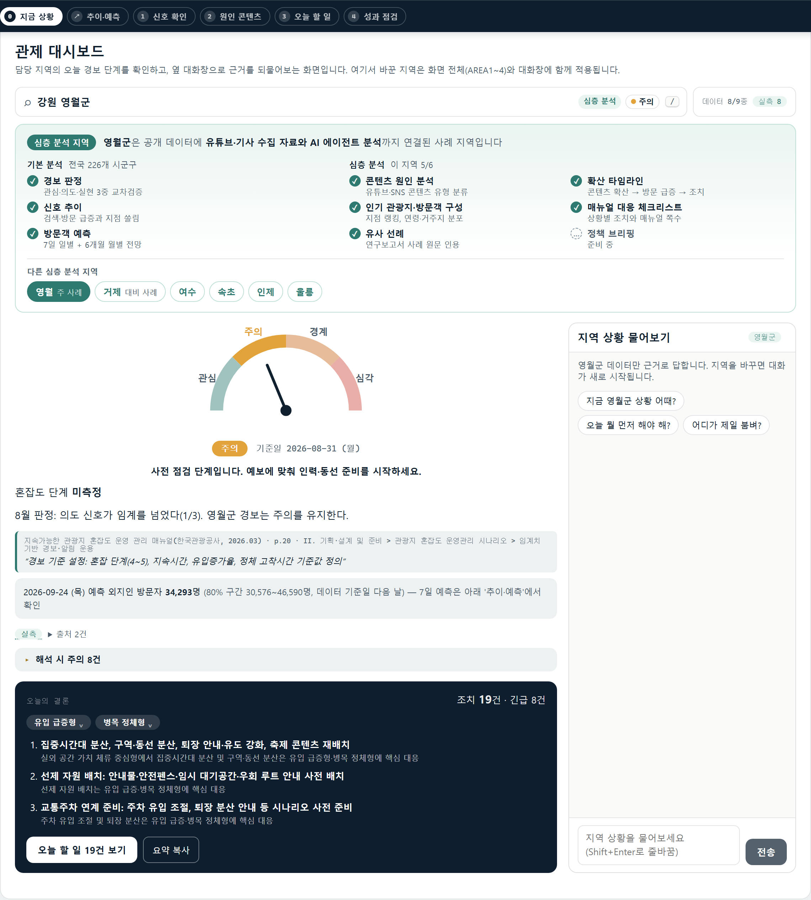

**현재 UI · AREA 0** (영월)

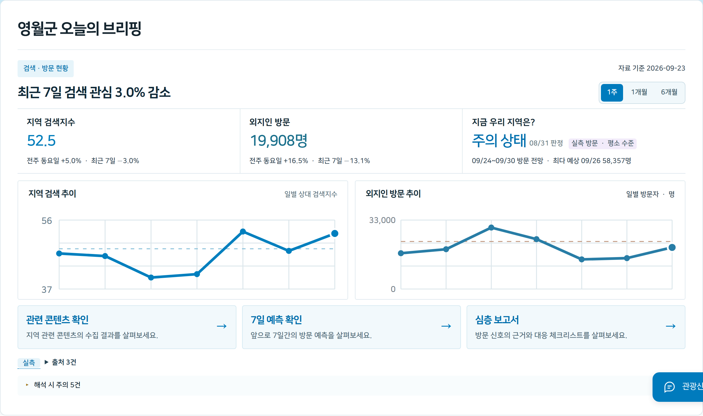

기존 UI의 AREA0는 지역 검색기 → 분석 범위 카드 → (게이지 + 판정 상세) + 오늘의 결론 → 오른쪽
도킹 대화창까지 한 화면에 담았다. 현재 UI는 **오늘의 브리핑 카드 하나**로 압축했고, 지역 선택은
헤더로, 대화창은 우하단 고정 런처로 옮겼다.

---

# AREA 0 · 관제 대시보드

## A1~A7. 경보 판정 상세 (`SignalStatusPanel`)

기존 UI는 경보 판정에 관한 일곱 가지를 한 덩어리로 보여 줬다.

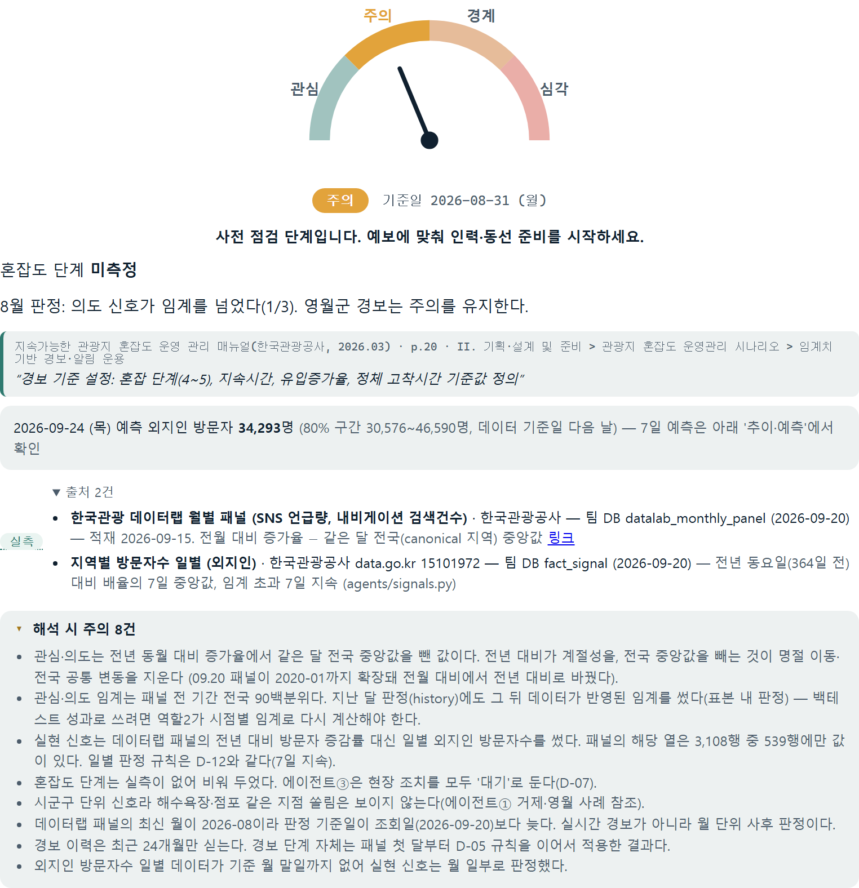

| # | 기능 | 읽는 필드 | 판정 |
|---|---|---|---|
| A1 | 4단 반원 게이지 + 바늘 | `alert_level` | **부분** |
| A2 | 직전 단계 전이 `(주의 → 경계)` | `previous_alert_level` | **없음** |
| A3 | 단계의 뜻 — "사전 점검 단계입니다. 예보에 맞춰 인력·동선 준비를 시작하세요." | `lib/alertLevels.js`의 `ALERT_MEANING` | **없음** |
| A4 | 혼잡도 단계 `N/5` · 밀도 | `congestion_level`, `density` | **없음** |
| A5 | 판정 근거 한 문장 | `basis` | **없음** |
| A6 | 매뉴얼 근거 인용(출처 + 원문) | `manual_ref` | **없음** |
| A7 | 기준일 다음 날 예측 + 80% 구간 | `forecast.daily[0]` | **부분** |

현재 UI는 같은 자리에서 **경보 단계 이름과 판정일만** 보여 준다.


- **A1 부분** — 단계 이름은 `주의 상태` 텍스트로 있다. 4단 척도 위의 위치와 색이 없다.
- **A7 부분** — 현재 UI는 "최다 예상일" 기준으로만 적는다(`최다 예상 09/28 41,234명`).
  기준일 **다음 날**의 예측값과 80% 구간은 7일 예측 차트의 마우스 오버 툴팁에만 있다.
- **A4는 데이터가 없다** — `congestion_level`은 사례 6종·전국 220종 **어느 `signal_status`
  파일에도 없다.** 위 캡처에서도 `혼잡도 단계 미측정`으로 찍혔다. 되살려도 항상 "미측정"이므로
  이식하지 않는다.

A2·A3·A5·A6은 현재 UI의 심층 분석 `신호 판정 근거` 블록 안에 접이식으로 넣는다.

## A8. 오늘의 결론 카드

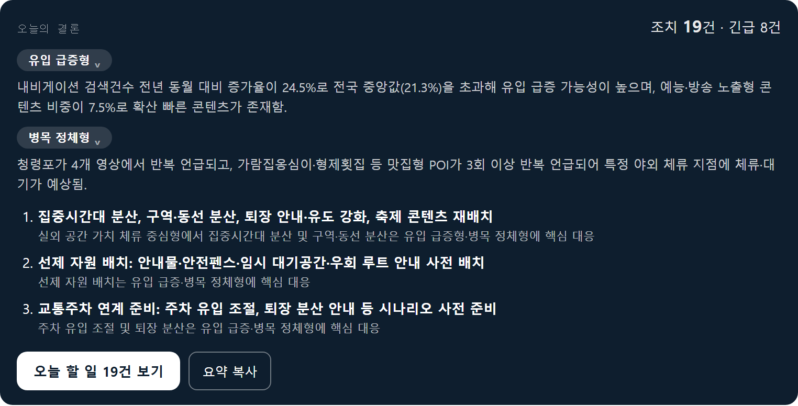

조치 건수·긴급 건수·완료 건수를 세고, **상황 유형과 그 근거**(`assessment.situation_types[]`),
**핵심 조치 3건과 "왜"**(`briefing.actions[].why`, 폴백 `checklist.items[].match_reason`)를
보여 준다. "오늘 할 일 N건 보기" 이동 버튼과 "요약 복사" 클립보드 버튼이 붙는다.

**판정: 없음.** 현재 UI의 `우선 대응 사항`(AREA3)이 발동 조치 상위 3건을 나열하지만,
상황 유형·근거·"왜"·건수 집계·복사 버튼은 전부 없다.

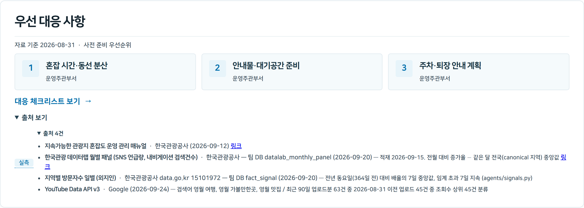

> `assessment.situation_types`와 `briefing.actions[].why`는 현재 UI 전체에서 **읽는 코드가 0**이다.

## A9. 분석 범위 카드

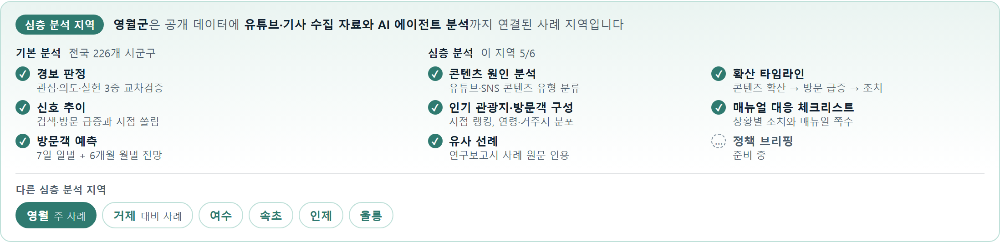

이 지역이 기본 분석인지 심층 분석인지, 9종 계약 중 무엇이 준비됐는지, 심층 사례 6곳은
어디인지를 한 카드로 설명한다.

**판정: 없음.** 현재 UI는 헤더 지역 검색 드롭다운의 `심층 분석` 배지로만 구분을 알린다.

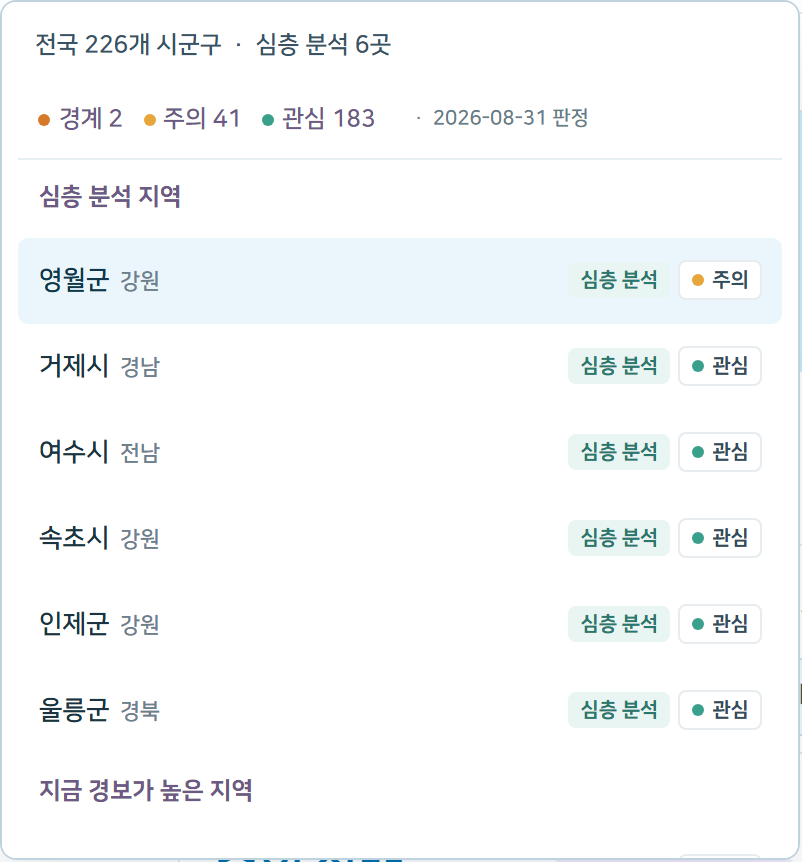

**보류 사유** — 이 카드의 스타일은 `components/area0-dashboard/tierCard.css`에 따로 있고,
ui-improvement 테마(`civic.css`/`datalab-theme.css`)에는 대응 규칙이 **0개**다. 그대로 넣으면
주변과 톤이 어긋난다.

## A10. 데이터 커버리지 배지

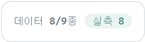

**판정: 없음.** `data/manifest.js`에 `getRegionCoverage()`가 그대로 남아 있지만 **호출부가 없다.**
보류하되, 지역마다 빈 화면이 생기는 이유를 알리는 장치라 나중에 다시 볼 값어치가 있다.

## A11. AREA0 지역 검색기

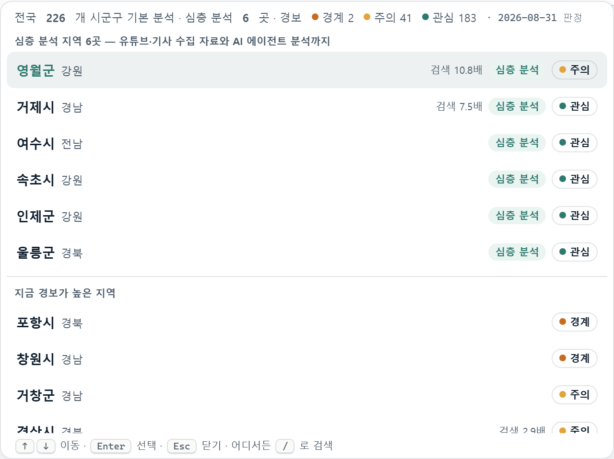

**판정: 부분.** 지역 선택 자체는 헤더 `RegionSearchPicker`로 옮겨 살아 있다(위 A9 캡처).
기존 검색기에만 있던 것: **최근 본 지역**(localStorage), **시도별 둘러보기 칩**,
`/` 전역 단축키, 일치 글자 강조, 충주 샘플 항목.

**보류 사유** — 지난 시도에서 이 컴포넌트를 헤더에 통째로 옮겼다가 헤더가 깨졌다.
`.header-region-picker button` 규칙이 드롭다운 내부 버튼 226개를 전부 보라색 알약으로 만든다.

## A12. 생애주기 패널 (충주)


발화/확산/피크/쇠퇴 4단 게이지 + 확신도 박스 + 월별 SNS 언급량 추이 + 해설.
`lifecycle_stage`·`lifecycle_series`·`confidence`·`narrative`를 읽는다.

**판정: 없음.** 현재 UI는 충주에 `daily_peak` 계약을 쓰는 `DailyPeakChart`를 대신 렌더한다.

**보류 사유** — 이 스키마는 `data/mock/chungju_signal_status.json` 목업 전용이다
(`data/prod`에 `lifecycle_*` 파일이 없다). 현재 UI에 이미 대체 화면이 있다.

## A13. 패널 eyebrow + 화면 설명문


`AREA 0 · 지금 상황` 라벨과 "이 화면은 무엇을 하는 곳인지" 한 문단. AREA1~4도 같은 형식이다.

**판정: 없음.** 현재 UI는 `<h2>` 한 줄만 둔다. 다만 현재 UI는 심층 분석에서
`01 · 신호 근거` 같은 **단계 번호 + 제목 + 설명문**을 쓰고 있어, 같은 역할을 다른 방식으로
이미 하고 있다고 볼 수 있다. 보류.

---

# 신호 추이 패널 (기존 UI 전용 · 현재 UI에 통째로 없음)

기존 UI는 AREA0 바로 아래에 전체 폭 `신호 추이·예측` 패널을 뒀다.
현재 UI의 `App.jsx`에는 이 섹션이 아예 없다.

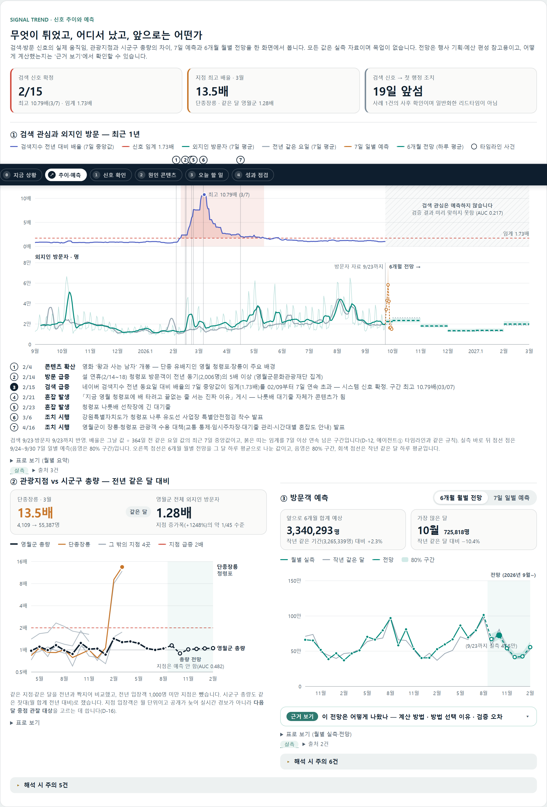

## T5. 요약 타일 3종

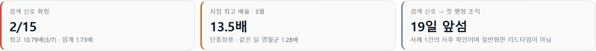

검색 신호 확정(`episodes[]`) · 지점 최고 배율(`points.surge`) · 신호→조치 리드타임
(`timeline.lags.signal_to_action_days`).

**판정: 부분.** 리드타임은 현재 UI AREA4 `LeadTimeTimeline`이 같은 필드로 같은 문구를 쓴다(중복).
나머지 둘은 없다. `episodes`는 전국 220곳 중 **22곳**에만 있다.

## T3. 1년 통합 신호 추이 차트

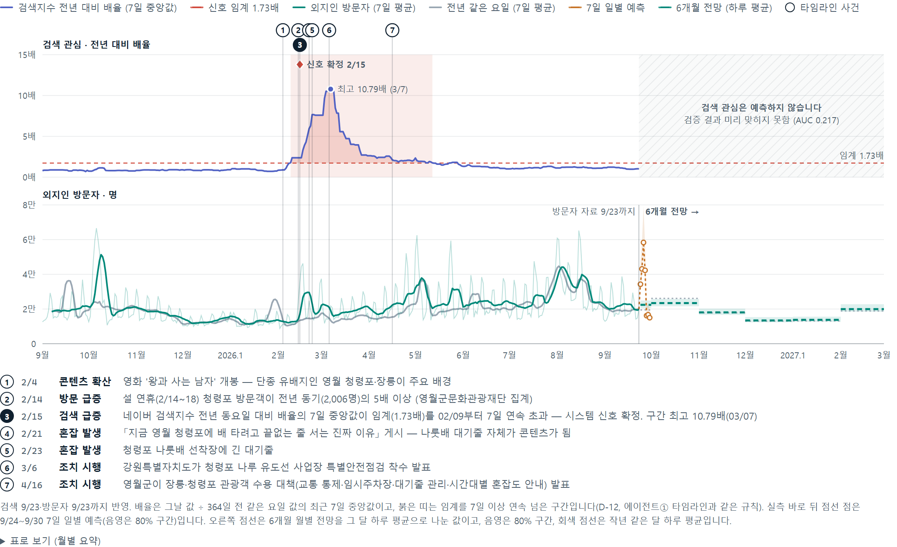

검색 배율(위)과 외지인 방문자(아래)를 **하나의 시간축**에 쌓고, 타임라인 이벤트 핀 5종
(콘텐츠 확산·검색 급증·방문 급증·혼잡 발생·조치 시행)과 에피소드 음영을 얹는다.

**판정: 부분.** 현재 UI도 같은 두 계열을 그린다 — 다만 카드 2개로 나눠서, 1주/1개월/6개월 토글로.

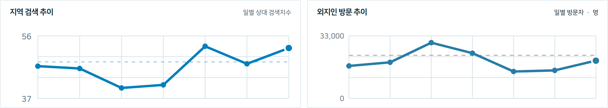

순증분은 ① 공통 시간축, ② 1년 범위, ③ 에피소드 음영, ④ 타임라인 이벤트 핀이다.
**그런데 `timeline` 데이터는 사례 6곳에만 있다**(전국 계약은 `signal_status`·`signal_series`·
`forecast`·`outlook` 4종뿐). 즉 ④의 값어치는 225곳 중 6곳에서만 나온다. **보류.**

## T2. 관광지점 vs 시군구 총량

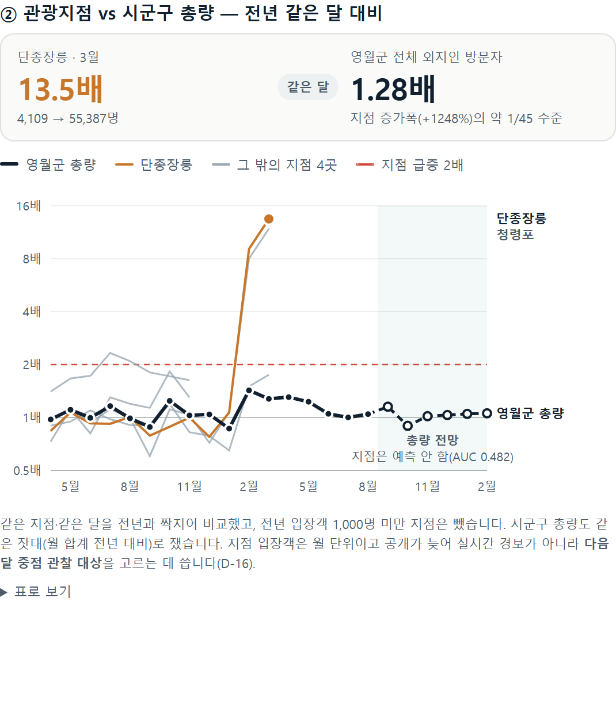

관광지점별 전년 대비 배율을 시군구 전체 배율과 같은 로그축에 올려, **어느 지점이 언제부터
얼마나 튀었는지**를 보여 준다. `signal_series.points.{attractions, region_total, surge}`.

**판정: 없음.** 비슷한 *차트*는 없고, 주제가 겹치는 *목록*이 있다 — 현재 UI 심층 분석의
`어느 관광지로 몰렸나요?`가 지점별 입장객·전년 대비 증감률·혼잡도를 순위로 보여 준다.

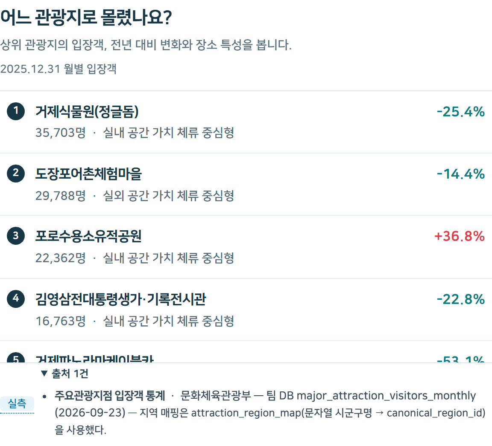

즉 "**어느** 지점이"는 있고 "**언제부터 얼마나**(월별 추이)"가 없다.
`points`를 읽는 살아있는 코드는 **0**이며, 데이터는 225곳 중 **159곳**에 있다. **보류.**

## T1. 6개월 월별 전망

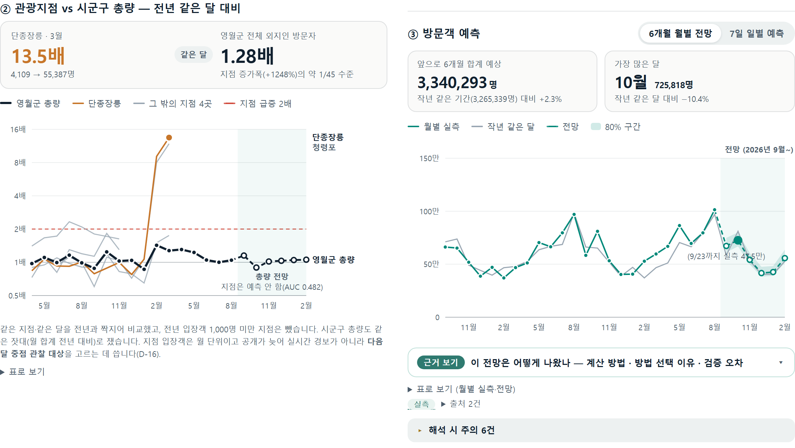

앞으로 6개월의 월별 방문객 전망 + 80% 구간 + 작년 같은 달 선.

**판정: 없음. 비슷한 화면이 하나도 없다.** 현재 UI의 7일 예측은 **일별 · 미래 7일**이고,
AREA0의 "6개월" 토글은 **과거** 실측이다. 7일 너머의 미래를 보여주는 화면이 현재 UI에 없다.

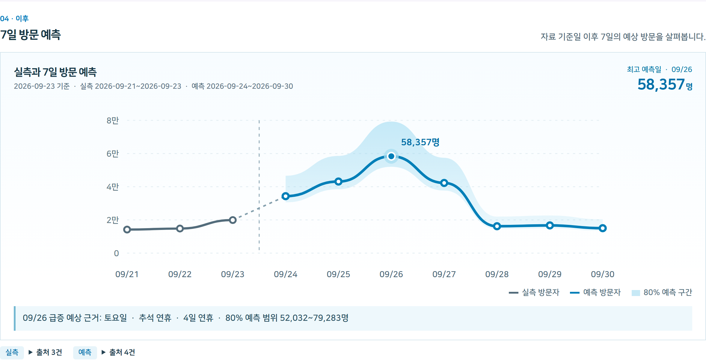

**`outlook` 데이터는 225개 지역 전부에 있다**(`data/prod/regions/outlook_*.json` 220개 +
사례 5개). 화면만 0이다. 보류한 항목 중 손실이 가장 크다.

## T4. 예측 근거 패널

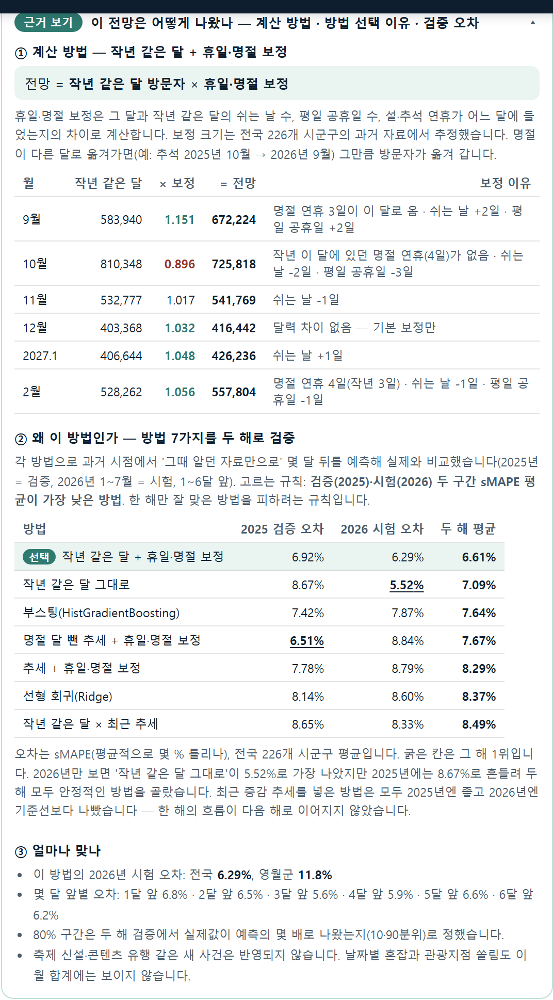

월별 산식과 보정 계수, 모델 후보별 sMAPE 검증표를 접이식으로 펼친다.
**판정: 없음.** T1과 함께 보류.

## 참고 — 7일 예측 (중복)

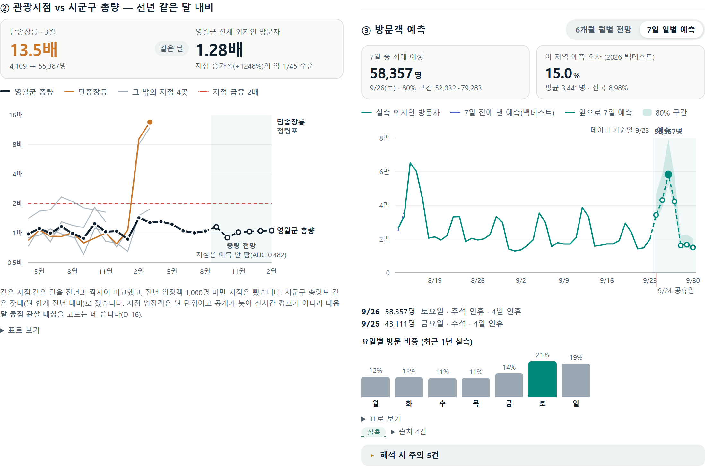

기존 UI의 7일 예측은 현재 UI `#forecast`와 **같은 데이터·같은 80% 구간**이다.
기존 쪽에만 있는 건 42일 히스토리와 "7일 전에 낸 예측 vs 실제" 백테스트 선이다. **중복.**

---

# AREA 1 · 신호 확인

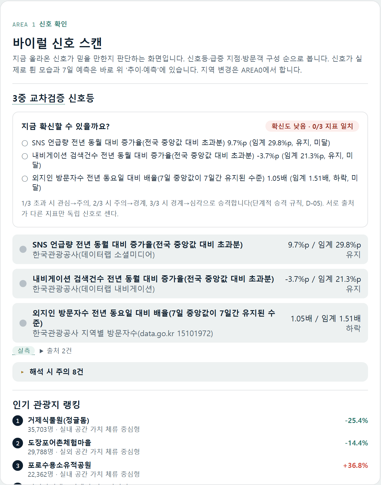

## B1~B5. 3중 교차검증 신호등

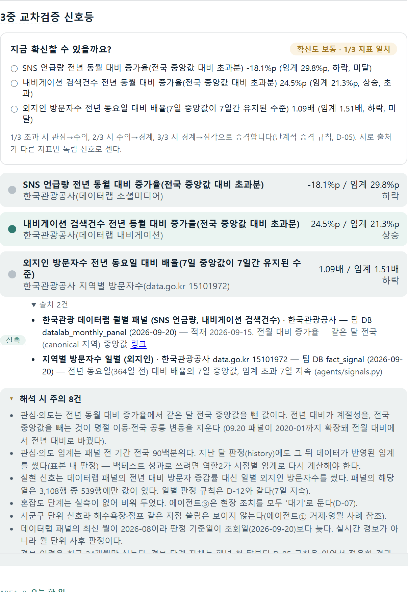

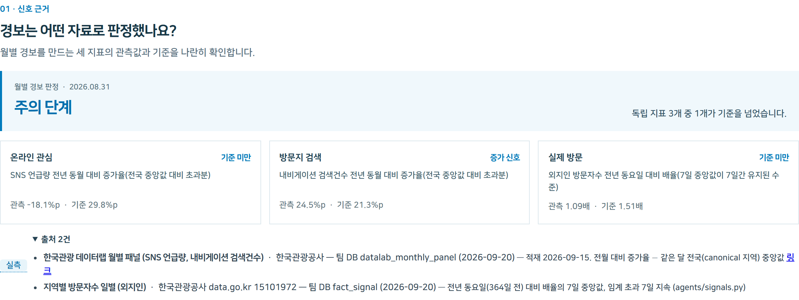

| # | 기능 | 판정 | 설명 |
|---|---|---|---|
| B1 | 신호등 3행(관심→의도→실현) | **부분** | 현재 UI도 세 지표의 관측/기준/초과여부를 카드 3개로 보여 준다. 신호등 점(●) 시각화만 없다 — 정보량은 동등하다 |
| B2 | 확신도 박스 + 승격 규칙 | **없음** | 현재 UI는 "독립 지표 3개 중 1개가 기준을 넘었습니다" 한 줄뿐. `확신도 보통 · 1/3 지표 일치` 배지와 **"1/3 초과 시 관심→주의, 2/3 시 주의→경계, 3/3 시 경계→심각"** 규칙 문장이 없다 |
| B3 | 지표 제공 기관 | **없음** | `한국관광공사(데이터랩 소셜미디어)` 같은 출처 기관이 지표마다 붙는다. 현재 UI에는 없다 |
| B4 | 지표 추세 | **없음** | `상승`/`하락`. 데이터(`cross_validation[].trend`)에 있는데 현재 UI가 안 읽는다 |
| B5 | 측정불가 사유 | **없음** | `value == null`일 때 현재 UI는 "자료 없음"으로 뭉갠다. `missing_reason`이 있으면 그걸 써야 한다 |

> **승격 규칙은 새로 쓸 필요가 없다.** 모든 `signal_status`에 `escalation` 객체가 있고
> 그 `note`에 D-05 원문이 들어 있다. 현재 UI에서 `escalation`을 읽는 코드는 **0**이다.

## B6. 분산 후보지(데드존) 칩 · 관광지 상세

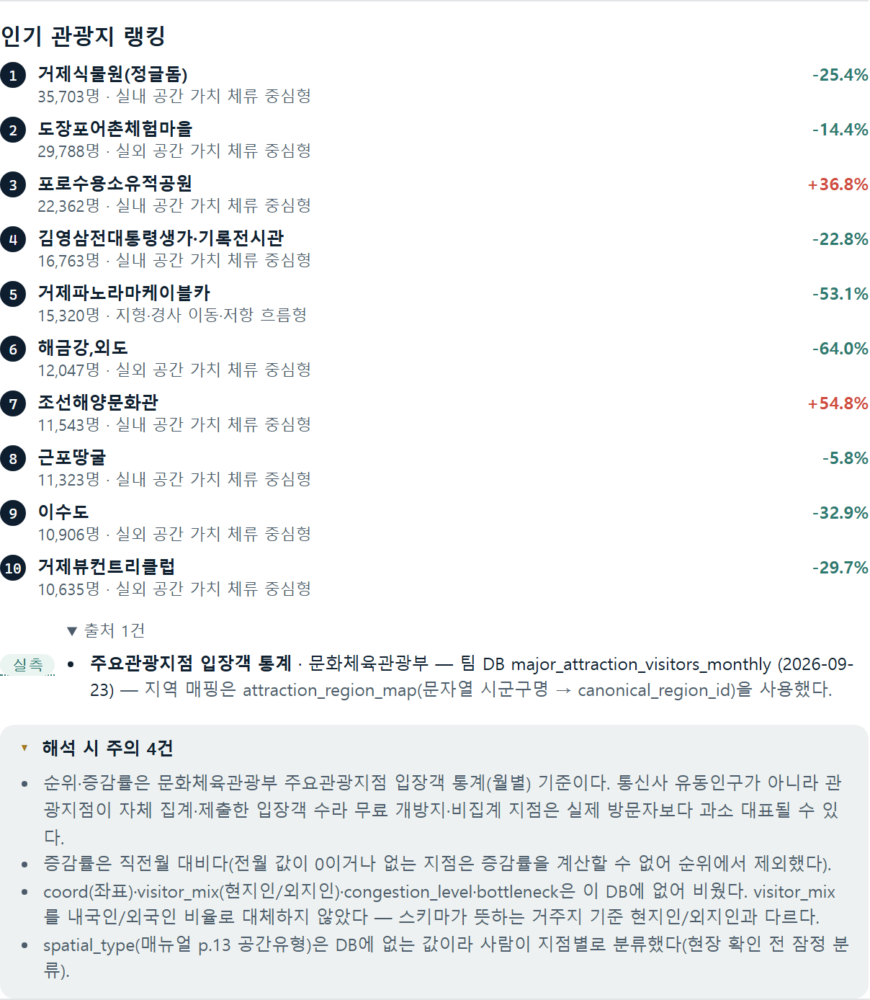

**판정: 없음(분산 후보지만).** 증감률·혼잡도·공간 유형·병목은 현재 UI 심층 분석의
`어느 관광지로 몰렸나요?`에 그대로 있다(위 `m-place.png`) — **중복**.
빠진 건 **분산 후보지 칩** 하나다. 현재 UI의 `HotspotRanking`은 `deadZonePois` prop을
여전히 받도록 돼 있는데 **아무도 넘기지 않아** 칩이 영영 뜨지 않는다. 한 줄로 고쳐진다.

## 방문객 프로파일 (중복)

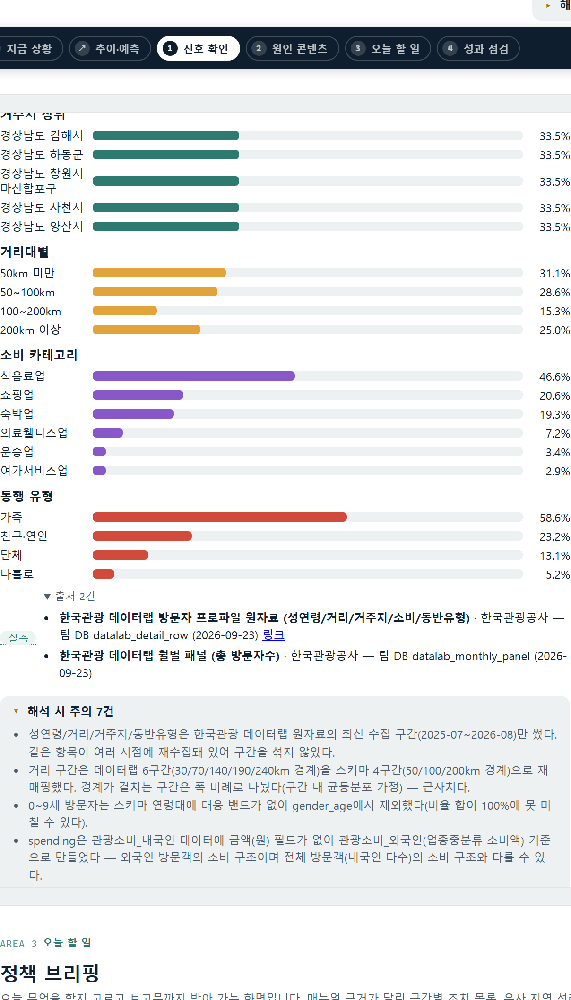

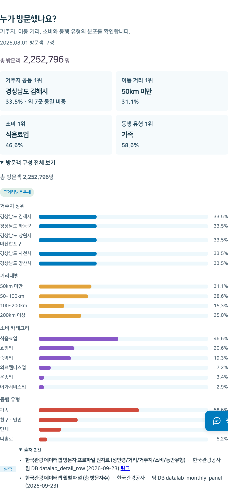

거주지·거리대·소비·동행·성연령 분포는 현재 UI 심층 분석 `누가 방문했나요?`에 모두 있다.
**중복 — 이식 불필요.**

## B7. 섹션별 해석 주의 (`CaveatNote`)

기존 UI는 AREA1의 세 섹션 각각에 `해석 시 주의 N건` 접이식을 달았다(위 `d-a1-crossval.png` 하단).
**판정: 없음.** 현재 UI AREA1과 AREA3에는 `CaveatNote`가 없다. AREA0·AREA4에는 이미 있으므로
같은 컴포넌트를 세 자리에 더 붙이면 된다.

---

# AREA 2 · 콘텐츠

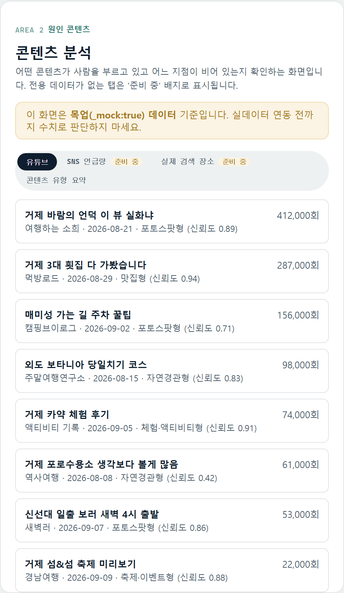

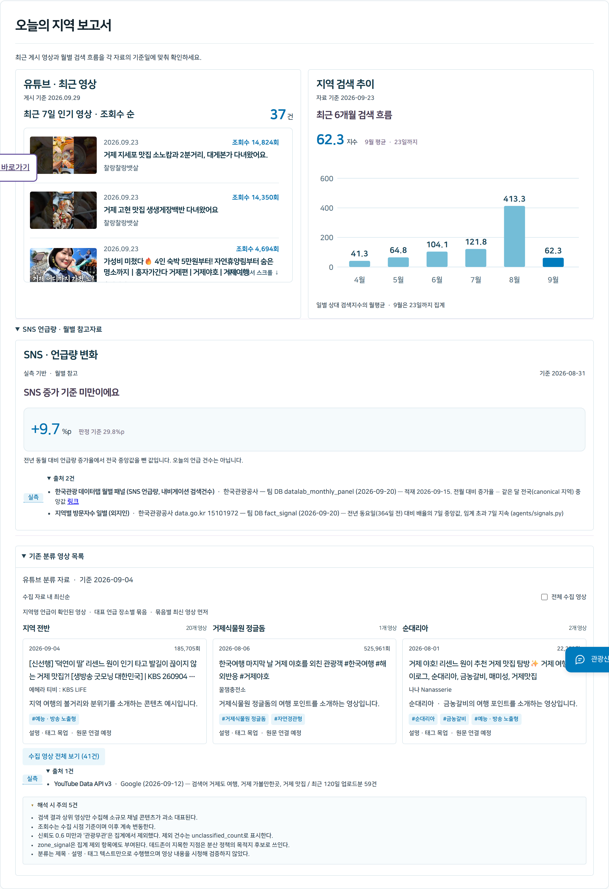

## C1. 콘텐츠 탭 4종


유튜브 / SNS 언급량 / 실제 검색 장소 / 콘텐츠 유형 요약. 뒤 두 탭은 전용 데이터가 없어
AREA1 계약을 대신 보여주며 `준비 중` 배지를 단다.

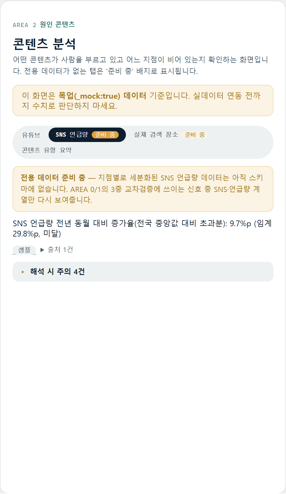

**판정: 부분 → 이식 불필요(삭제 결정).** 탭별로 따져 보면:

| 탭 | 현재 UI 대응 |
|---|---|
| 유튜브 | `UploadVideoList` — 장소별로 묶고 `전체 수집 영상` 체크박스·`수집 영상 전체 보기`로 전건 도달 가능 |
| SNS 언급량 (대체) | 심층 분석 `신호 판정 근거`가 같은 `cross_validation`을 더 자세히 보여 준다 |
| 실제 검색 장소 (대체) | 심층 분석 `어느 관광지로 몰렸나요?`가 더 자세하다 |
| 콘텐츠 유형 요약 | 심층 분석 `어떤 콘텐츠가 관심을 모았나요?`로 이동 |

탭 껍데기만 없어지고 내용은 전부 다른 자리에 있다. 게다가 현재 UI의 `VideoCard`는
`selected`/`onSelect`를 받지 않아 탭을 되살려도 절반은 동작하지 않는다.

## C2~C4. 콘텐츠 유형 요약

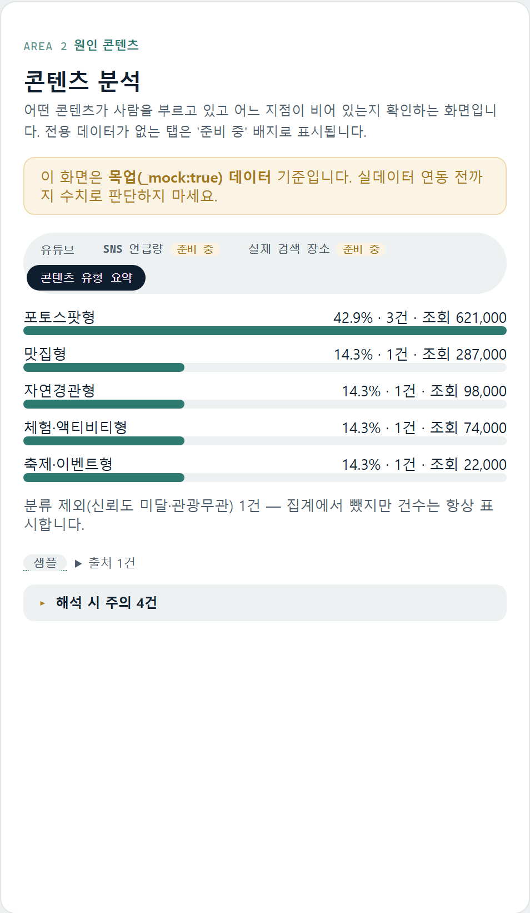

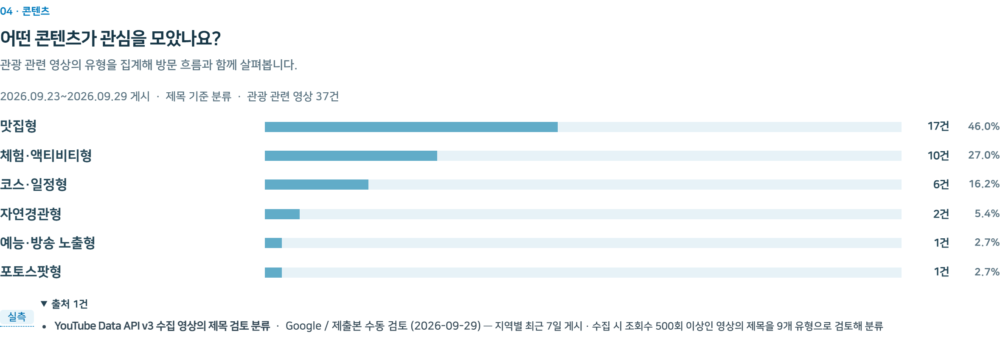

| # | 기능 | 필드 | 판정 |
|---|---|---|---|
| — | 유형별 비중 막대 + 건수 | `summary[].{content_type, ratio, count}` | **중복** — 현재 UI가 같은 막대로 보여 준다 |
| C2 | 유형별 **누적 조회수** | `summary[].total_views` | **없음** |
| C3 | 분류 제외 건수 | `unclassified_count` | **없음** |
| C4 | 핫존/데드존 신호 건수 + 분산 후보지 목록 | `zone_signals.{핫존, 데드존, 데드존_지점[]}` | **없음** |

C2~C4 세 필드는 현재 UI 전체에서 읽는 코드가 **0**이다(고아 파일 `ContentTypeSummary.jsx`에만 존재).
현재 UI의 막대 목록 `<small>`에 한 줄, 목록 아래 두 줄이면 들어간다.

## C5~C9. 영상 카드

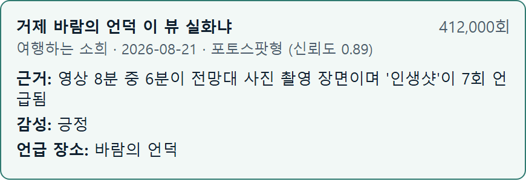

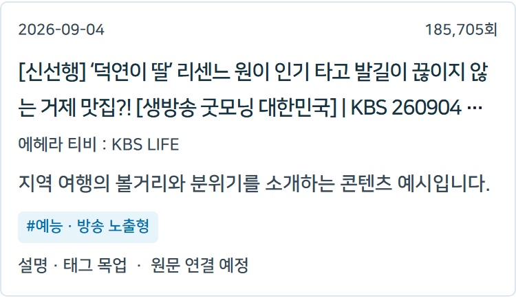

| # | 기능 | 필드 | 판정 |
|---|---|---|---|
| C5 | 분류 근거 | `items[].evidence` | **없음** |
| C6 | 감성 | `items[].sentiment` | **없음** — 현재 UI `web/src` 전체 grep 0건 |
| C7 | 분류 신뢰도 수치 · 분류 유형 | `items[].confidence`, `.content_type` | **부분** — `confidence`는 `contentRelevance.js`의 내부 필터로만 쓰이고 숫자는 안 보인다 |
| C8 | 핫존/데드존 배지 | `items[].zone_signal` | **없음** — `ZoneSignalBadge`가 import되지 않는다 |
| C9 | 언급 장소 전체 | `items[].poi_mentioned[]` | **부분** — 현재 UI는 앞 1~2개만 쓴다 |

현재 UI 카드는 원본 링크·설명·태그를 보여 주는 ui 디자인이 더 낫다.
**카드 디자인은 그대로 두고 아래에 접이식 하나를 더해** 다섯 항목을 담는다.

---

# AREA 3 · 정책 대응

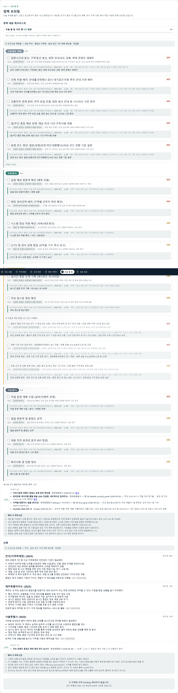

## D1~D2. 선정 사유와 매칭 조건


- **D1 조치별 선정 사유(`match_reason`)** — **부분.** 현재 UI는 AREA0 카드(지금은 죽은 코드)에서만
  폴백으로 썼다. 정책 보고서의 전체 체크리스트에는 **전혀 없다.**
- **D2 매칭 조건 박스(`matched_for`)** — **없음.** "이 조건으로 매칭됨 — 경보 주의 · 혼잡도 미측정 ·
  야외 개방 관치 체험 중심형 · 자연경관" 한 줄. 현재 UI에서 `checklist.matched_for`를 읽는 코드는 0이다.

## D3~D6. 진행 상태와 구간

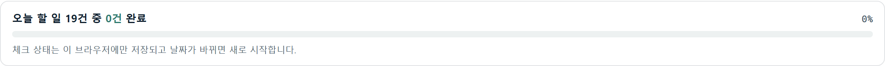


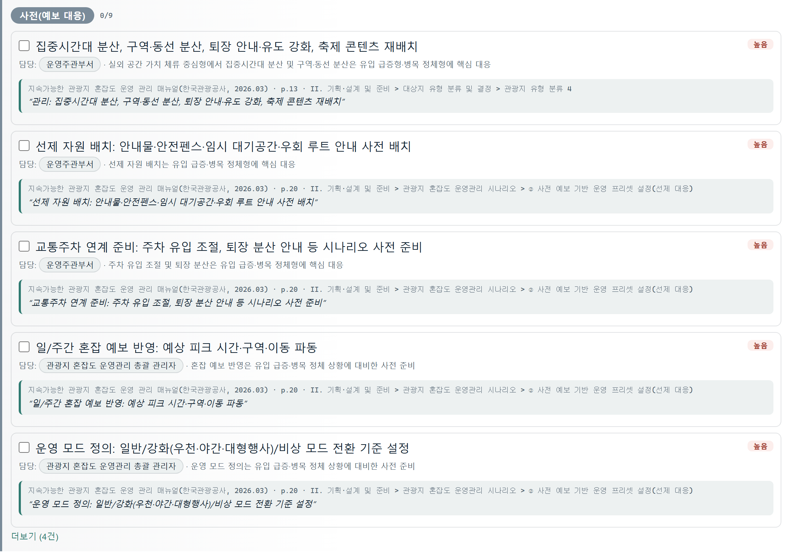

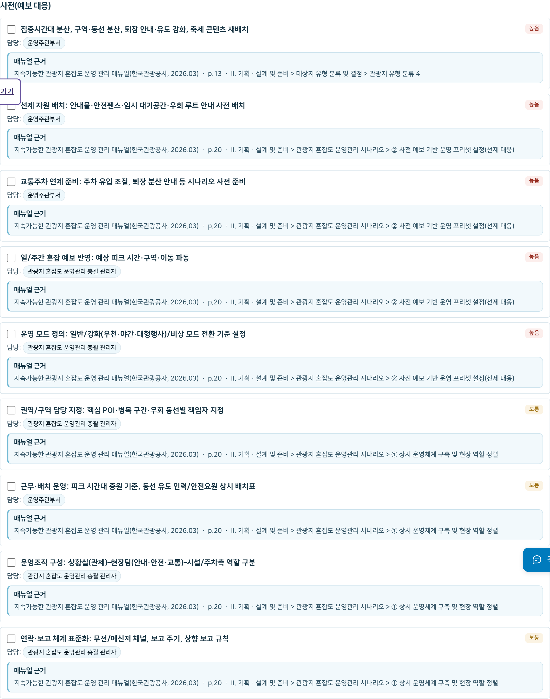

| # | 기능 | 판정 | 설명 |
|---|---|---|---|
| D4 | 진행률 % + 막대 | **부분** | 현재 UI는 `선정된 조치 N건 / N건 완료` 텍스트만. 퍼센트와 막대가 없다 |
| D5 | 구간별 완료 수 `3/7` | **없음** | 현재 UI는 구간 제목만 |
| D6 | 구간 5건 초과 `더보기` | **없음** | 현재 UI는 전건을 한 번에 편다 |
| — | 저장 안내 문구 | **없음** | "체크 상태는 이 브라우저에만 저장되고 날짜가 바뀌면 새로 시작합니다" |

> **저장소가 서로 다르다.** 기존 UI는 날짜가 들어간 키(`checklistDone:<지역>:<날짜>`)를 써서
> 날짜가 바뀌면 리셋되고, 현재 UI는 `tourism-radar-checklist:<지역>-<기준일>`을 써서 리셋이 없다.
> **저장소를 두 개 만들면 안 된다** — 현재 UI 키 하나로 통일한다.

## D3. 지금은 해당 없음 N건

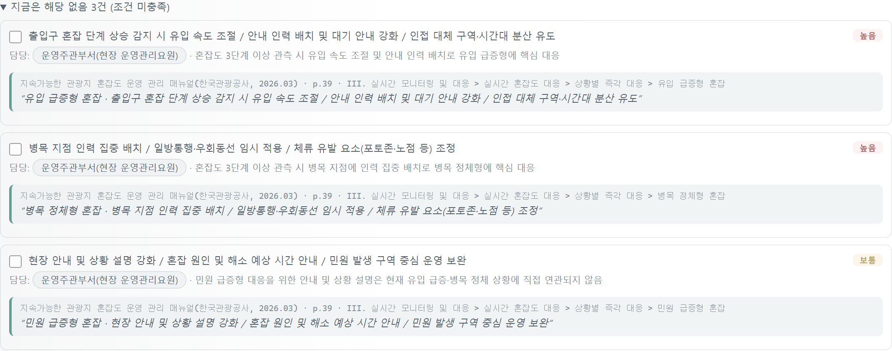

조건을 아직 만족하지 않은 조치(`status === "대기"`)를 구간 끝에 접어 둔다. 영월은 3건이다.
**판정: 없음.** 현재 UI는 `status === "발동"`만 통과시켜 대기 조치를 아예 렌더하지 않는다.

## D7~D8. 매뉴얼 원문과 브리핑

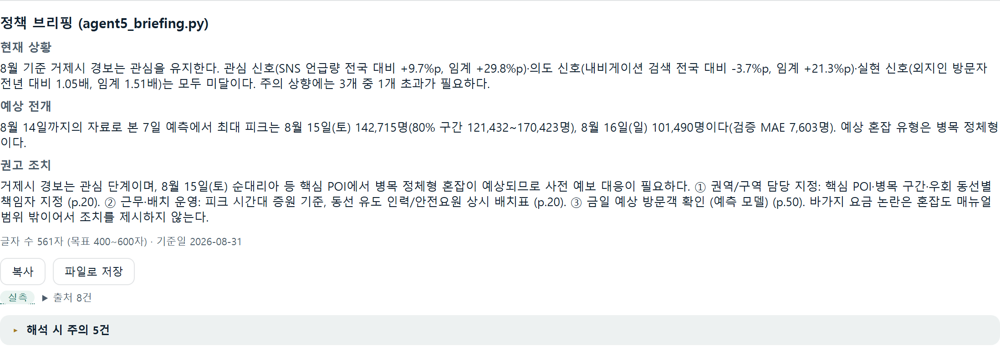

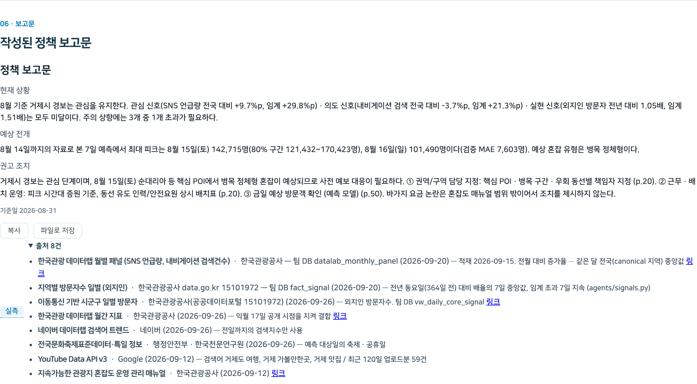

- **D7 매뉴얼 원문 인용** — **없음.** 현재 UI는 `ManualRefCite`를 `alwaysVisible`로 부르는데,
  그 분기가 출처만 렌더하고 **원문(`citation`)을 버린다.** 위 A6 캡처의 기울임 인용문이 그것이다.
- **D8 브리핑 글자 수** — **없음.** `briefing.char_count`를 읽는 코드가 0이다.

---

# 전역

## E1. 사용법 투어

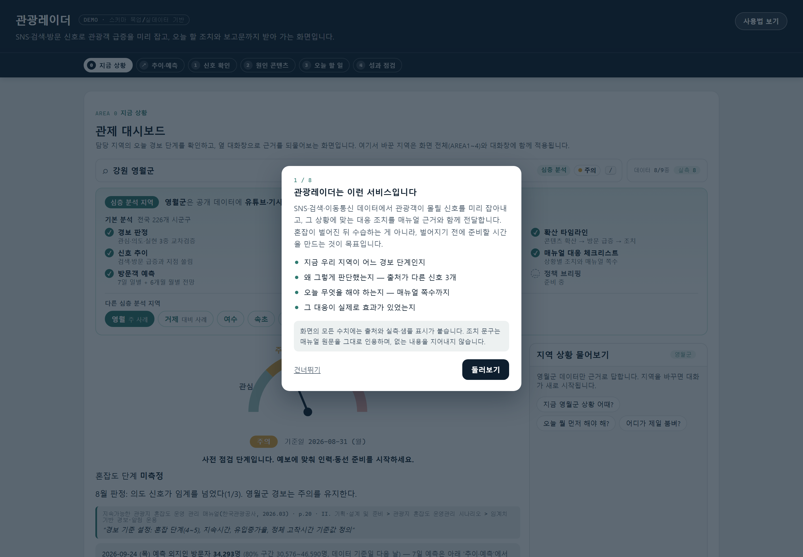

첫 방문 시 자동으로 열리는 7단계 스포트라이트. `hasSeenTour()`로 한 번만 뜬다.

**판정: 없음.** 현재 UI `App.jsx`는 `GuideTour`를 import하지 않고, 헤더에 재생 버튼도 없다.

**주의** — 7단계 중 3단계가 현재 UI에 없는 클래스(`.region-search`, `.alert-summary`,
`.today-action`)와 없어진 `#trend`를 가리킨다. `GuideTour`는 타깃이 없는 단계를 조용히
걸러내므로, 셀렉터를 다시 매핑하지 않으면 절반만 도는 투어가 된다.

## E2~E4. 챗봇

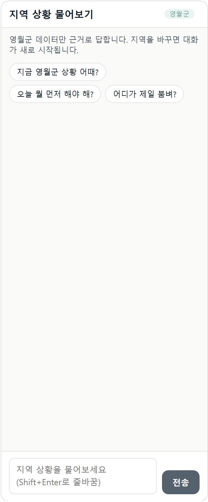

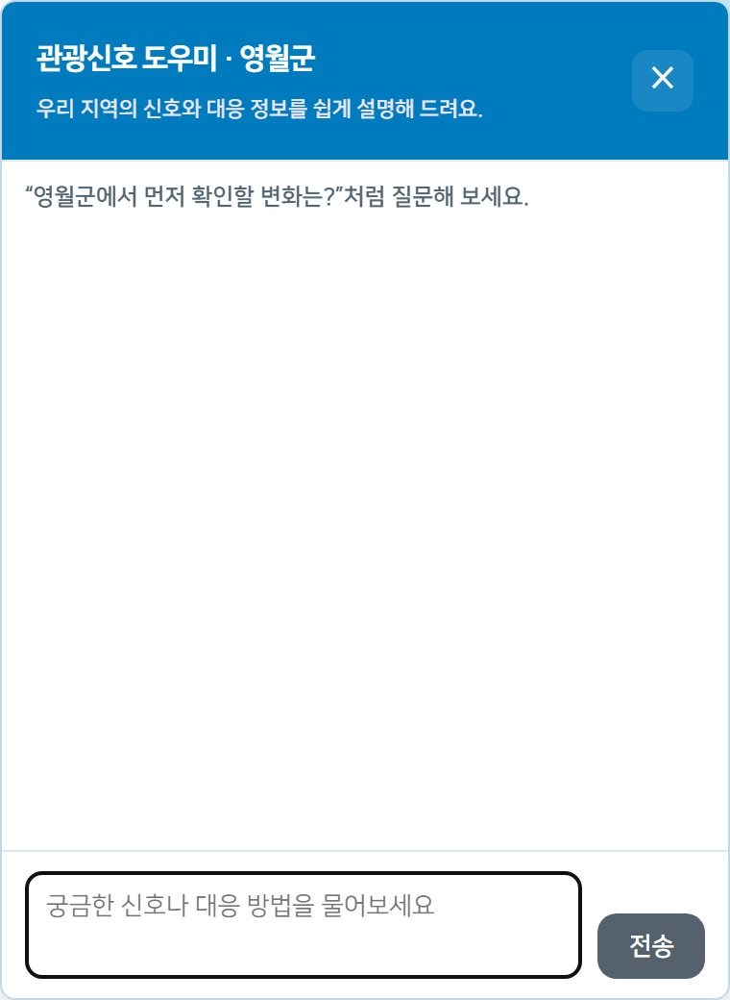

| # | 기능 | 판정 |
|---|---|---|
| E2 | 예시 질문 칩 (`지금 {지역} 상황 어때?` 등 3개) | **없음** |
| E3 | 답변 출처 칩 (실측 / 샘플 / 준비 전 / 조회 실패 구분) | **부분** — 현재 UI도 `SourceBadge`+`CaveatNote`는 보여 주지만 계약별 상태 칩 한 줄이 없다 |
| E4 | 마크다운 정규화 | **없음 — 버그** |

**E4는 회귀다.** 기존 UI는 `normalizeMarkdown()`으로 한국어 조사 앞뒤의 강조 표시를 교정한 뒤
렌더했는데, 현재 UI는 원문을 그대로 넘긴다. `**'주의'**이며` 같은 문장에서 별표가 그대로 새어 나온다.
`lib/markdown.js`는 파일만 남고 아무도 부르지 않는다.

> 대화창 **배치**는 현재 UI가 낫다. 기존 UI는 AREA0 옆 2단 도킹이라 좁은 화면에서 문제가 있었고,
> 현재 UI는 우하단 고정 런처다. **런처 구조는 그대로 두고 위 세 가지만 얹는다.**

## E5. 고지문 footer

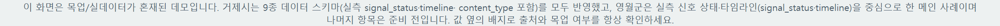

목업/실데이터 혼재를 알리는 페이지 최하단 문단.
**판정: 없음.** 현재 UI는 값마다 붙는 출처 배지로 같은 역할을 분산 처리한다. **보류.**

---

# 손실이 아닌 것

혼동하기 쉬워 따로 적는다.

| 항목 | 왜 손실이 아닌가 |
|---|---|
| `congestion_level` · `density` | 사례 6종·전국 220종 **어느 `signal_status` 파일에도 없는 필드다.** 기존 UI에서도 "미측정"으로 찍힌다 |
| `RegionSummary.jsx`, `InterestChart.jsx`, `SignalSeriesChart.jsx`, `ReviewMatrixStatusCard.jsx`, `lib/regionSummary.js` | ui-improvement **자체에서 이미 도달 불가**였다. 병합이 죽인 게 아니다 |
| 7일 예측 차트 | 현재 UI `#forecast`와 같은 데이터·같은 구간 |
| 방문객 프로파일 6종 분포 | 현재 UI 심층 분석 `누가 방문했나요?`에 전부 있다 |
| 관광지 증감률·혼잡도·병목 | 현재 UI 심층 분석 `어느 관광지로 몰렸나요?`에 전부 있다 |
| 리드타임 타일 | 현재 UI AREA4 `LeadTimeTimeline`과 같은 필드·같은 문구 |

---

# 보류 사유 정리

| 항목 | 보류 사유 |
|---|---|
| 추이 차트 3종 + 근거 패널 + 요약 타일 | 전용 패널이 필요해 현재 UI 레이아웃을 바꿔야 한다. `outlook`(225곳)과 `points`(159곳)는 데이터가 있으므로 **나중에 되살릴 값어치가 가장 큰 보류 항목**이다 |
| 경보 게이지 | 단계 이름이 이미 두 곳에 텍스트로 있다 |
| 혼잡도·밀도 | 데이터가 존재하지 않는다 |
| 기준일 다음 날 예측 | 7일 예측 차트에 같은 값이 있다 |
| 분석 범위 카드 | `tierCard.css`가 ui 테마에 통합돼 있지 않아 톤이 어긋난다 |
| 데이터 커버리지 배지 | 헤더 검색 배지가 비슷한 역할을 한다 |
| AREA0 지역 검색기 | 헤더로 이미 이동했다. 통째 이식은 헤더를 깨뜨린 전례가 있다 |
| 생애주기 패널 | 목업 전용 스키마이고 현재 UI에 대체 화면이 있다 |
| 패널 eyebrow·설명문 | 현재 UI가 단계 번호 + 제목 + 설명문으로 같은 역할을 한다 |
| 콘텐츠 탭 | 네 탭의 내용이 전부 다른 자리에 있다 |
| 고지문 footer | 출처 배지가 같은 역할을 분산 처리한다 |

---

# 부록 · 재현 방법

```bash
# 두 리비전을 별도 워크트리에 띄운다 (현재 작업 브랜치를 건드리지 않는다)
git worktree add <임시경로>/ui-develop origin/develop
git worktree add <임시경로>/ui-merge   origin/integration/ui-develop-merge
# 각 워크트리의 web/ 에 node_modules 를 링크한 뒤
npx vite --port 5201   # develop
npx vite --port 5202   # merge
```

캡처는 Playwright 요소 단위 크롭(뷰포트 1440×1000, 2배 해상도)이다.
대상 목록과 스크립트는 리포에 남기지 않았다 — 위 절차로 언제든 다시 만들 수 있다.

도달 그래프(무엇이 죽었는지)는 `web/src/main.jsx`부터 상대 경로 import를 따라가
파일 집합과 차집합을 내는 방식으로 계산했다.
